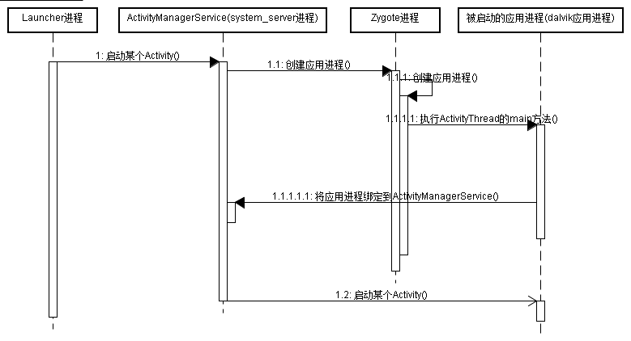
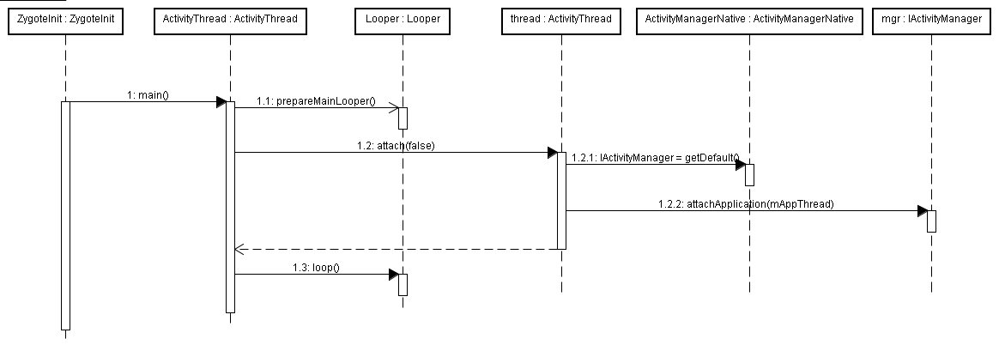
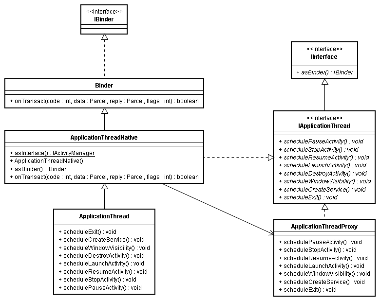
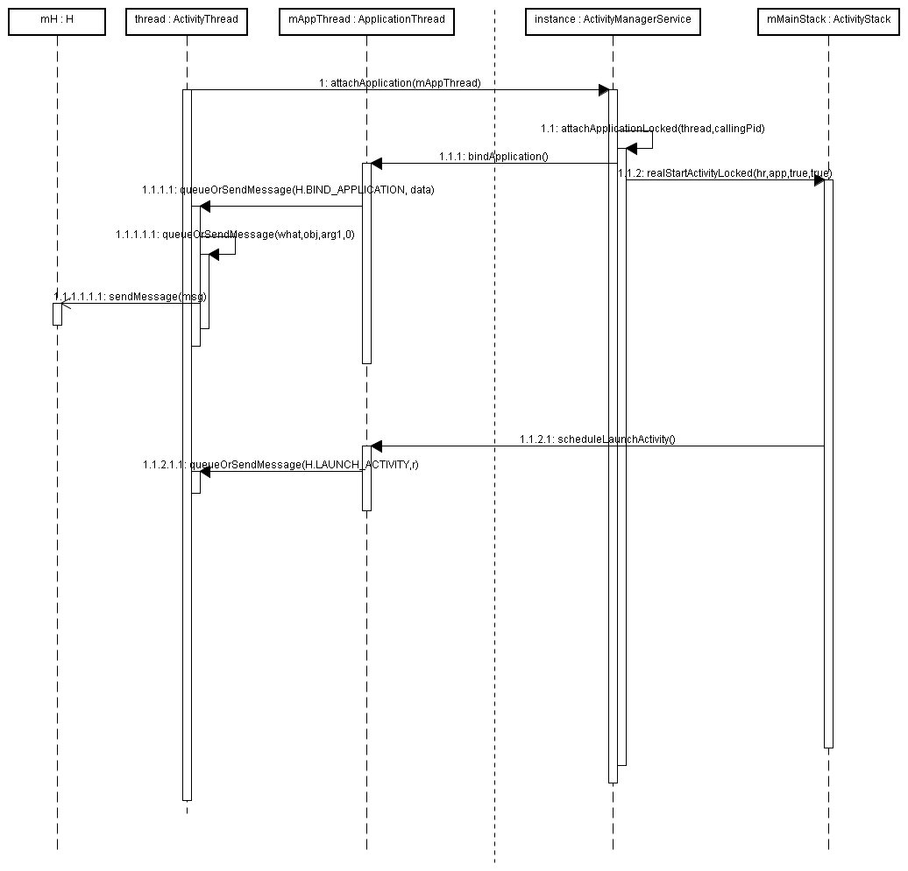
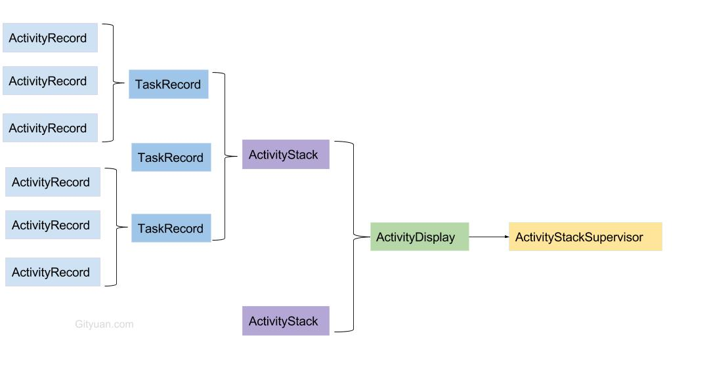
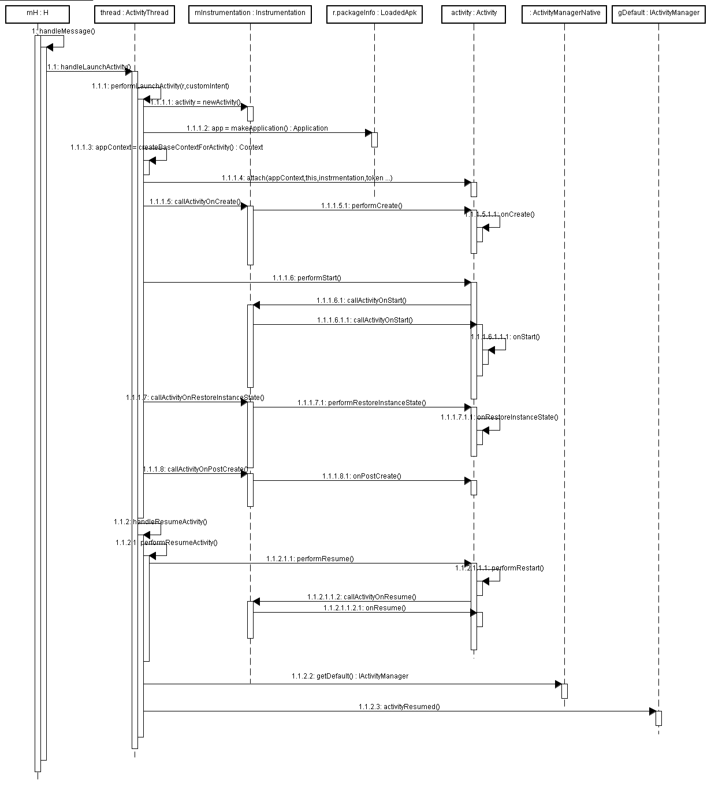
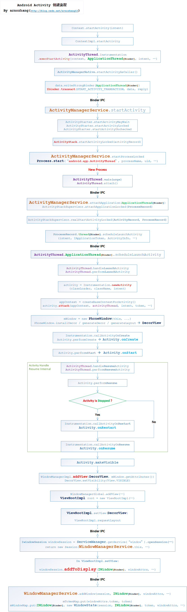

# Activity启动流程

##1、进程的创建



- AWS使用socket通知Zygote：创建APP进程，Zygote fock出进程，执行ActivityThread的main方法

  > APP进程开始初始化
  >
  > - 配置主线程消息处理机制Looper
  > - 创建应用的binder服务端ApplicationThread，供AMS调用并与AWS进行绑定

- APP使用Binder通知AMS：APP进程创建完成
  
  > - AMS得到ApplicationThreadProxy，获得了通过binder控制APP的能力
  > - AMS整理出APP需要的相关数据，供APP下一步创建app&aty
  
- AWS使用Binder通知APP：执行创建application、activity，分两次通知

  > - APP添加创建application任务到消息队列
  > - APP添加创建activity任务到消息队列
  > - APP开启消息循环，执行消息队列中的任务

###1.1 PMS获取Activity信息ActivityInfo

上图1.1过程中AMS首先会会通过**PMS**解析Activity

> ActivityStack:管理Android 中的 Activity 组件堆栈信息，也就是 Task
>
> ActivityStackSupervisor:管理所有的ActivityStack

调用链

> ActivityManagerService 类的 startActivity()方法
>
> ActivityManagerService 类的 startActivityAsUser()方法
> ActivityStackSupervisor 类的 startActivityMayWait() 方法
>
> ActivityStackSupervisor 类的 **resolveActivity**() 方法 ,向**PMS**获取activity信息
>
> ```
> ActivityInfo resolveActivity(Intent intent, String resolvedType, int startFlags,
>             ProfilerInfo profilerInfo, int userId) {
>         // Collect information about the target of the Intent.
>         ActivityInfo aInfo;
>         try {
>             ResolveInfo rInfo =
>                 AppGlobals.getPackageManager().resolveIntent(
>                         intent, resolvedType,
>                         PackageManager.MATCH_DEFAULT_ONLY
>                                     | ActivityManagerService.STOCK_PM_FLAGS, userId);
>             aInfo = rInfo != null ? rInfo.activityInfo : null;
>         } catch (RemoteException e) {
>             aInfo = null;
>         }
> ```
>
>  ActivityStackSupervisor 类的 startActivityLocked() 方法，使用ActivityInfo执行下一步启动

### 1.2、ActivityThread 应用进程的main方法

[ActivityThread](https://android.googlesource.com/platform/frameworks/base/+/master/core/java/android/app/ActivityThread.java)：APP程序main函数入口，开启主线程轮询，初始话ApplicationThread



1、应用程序的起点：Zygote fock进程后会执行ActivityThread的main函数

1.1、建主线程Looper：Looper.prepareMainLooper();

1.2.1获取AWS的binder代理

1.2.2 应用的binder服务端与AWS绑定

1.3 looper开始轮询

### 1.3 ApplicationThread 应用的binder服务端

####1.3.1 ApplicationThread介绍

应用进程需要调用ActivityManagerService提供的功能，而ActivityManagerService也需要主动调用应用进程以控制应用进程并完成指定操作。

- IApplicationThread: binder的AIDL接口
- ApplicationThread：APP的binder服务端，**ActivityThread内部类**
- ApplicationThreadProxy：APP的binder客户端，AWS通过其控制app



####1.3.2 ApplicationThread与AMS的绑定



- `mAppThread:ApplicationThread`ActivityThread的属性,随对象初始化

  - ```java
     @UnsupportedAppUsage
     final ApplicationThread mAppThread = new ApplicationThread();
    ```

- `mH:H`  ActivityThread私有属性，应用主线程Handler

- `mMainStack：ActivityStack`并不是一个Activity栈，真正意义上的Activity栈是TaskRecord，这个类是负责管理各个Activity栈，内部维护一个ArrayList<TaskRecord>

在ActivityThread的main方法里创建了thread：ActivityThread。然后调用thread.attach(false);

attach方法是绑定流程的起点，主要代码如下所示:

```java
//ActivityThread类
private void attach(boolean system) {
    sThreadLocal.set(this);
    mSystemThread = system;
    if (!system) {
        //...
        IActivityManager mgr = ActivityManagerNative.getDefault();
        try {
        //mAppThread：ApplicationThread  
        //调用ActivityManagerService的attachApplication方法
        //将ApplicationThread对象绑定至ActivityManagerService，
        //这样ActivityManagerService就可以通过ApplicationThread代理对象控制应用进程
            mgr.attachApplication(mAppThread);
        } catch (RemoteException ex) {
            // Ignore
        }
    } else {
        //...
    }
    //... 
}
```

ActivityManagerService的attachApplication方法执行attachApplicationLocked(thread, callingPid)进行绑定。

```java
//ActivityManagerService类
private final boolean attachApplicationLocked(IApplicationThread thread,
        int pid) { 
    ProcessRecord app;
    //thread对象其实是ActivityThread里ApplicationThread对象在ActivityManagerService的代理对象
  	//即ApplicationThreadProxy
    app.thread = thread; 
    //...  
    try {
      	//...
        //binder通知应用创建Application，最终会调用ApplicationThread的bindApplication方法
        thread.bindApplication(processName, appInfo, providers,
                app.instrumentationClass, profileFile, profileFd, profileAutoStop,
                app.instrumentationArguments, app.instrumentationWatcher, testMode,
                enableOpenGlTrace, isRestrictedBackupMode || !normalMode, app.persistent,
                new Configuration(mConfiguration), app.compat, getCommonServicesLocked(),
                mCoreSettingsObserver.getCoreSettingsLocked());
        //... 
    } catch (Exception e) {
       //...
    }
    //... 
   	// See if the top visible activity is waiting to run in this process...
  	//binder通知应用创建activity，最终会调用ApplicationThread的scheduleLaunchActivity方法
    HistoryRecord hr = topRunningActivityLocked(null);
    if (hr != null && normalMode) {
      if (hr.app == null && app.info.uid == hr.info.applicationInfo.uid
          && processName.equals(hr.processName)) {
          try {
              // realStartActivityLocked真正启动activity
              if (realStartActivityLocked(hr, app, true, true)) {
                  idSomething = true;
                  }
              } catch (Exception e) {
                Slog.w(TAG, "Exception in new application when starting activity "
                     + hr.intent.getComponent().flattenToShortString(), e);
                badApp = true;
              }
       } else {
                ensureActivitiesVisibleLocked(hr, null, processName, 0);
       }
     }
    //... 
    return true;
}
```

AMS调用ApplicationThreadProxy的scheduleLaunchActivity，回应用进程去启动activity

```java
    private final boolean realStartActivityLocked(HistoryRecord r,
            ProcessRecord app, boolean andResume, boolean checkConfig)
            throws RemoteException {
        r.startFreezingScreenLocked(app, 0);
        mWindowManager.setAppVisibility(r, true);
        // Have the window manager re-evaluate the orientation of
        // the screen based on the new activity order.  Note that
        // as a result of this, it can call back into the activity
        // manager with a new orientation.  We don't care about that,
        // because the activity is not currently running so we are
        // just restarting it anyway.
        if (checkConfig) {
            Configuration config = mWindowManager.updateOrientationFromAppTokens(
                    mConfiguration,
                    r.mayFreezeScreenLocked(app) ? r : null);
            updateConfigurationLocked(config, r);
        }
        r.app = app;
        if (localLOGV) Slog.v(TAG, "Launching: " + r);
        int idx = app.activities.indexOf(r);
        if (idx < 0) {
            app.activities.add(r);
        }
        updateLruProcessLocked(app, true, true);
        try {
            if (app.thread == null) {
                throw new RemoteException();
            }
            List<ResultInfo> results = null;
            List<Intent> newIntents = null;
            if (andResume) {
                results = r.results;
                newIntents = r.newIntents;
            }
            if (DEBUG_SWITCH) Slog.v(TAG, "Launching: " + r
                    + " icicle=" + r.icicle
                    + " with results=" + results + " newIntents=" + newIntents
                    + " andResume=" + andResume);
            if (andResume) {
                EventLog.writeEvent(EventLogTags.AM_RESTART_ACTIVITY,
                        System.identityHashCode(r),
                        r.task.taskId, r.shortComponentName);
            }
            if (r.isHomeActivity) {
                mHomeProcess = app;
            }
            ensurePackageDexOpt(r.intent.getComponent().getPackageName());
          	//app即ApplicationThreadProxy，回应用进程去启动activity
          	//r：HistoryRecord对应一个activity
            app.thread.scheduleLaunchActivity(new Intent(r.intent), r,
                    System.identityHashCode(r),
                    r.info, r.icicle, results, newIntents, !andResume,
                    isNextTransitionForward());
        } catch (RemoteException e) {
            if (r.launchFailed) {
                // This is the second time we failed -- finish activity
                // and give up.
                Slog.e(TAG, "Second failure launching "
                      + r.intent.getComponent().flattenToShortString()
                      + ", giving up", e);
                appDiedLocked(app, app.pid, app.thread);
                requestFinishActivityLocked(r, Activity.RESULT_CANCELED, null,
                        "2nd-crash");
                return false;
            }
            // This is the first time we failed -- restart process and
            // retry.
            app.activities.remove(r);
            throw e;
        }
        r.launchFailed = false;
        if (updateLRUListLocked(r)) {
            Slog.w(TAG, "Activity " + r
                  + " being launched, but already in LRU list");
        }
        if (andResume) {
            // As part of the process of launching, ActivityThread also performs
            // a resume.
            r.state = ActivityState.RESUMED;
            r.icicle = null;
            r.haveState = false;
            r.stopped = false;
            mResumedActivity = r;
            r.task.touchActiveTime();
            completeResumeLocked(r);
            pauseIfSleepingLocked();                
        } else {
            // This activity is not starting in the resumed state... which
            // should look like we asked it to pause+stop (but remain visible),
            // and it has done so and reported back the current icicle and
            // other state.
            r.state = ActivityState.STOPPED;
            r.stopped = true;
        }
        // Launch the new version setup screen if needed.  We do this -after-
        // launching the initial activity (that is, home), so that it can have
        // a chance to initialize itself while in the background, making the
        // switch back to it faster and look better.
        startSetupActivityLocked();
        
        return true;
    }

```


## 2 Application创建流程

- Instrumentation

  > - 应用最先初始化的重量级对象，早于instrContext：ContextImpl ，早于Application
  > - 生命周期函数、activity创建经其控制
  > - [用于单元测试](https://blog.csdn.net/youxiansanren/article/details/44281009)

- LoadedApk

  > - Local state maintained about a currently loaded .apk 
  > - 译：**LoadedApk对象是APK文件在内存中的表示**
  > - Apk文件的相关信息，诸如Apk文件的代码和资源，Classloader，甚至代码里面的Activity，Service等组件的信息我们都可以通过此对象获取。
  > - 插件化的Hook对象，反射替换其ClassLoader等属性实现

AMS通过应用进程的Binder代理ApplicationThreadProxy，最终会调用ApplicationThread的bindApplication方法

```java
//ActivityThread类
public final void bindApplication(String processName,
        ApplicationInfo appInfo, List<ProviderInfo> providers,
        ComponentName instrumentationName, String profileFile,
        ParcelFileDescriptor profileFd, boolean autoStopProfiler,
        Bundle instrumentationArgs, IInstrumentationWatcher instrumentationWatcher,
        int debugMode, boolean enableOpenGlTrace, boolean isRestrictedBackupMode,
        boolean persistent, Configuration config, CompatibilityInfo compatInfo,
        Map<String, IBinder> services, Bundle coreSettings) {
    //...  
    AppBindData data = new AppBindData();
    data.processName = processName;
    data.appInfo = appInfo;
    data.providers = providers;
    data.instrumentationName = instrumentationName;
    data.instrumentationArgs = instrumentationArgs;
    data.instrumentationWatcher = instrumentationWatcher;
    data.debugMode = debugMode;
    data.enableOpenGlTrace = enableOpenGlTrace;
    data.restrictedBackupMode = isRestrictedBackupMode;
    data.persistent = persistent;
    data.config = config;
    data.compatInfo = compatInfo;
    data.initProfileFile = profileFile;
    data.initProfileFd = profileFd;
    data.initAutoStopProfiler = false;
    //往ActivityThread的消息队列发送消息
    queueOrSendMessage(H.BIND_APPLICATION, data);
}
```

这样调用queueOrSendMessage会往ActivityThread的消息队列发送消息，消息的用途是BIND_APPLICATION。

这样会在handler里处理BIND_APPLICATION消息，接着调用handleBindApplication方法处理绑定消息。

```java
//ActivityThread类
private void handleBindApplication(AppBindData data) {
  //..
  // Instrumentation info 会影响class loader,要在设置context前加载
  final InstrumentationInfo ii;
  ii = new ApplicationPackageManager(null, getPackageManager())
           .getInstrumentationInfo(data.instrumentationName, 0);
  //...  
  //Context的根
  final ContextImpl appContext = ContextImpl.createAppContext(this, data.info);
  //。。。
  ApplicationInfo instrApp = new ApplicationInfo();
  instrApp.packageName = ii.packageName;
  instrApp.sourceDir = ii.sourceDir;
  instrApp.publicSourceDir = ii.publicSourceDir;
  instrApp.dataDir = ii.dataDir;
  instrApp.nativeLibraryDir = ii.nativeLibraryDir;
  //ClassLoader的来源，系统提供的PathClassLoader，可加载apk对应目录的class
  //将其替换成自定义的DexClassLoader可实现插件化动态加载
  LoadedApk pi = getPackageInfo(instrApp, data.compatInfo,
        appContext.getClassLoader(), false, true);
 
  ContextImpl instrContext = new ContextImpl();
  instrContext.init(pi, null, this);
    //... 
  if (data.instrumentationName != null) {
       //...
  } else {
       //注意Activity的所有生命周期方法都会被Instrumentation对象所监控，
       //也就说执行Activity的生命周期方法前后一定会调用Instrumentation对象的相关方法
       //并不是说只有跑单测用例才会建立Instrumentation对象，
       //即使不跑单测也会建立Instrumentation对象
       mInstrumentation = new Instrumentation();
  }
  //... 
  try {
     //...
     Application app = data.info.makeApplication(data.restrictedBackupMode, null);
     mInitialApplication = app;
     //...         
     try {
          mInstrumentation.onCreate(data.instrumentationArgs);
      }catch (Exception e) {
             //...
      }
      try {
           //这里会调用Application的onCreate方法
           //故此Applcation对象的onCreate方法会比ActivityThread的main方法后调用
           //但是会比这个应用的所有activity先调用
            mInstrumentation.callApplicationOnCreate(app);
        } catch (Exception e) {
           //...
        }
    } finally {
        StrictMode.setThreadPolicy(savedPolicy);
    }
}

```

## 3 Activity的创建流程

### 3.1 前置知识点

- ProcessRecord：一个进程中的组件信息，具体看[这里](http://gityuan.com/2017/05/19/ams-abstract/)

- ActivityRecord：记录Activity的信息，系统中Activity的代理，通过mToken进行binder绑定, 成员变量task指向TaskRecord，

- task ：一个activity栈，包含多个activity，singleTask等导致有多个栈

- stack  ：一个堆，包含多栈，堆分不同类型：一般应用，桌面，当前聚焦等

- TaskRecord：记录一个回退栈信息，如：当前所属的stack、当前task的所有Activity列表

- ActivityStack：记录一种类型多个回退栈信息，如：所有的Task列表，当前resumed的activity等

- ActivityDisplay：主要有Home Stack和App Stack这两个栈；分屏时有多个

- ActivityStackSupervisor：保存全部类型的堆，分屏时有多个

- HistoryRecord:在整个系统中，Activity实际上有两个实体。一个在应用进程中跟应用程序员打交道的Activity，一个是在AMS的中具有管理功能的 History Record。应用进程中的Activity都登记ActivityThread实例中的mActivity数组中，而在AM 端，HistroytRecord实例放置在mHistroy栈中。mHistory栈是Android管理Activity的场所，放置在栈顶的就是 User看到的处于活动状态的Activity。

  **Activity栈关系图**

  

### 3.2 activity 的create到onPostCreate 

应用进程binder绑定后，AMS通知应用创建activity，最终会调用ApplicationThread的scheduleLaunchActivity方法。回到activityThread中执行queueOrSendMessage，handler开始activity的创建工作



onCreate至onPostCreate 主要在performLaunchActivity执行，（新版本代码已改,但新的也未发现与AMS交互）

```java
//ActivityThread类
private Activity performLaunchActivity(ActivityClientRecord r, Intent customIntent) {
    //...
    Activity activity = null;
    try {
        java.lang.ClassLoader cl = r.packageInfo.getClassLoader();
        activity = mInstrumentation.newActivity(
                cl, component.getClassName(), r.intent);
        //...
    } catch (Exception e) {
        //...
    }
    try {
        //r.packageInfo.makeApplication实际并未创建Application对象，
        //因为bindApplication过程已经创建了Application对象，
        //makeApplication方法会返回已创建的Application对象
        Application app = r.packageInfo.makeApplication(false, mInstrumentation);
        //...         
        if (activity != null) {
            //...
            //将application对象,appContext对象绑定到新建的activity对象
            activity.attach(appContext, this, getInstrumentation(), r.token,
                    r.ident, app, r.intent, r.activityInfo, title, r.parent,
                    r.embeddedID, r.lastNonConfigurationInstances, config);
            //... 
            //会调用Activity的onCreate方法             
            mInstrumentation.callActivityOnCreate(activity, r.state);
            //...
            //...
            //调用Activity的onStart方法
            if (!r.activity.mFinished) {
                activity.performStart();
                r.stopped = false;
            }              
            if (!r.activity.mFinished) {
                if (r.state != null) {
                    //会调用Activity的onRestoreInstanceState方法
                    mInstrumentation.callActivityOnRestoreInstanceState(activity, r.state);
                }
            }
            if (!r.activity.mFinished) {
                activity.mCalled = false;
                mInstrumentation.callActivityOnPostCreate(activity, r.state);
                //...
            }
        }
        //...
    } catch (SuperNotCalledException e) {
        throw e;

    } catch (Exception e) {
        //...
    }
    return activity;
}
```


## 4 activity 的onResume

```java
//ActivityThread类
final void handleResumeActivity(IBinder token, boolean clearHide, boolean isForward,
        boolean reallyResume) {
    //...
    //performResumeActivity最终会调用Activity的onResume方法 
    ActivityClientRecord r = performResumeActivity(token, clearHide);
    if (r != null) {
        final Activity a = r.activity;
        //... 
        //显示界面
        if (r.window == null && !a.mFinished && willBeVisible) {
            r.window = r.activity.getWindow();
            View decor = r.window.getDecorView();
            decor.setVisibility(View.INVISIBLE);
            ViewManager wm = a.getWindowManager();
            WindowManager.LayoutParams l = r.window.getAttributes();
            a.mDecor = decor;
            l.type = WindowManager.LayoutParams.TYPE_BASE_APPLICATION;
            l.softInputMode |= forwardBit;
            if (a.mVisibleFromClient) {
                a.mWindowAdded = true;
              	//添加view到wms，binder通信
                wm.addView(decor, l);
            }
           //...         
        } else if (!willBeVisible) {
             //...
        }
        // Tell the activity manager we have resumed.
        if (reallyResume) {
            try {
                ActivityManagerNative.getDefault().activityResumed(token);
            } catch (RemoteException ex) {
            }
        }

    } else {
         //...
    }
}
```

performResumeActivity的主要代码如下所示:

```java
//ActivityThread类
public final ActivityClientRecord performResumeActivity(IBinder token,
        boolean clearHide) {
    ActivityClientRecord r = mActivities.get(token);
    //...
    if (r != null && !r.activity.mFinished) {
         //...
        try {
            //... 
            //会调用Activity的onResume方法 
            r.activity.performResume();
            //...
        } catch (Exception e) {
            //...
        }
    }
    return r;
}
```

## 999、

