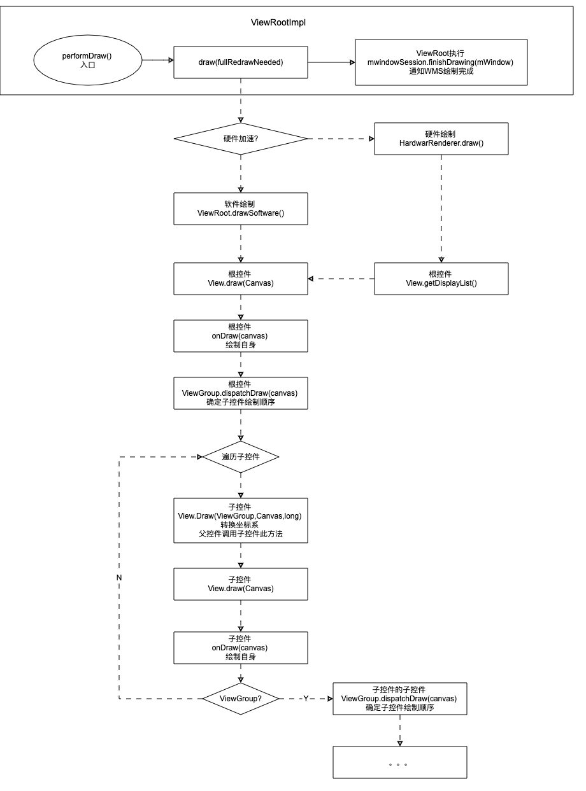

# Android view绘制流程

控件使用树形结构存储，遍历控件树，触发onDraw(),使用参数canvas APi进行绘制；

canvas哪来的：窗口添加后，有个surface（渲染缓冲区）。使用它可以创建canvas，绘制区域是整个窗口。通过坐标系转换和裁剪，转换成了view对应的canvas

怎么转换的：mesure流程确定宽高，layout流程确定位置。保存在每个控件的成员变量里面。绘制流程遍历控件树的时候，根据这些数据对canvas进行裁剪和坐标系转换

再讲讲 [绘制入口](#绘制入口) 


## 最难的问题


Window提供了一个canvas，绘制区域为整个窗口

测量流程确定view的尺寸

布局流程确定view的位置

根据尺寸与位置，对window提供的canvas进行坐标系转换、设置裁剪区域，可以得到view使用的canvas，即View.onDraw(canvas)参数。

绘制流程遍历view树，由根结点到叶子结点，依次执行View.onDraw()。

开发者复写View.onDraw()，使用转换后的canvas绘制界面

## 绘制入口

相关源码：[performTraversals() ](#performTraversals())

绘制流程的核心函数，onMeasure()、onLayout()、onDraw()都是在其执行过程中触发

- 准备阶段：搜集信息、执行view.post(runnable)

- 协商测量：窗口的尺寸需要根据mView改变(dialog)，由[measureHierarchy()](#measureHierarchy())实现。

  


## 预测量

相关源码：[measureHierarchy()](#measureHierarchy())

原因：窗口的尺寸需要根据mView改变(悬浮窗口dialog)

目的：判断控件树的尺寸==窗口尺寸，不一致则返回true，表示窗口需要重新布局


1、第一次window使用默认尺寸(系统配置文件有个默认值)

2、第二次：(系统默认宽度+宽口最大可用宽度)/2

3、第三次使用宽口最大可用宽度

## 测量流程

相关源码：[measure()](#measure())


三个流程类似，其余两个不画了。

### MeasureSpec

MeasureSpec表示的是一个32位的整形值，它的高2位表示测量模式SpecMode，低30位表示父控件的建议尺寸。

```java
 final int specMode = MeasureSpec.getMode(measureSpec);
 final int specSize = MeasureSpec.getSize(measureSpec);
```

25～30位放标识，eg：View.MEASURED_STATE_TOO_SMALL = 0x01000000，第25位=1

高8位是状态位：getMeasuredState()获取的就是状态位，其中高16位是宽度的，低16位是高度，即高度的状态位被>>16位


> - EXACTLY：view必须为SPEC_SIZE指定的尺寸
> - AT_MOST：view可以是任意尺寸，但不可以大于SPEC_SIZE。eg：WRAP_CONTENT
> - UNSPECIFIED：view测量时可以无视SPEC_SIZE，可以是任意的尺寸。eg：ScrollView

### FrameLayout的测量过程

相关源码：[onMeasure()](#onMeasure()) [resolveSizeAndState()](#resolveSizeAndState())

**childMeasuredState**

说明：所有的子控件状态位（高8位）或运算而来，用来决定本控件的状态位

问题：子控件AT_MOST、EXACTLY都有的话，会导致其31、32位都是1，然而这不属于MeasureSpec

测试：在frameLayout中添加多个TextView，任意修改各控件尺寸。

结果：MeasureSpec.getMode(getMeasuredHeightAndState())的结果永远为0（size是有的）

分析：TextView没管Spec_mode，ImageView则写死了为0.所以0|0=0.frameLayout的Spec_mode也一直是0

### 宽高的获取

1、LayoutParams：指定的尺寸。

​	对应```android:layout_width="100dp"```

2、View#getMeasuredHeight()/getMeasuredWidth() 测量的结果

测量流程后有效，setMeasuredDimension()保存的宽高

3、View#getWidth()/getHeight()

布局流程后有效，根据坐标算出来的，实际大小。


### 重载onMeasure原则

- 控件在进行测量时，控件需要将它的padding尺寸计算在内，因为padding是其尺寸的一部分。
- ViewGroup在进行测量时，需要将子控件的Margin尺寸计算在内。因为子控件的Margin尺寸是父控件尺寸的一部分。
- ViewGroup为子控件准备Measure Spec时，SPEC_MODE应取决于子控件的LayoutParams.width/height的取值。取值为MATCH_PARENT或一个确定的尺寸时应为EXACTLY，WRAP_CONTENT时应为AT_MOST。至于SPEC_SIZE，应理解为ViewGroup对子控件尺寸的限制，即ViewGroup按照其实际意图所允许子控件获得的最大尺寸。并且需要扣除子控件的Margin尺寸
- 虽然测量的目的在于确定尺寸，与位置无关。但是子控件的位置时ViewGroup进行预测量时必须首先考虑的。因为子控件的位置既决定了子控件可用的剩余尺寸，也决定了父控件的尺寸(当父控件的LayoutParams.width\height为WRAP_CONTENT时)
- 在测量结果中添加MEASURED_STATE_TOO_SMALL需要做到实事求是。当一个方向上的空间不足以显示其内容时应考虑利用另一个方向上的空间，例如对文字进行换行处理，因为添加这个标记有可能导致父控件对其进行重新测量从而降低效率。
- 当子控件的测量结果中包含MEASURE_STATE_TOO_SMALL标记时，只要有可能，父控件就应当调整给予子控件的MeasureSoec，并进行重新测量。倘如没有调整的余地。父控件也应当将MEASURE_STATE_TOO_SMALL加入自己的测量结果中，让它的父控件尝试进行调整。
- ViewGroup在测量子控件时必须调用子控件的measure(),而不能直接调用其onMeasure()方法。直接调用onMeasure()方法的最严重后果是子控件的PFLAG_LAYOUT_REQUIRED标识无法加入mPrivateFlag中，从而导致子控件无法进行布局。

## 布局流程

相关源码：[layout()](#layout())

入口：ViewRootImpl.performLayout()

View通过mLeft、mTop、mRight、mBottom成员变量保存坐标值；tip:相对父容器，非窗口坐标系。


## 绘制流程

相关源码：[performDraw()](#performDraw()) [draw(fullRedrawNeeded)](#draw(fullRedrawNeeded))




###  软件绘制

相关源码：[drawSoftware()](#drawSoftware()) [draw()](#draw())  [dispatchDraw()](#dispatchDraw())

> 1、mSurface// WMS.addView()时创建

> 2、Canvas canvas=mSurface.lockCanvas();// 获取一个以此surface为画布的canvas

> 3、mView.draw(canvas)；//使用canvas进行绘制，由根控件，沿控件树传递绘制流程

> 4、Surface.unlockCanvasAndPost(canvas)//显示绘制的内容到屏幕

图形库：Skia


### 硬件绘制

相关源码：[HardwareRenderer.draw()](#HardwareRenderer.draw())


**图形库**：openGL ES 2.0

**输出目标**：Android的Surface封装成的EGLSurface

**入口**：HardwareRenderer.draw(),抽象类，子类为[GLRenderer](https://android.googlesource.com/platform/frameworks/base/+/4c1d506d7bf803f4fb5f8146fe7f81c3488c3225/core/java/android/view/GLRenderer.java)，4.4之后可能是ThreadedRenderer

**信息传递流程**：Canvas(Java API) —> OpenGL(C/C++ Lib) —> 驱动程序 —> GPU。

- **DisplayList**

  DisplayList是一个基本绘制元素，包含元素原始属性（位置、尺寸、角度、透明度等），对应Canvas的drawXxx()方法。

- **RenderNode**

  一个RenderNode包含若干个DisplayList，通常一个RenderNode对应一个View，包含View自身及其子View的所有DisplayList。

- **HardwareCanvas**

  canvas子类，提供了诸如drawDisplayList()、drawHardwareLayer()等硬件加速特有操作。同时将Canvas类中的操作重定向到硬件加速图形库中

- **updateDisplayListIfDirty()**:去获得一张Canvas，用来记录绘制命令


### 坐标系转换

相关源码：[draw(ViewGroup,Canvas,long )](#draw(ViewGroup,Canvas,long ))

如何把父控件的canvas转换成，子控件的canvas

```java
	// 平移坐标系
	canvas.translate(X轴正方向移动距离，Y轴正方向移动距离)；
  //范围裁切，绘制范围会被限制在裁切范围内。
  canvas.clipRect(left, top, right, bottom); 
```

### 绘图缓存

ListView在滑动时，每个Item的内容不会发生改变。保存item的快照使用，则不需要对item进行绘制。

**软件绘制**：在View类中```Bitmap mDrawingCache;```保存了快照。

**硬件绘制**：todo

**应用**

```java
// 关闭绘制缓存
view.setLayerType(View.LAYER_TYPE_NONE,null);
// 开启绘制缓存，使用软件绘制
view.setLayerType(View.LAYER_TYPE_SOFTWARE,null);
// 开启绘制缓存，使用硬件绘制。如未开启硬件加速，则使用软件绘制
view.setLayerType(View.LAYER_TYPE_HARDWARE,null);
```


## Canvas 基础

**Canvas状态**

对画布进行转换（eg平移裁剪），一顿绘制后，想把画布再变成转换前的状态。

save()保存当前画布的状态，一顿绘制后，restore()恢复之前的状态

**Layer图层**

一个canvas链接一个bitmap，bitmap可以看成我们平时说的画布，最终的东西都是绘制在这上面的

每次调用drawXXX方法会生成一个新的透明layer,东西被绘制在layer上，然后最终会被绘制在bitmap上。

**savelayer()**会生成新的Bitmap和Canvas,然后再调用drawXX()也会生成新的layer，但这个layer会被绘制到新生成的Bitmap上，其他所有的rotate，clip等操作，都会作用在新的Canvas上（或者新指向的bitmap上），不会影响原始的Canvas和bitmap），直到调用restore函数，才会被最终绘制到原始Canvas连接的bitmap上。

| 函数             | 说明                                                         |
| ---------------- | ------------------------------------------------------------ |
| save()           | 把当前的画布的状态进行保存，然后放入Canvas状态栈中           |
| saveLayer()      | 类似save(),但会新建一个bitmap，后续的操作都会作用在这个bitmap上。直到restore()时,再合并到原始的bitmap上。 |
| saveLayerAlpha() | 类似saveLayer()，可以指定透明度                              |
| restore()        | 把栈中最顶层的画布状态取出来，并按照这个状态恢复当前的画布，并在这个画布上做画。 |
| restoreToCount() | 可指定取出栈顶第几个状态                                     |
| getSaveCount()   | 获取栈中保存的状态信息的个数，计算方式等于save()的次数减去restore的次数。一次没调用过save(),返回值为1，不是0； |

## requestLayout分析

**1、沿控件树回溯到ViewRootImpl#requestLayout() ,沿途标记脏区**

tip：根控件的mParent是ViewRootImpl。ViewRootImpl实现了ViewParent接口，在ViewRootImpl#setView()将根控件的mParent设置为ViewRoot。所以最终回溯到ViewRootImpl#requestLayout().

```java
// View函数，ViewGroup默认没有复写此方法，所以也是用这个
public void requestLayout() {
    if (mMeasureCache != null) mMeasureCache.clear();
    if (mAttachInfo != null && mAttachInfo.mViewRequestingLayout == null) {
        // 父控件正在进行布局
        ViewRootImpl viewRoot = getViewRootImpl();
        if (viewRoot != null && viewRoot.isInLayout()) {
            if (!viewRoot.requestLayoutDuringLayout(this)) {
                return;
            }
        }
        mAttachInfo.mViewRequestingLayout = this;
    }
		// 1、添加标记，将本控件设置为脏区
    mPrivateFlags |= PFLAG_FORCE_LAYOUT;// 需要重新布局
    mPrivateFlags |= PFLAG_INVALIDATED;// 标记脏区

    if (mParent != null && !mParent.isLayoutRequested()) {
      	// 2、控件树回溯到ViewRootImpl#requestLayout() 
        mParent.requestLayout();
    }
    if (mAttachInfo != null && mAttachInfo.mViewRequestingLayout == this) {
        mAttachInfo.mViewRequestingLayout = null;
    }
}
```

**2、修改mLayoutRequested标记，标示需要重新布局**

```java
// ViewRootImpl
@Override
public void requestLayout() {
    if (!mHandlingLayoutInLayoutRequest) {
        checkThread();// 检查执行线程必须是主线程
        mLayoutRequested = true;// 1、修改标记，标示需要重新布局
        scheduleTraversals();// 2、触发绘制，invalidate()也是使用此方法
    }
}
```

**3、将runnable添加到编舞者的队列中等待执行**

```java
// ViewRootImpl
// 待执行的runnable，run()执行doTraversal() ，最终调用 performTraversals();
final TraversalRunnable mTraversalRunnable = new TraversalRunnable();
// 请求&接收VSync 信号（硬件每 16 毫秒产一个）
Choreographer mChoreographer;
void scheduleTraversals() {
    if (!mTraversalScheduled) {
        mTraversalScheduled = true;
      	// 开启内存屏障，只让异步消息通过。目的是让异步消息先执行，
       	// Android 系统中的 UI 更新相关的消息即为异步消息，需要优先处理。
        mTraversalBarrier = mHandler.getLooper().getQueue().postSyncBarrier();
      	// runnbale会添加到编舞者的CallbackQueue[] mCallbackQueues;成员变量中
      	// 编舞者发送异步消息，使用的也是主线程的looper，即一个handler（不肯定）
        mChoreographer.postCallback(
          			// 当编舞者收到Vsync信号，会触发设置的Callback，runnable得到执行
                Choreographer.CALLBACK_TRAVERSAL, mTraversalRunnable, null);
        if (!mUnbufferedInputDispatch) {
            scheduleConsumeBatchedInput();
        }
        notifyRendererOfFramePending();
        pokeDrawLockIfNeeded();
    }
}
```

**4、runnable被执行，触发绘制入口函数 performTraversals();**

```java
void doTraversal() {
    if (mTraversalScheduled) {
        mTraversalScheduled = false;
      	// 移除同步屏障
        mHandler.getLooper().getQueue().removeSyncBarrier(mTraversalBarrier);
        if (mProfile) {
            Debug.startMethodTracing("ViewAncestor");
        }
				// 绘制入口函数得到执行
        performTraversals();
        if (mProfile) {
            Debug.stopMethodTracing();
            mProfile = false;
        }
    }
}
```

## invalidate与脏区

**1、触发绘制的流程**

与requestLayout()类似，回溯到ViewRootImpl#invalidateChildInParent(),会使用与requestLayout()相同的函数scheduleTraversals()，最终执行performTraversals()开始绘制。回溯的核心代码是ViewGroup#invalidateChild().

由于没有设置ViewRootImpl#mLayoutRequest标示，会跳过测量&布局流程，直接执行绘制

**2、脏区**

为保证绘制效率，控件树仅对需要重新绘制的区域（即脏区）进行绘制；

所以在向上回溯过程中，需要收集脏区信息，保存在ViewRoot成员变量```Rect mDirty``中

绘制时需要使用mDirty作为依据，创建canvas。

eg：软件绘制```canvas = mSurface.lockCanvas(dirty);```

**3、脏区的搜集**

一个子控件的颜色发生改变，用Rect描述脏区，**坐标系是此控件的**

⬇️传递Rect给父控件

父控件收到Rect，转换坐标系为本控件

⬇️传递Rect给父控件

。。。

⬇️传递Rect给父控件

根控件收到Rect，转换坐标系为本控件

⬇️传递Rect给父控件

ViewRoot收到Rect，转换坐标系为本控件，终止向上回溯，执行scheduleTraversals()开始绘制；

```java
    /**
     * 用Rect描述脏区，传递给父控件
     * View函数，invalidate()有多个重载，最终都会走这个方法
     * @param l 子控件坐标系，距离左
     * @param t 子控件坐标系，距离上
     * @param r 子控件坐标系，距离右
     * @param b 子控件坐标系，距离下
     * @param invalidateCache 绘制缓存清空，默认ture
     * @param fullInvalidate  完全重绘，默认ture
     */
void invalidateInternal(int l, int t, int r, int b, boolean invalidateCache,
        boolean fullInvalidate) {
    if (mGhostView != null) {
        mGhostView.invalidate(true);
        return;
    }
		//处理该子View不可见/处于动画中
    if (skipInvalidate()) {
        return;
    }
    // Reset content capture caches
    mCachedContentCaptureSession = null;
		// 判断是否需要重绘，不需要则流程到此结束，不再重绘。
    if ((mPrivateFlags & (PFLAG_DRAWN | PFLAG_HAS_BOUNDS)) == (PFLAG_DRAWN | PFLAG_HAS_BOUNDS)
            || (invalidateCache && (mPrivateFlags & PFLAG_DRAWING_CACHE_VALID) == PFLAG_DRAWING_CACHE_VALID)
            || (mPrivateFlags & PFLAG_INVALIDATED) != PFLAG_INVALIDATED
            || (fullInvalidate && isOpaque() != mLastIsOpaque)) {
      // 完全重绘  
      if (fullInvalidate) {
          	// 控件是否为“实心”，即无法透过此控件所属区域，看到此控件之下的内容。
            mLastIsOpaque = isOpaque();
            mPrivateFlags &= ~PFLAG_DRAWN;
        }
				// 添加脏区标识
        mPrivateFlags |= PFLAG_DIRTY;
				// 清除绘制缓存
        if (invalidateCache) {
            mPrivateFlags |= PFLAG_INVALIDATED;
            mPrivateFlags &= ~PFLAG_DRAWING_CACHE_VALID;
        }

        // 将脏区区域（Rect）传递给父容器
        final AttachInfo ai = mAttachInfo;
        final ViewParent p = mParent;
        if (p != null && ai != null && l < r && t < b) {
            final Rect damage = ai.mTmpInvalRect;// 重点：脏区的创建
            damage.set(l, t, r, b);// 左上右下描述矩形
            p.invalidateChild(this, damage);// 传给父控件
        }

        // Damage the entire projection receiver, if necessary.
        if (mBackground != null && mBackground.isProjected()) {
            final View receiver = getProjectionReceiver();
            if (receiver != null) {
                receiver.damageInParent();
            }
        }
    }
}
```


```java
    /**
     * ViewGroup的函数
     * @param child  请求重绘的子控件
     * @param dirty	 所有所属子控件的脏区
     */
public final void invalidateChild(View child, final Rect dirty) {
    final AttachInfo attachInfo = mAttachInfo;
  	// 如果开了硬件加速，另外处理
    if (attachInfo != null && attachInfo.mHardwareAccelerated) {
        onDescendantInvalidated(child, child);
        return;
    }

    ViewParent parent = this;
    if (attachInfo != null) {
        // 子控件正在绘制动画中，标识
        final boolean drawAnimation = (child.mPrivateFlags & PFLAG_DRAW_ANIMATION) != 0;

        // 子控件矩阵.
        Matrix childMatrix = child.getMatrix();
        if (child.mLayerType != LAYER_TYPE_NONE) {
            mPrivateFlags |= PFLAG_INVALIDATED;// 添加本控件脏区标识
            mPrivateFlags &= ~PFLAG_DRAWING_CACHE_VALID;// 清除本控件绘制缓存标识
        }

      	// 储存子View的mLeft和mTop值
        final int[] location = attachInfo.mInvalidateChildLocation;
        location[CHILD_LEFT_INDEX] = child.mLeft;
        location[CHILD_TOP_INDEX] = child.mTop;
      	// 下面这段应该是处理子控件不透明、正在动画或转换，对脏区需要一些处理
      	// isIdentity():判断当前矩阵是否为单位矩阵。
        if (!childMatrix.isIdentity() ||
                (mGroupFlags & ViewGroup.FLAG_SUPPORT_STATIC_TRANSFORMATIONS) != 0) {
            RectF boundingRect = attachInfo.mTmpTransformRect;
            boundingRect.set(dirty);
            Matrix transformMatrix;
            if ((mGroupFlags & ViewGroup.FLAG_SUPPORT_STATIC_TRANSFORMATIONS) != 0) {
                Transformation t = attachInfo.mTmpTransformation;
                boolean transformed = getChildStaticTransformation(child, t);
                if (transformed) {
                    transformMatrix = attachInfo.mTmpMatrix;
                    transformMatrix.set(t.getMatrix());
                    if (!childMatrix.isIdentity()) {
                        transformMatrix.preConcat(childMatrix);
                    }
                } else {
                    transformMatrix = childMatrix;
                }
            } else {
                transformMatrix = childMatrix;
            }
            transformMatrix.mapRect(boundingRect);
            dirty.set((int) Math.floor(boundingRect.left),
                    (int) Math.floor(boundingRect.top),
                    (int) Math.ceil(boundingRect.right),
                    (int) Math.ceil(boundingRect.bottom));
        }
/*====================下面核心：沿控件树回溯知道ViewRoot，同时整合脏区======================*/
        do {
            View view = null;
            if (parent instanceof View) {
              	// 父控件如不是View，就是ViewRootImpl
                view = (View) parent;
            }
          	// 下面开始View与parent都是指父控件，同一个
						// 正在动画
            if (drawAnimation) {
                if (view != null) {
                    view.mPrivateFlags |= PFLAG_DRAW_ANIMATION;
                } else if (parent instanceof ViewRootImpl) {
                    ((ViewRootImpl) parent).mIsAnimating = true;
                }
            }

            // 处理脏区标识
            if (view != null) {
                if ((view.mPrivateFlags & PFLAG_DIRTY_MASK) != PFLAG_DIRTY) {
                    view.mPrivateFlags = (view.mPrivateFlags & ~PFLAG_DIRTY_MASK) | PFLAG_DIRTY;
                }
            }
						// 继续向父容器回溯
          	// 1、parent的父控件是ViewGroup
          	// 返回parent的父控件，然后继续回溯。执行ViewGroup#invalidateChildInParent()
          	// 功能：offset()把脏区坐标系转成父控件的；union()把脏区与父控件的区域求并集
          	// 2、parent的父控件是ViewRoot
          	// 返回null，终止回溯，触发绘制入口函数，具体下面分析
            parent = parent.invalidateChildInParent(location, dirty);
          	// 此时parent是父父控件
            if (view != null) {
                // view是父控件，正常不会是null，下面处理父控件的脏区
                Matrix m = view.getMatrix();// 父控件的矩阵
                if (!m.isIdentity()) {
                  	// attachInfo：View.AttachInfo;这个是当前控件的attachInfo
                  	// mTmpTransformRect:RectF，
                    RectF boundingRect = attachInfo.mTmpTransformRect;
                    boundingRect.set(dirty);// Rect转成RectF
                  // 用父控件的矩阵转换boundingRect，并把结果放入boundingRect，即boundingRect改变了
                    m.mapRect(boundingRect);
                  	// 再把boundingRect的结果赋给dirty，到这里dirty的坐标系应该是父控件的了
                    dirty.set((int) Math.floor(boundingRect.left),
                            (int) Math.floor(boundingRect.top),
                            (int) Math.ceil(boundingRect.right),
                            (int) Math.ceil(boundingRect.bottom));
                }
            }
          // 向上回溯到父父控件是ViewRoot，parent会是null，回溯过程终止
        } while (parent != null);
    }
}
```


```java
// ViewRootImpl函数
@Override
public ViewParent invalidateChildInParent(int[] location, Rect dirty) {
    checkThread();// 调用必须主线程
    if (dirty == null) {
        invalidate();// 触发绘制，脏区为全部
        return null;
    } else if (dirty.isEmpty() && !mIsAnimating) {
        return null;
    }
		// 处理滚动偏移，略
    if (mCurScrollY != 0 || mTranslator != null) {
        mTempRect.set(dirty);
        dirty = mTempRect;
        if (mCurScrollY != 0) {
            dirty.offset(0, -mCurScrollY);
        }
        if (mTranslator != null) {
            mTranslator.translateRectInAppWindowToScreen(dirty);
        }
        if (mAttachInfo.mScalingRequired) {
            dirty.inset(-1, -1);
        }
    }
		// 进行下一步
  	// 1、与已有的脏区求并集
  	// 2、触发绘制，执行scheduleTraversals();
    invalidateRectOnScreen(dirty);
		// 一定会返回null，终止回溯过程
    return null;
}
```


## ViewRootImpl

创建于WindowManagerGlobal.addView()中,

| 成员变量                                   | 作用                                                         |
| ------------------------------------------ | ------------------------------------------------------------ |
| IWindowSession mWindowSession              | ViewRootImpl和WMS进行通信的代理                              |
| Thread mThread                             | 创建ViewRoot的线程，即UI线程。在处理控件树的请求时（eg：重新布局、请求重绘、改变焦点等），会检查发起请求的thread与这个mThread是否相同。倘如不同则会拒绝这个请求并抛出异常 |
| Rect mDirty                                | 用于收集窗口中的无效区域，即需要进行重绘的区域。eg：TextView文字发生改变，TextView会将自己的区域标记为无效区域，并通过invalidate()将这块区域添加到此mDirty中。当下次重绘事，TextView便可以将新的文字绘制在这块区域上 |
| Rect mWinFrame                             | 描述当前窗口的位置和大小。与WMS中的WindowState.mFrame保持一致 |
| W mWindow                                  | W是IWindow.Stub的子类。作为WMS中新窗口的ID，并接收来自WMS的回调 |
| View.AttachInfo mAttachInfo                | 储存控件树依附的窗口信息，控件树中每个view会将这个对象保存在自己mAttachInfo中。信息包含：WindowSession，窗口实例(即mWindow)、ViewRootImpl实例、窗口所属的Display、窗口的Surface、窗口在屏幕上的位置等。 |
| Choreographer mChoreographer               | 请求接收VSync 信号，硬件每 16 毫秒产一个 VSync 信号，刷新屏幕 |
| ViewRootHandler mHandler                   | 主线程的Handler，安排其他线程事件在主线程上执行。eg：mWindow引发的回调（WMS的事件），处理view.post(runnable) |
| Surface mSurface                           | mSurface.lockCanvas()得canvas，存储在共享内存，app创建空壳，WMS创建内容，然后拷贝回给壳的outSurface变量 |
| View mView                                 | 根view。eg：DecorView，Activity 中的顶级 View                |
|                                            |                                                              |
|                                            |                                                              |
| Display mDisplay                           | 保存Display，在后面的serView()时会把窗口添加到这个Display上  |
| FallbackEventHandler mFallbackEventHandler | 处理未经任何人消费的输入事件的场所（事件派发）               |


WindowManagerGlobal:进程单例，存储所有 Window 所对应的 ViewRootImpl

### performTraversals() 

```java
// api 29
// 保存需要提供给View的信息
View.AttachInfo mAttachInfo;
private void performTraversals() {
  	/*===================准备阶段=======================*/
    // 将mView保存在局部变量host中，以此提高访问效率
    final View host = mView;// 根view。eg：DecorView，Activity 中的顶级 View
    if (host == null || !mAdded)
        return;

    mIsInTraversal = true;
    mWillDrawSoon = true;
  	// window需要改变尺寸
    boolean windowSizeMayChange = false;
    boolean surfaceChanged = false;
    WindowManager.LayoutParams lp = mWindowAttributes;
		// 窗口的尺寸， mView测量时，SPEC_SIZE分量的候选（MeasureSpec中的数）
    int desiredWindowWidth;
    int desiredWindowHeight;

    final int viewVisibility = getHostVisibility();
  	// 窗口可见性发生改变没
    final boolean viewVisibilityChanged = !mFirst
            && (mViewVisibility != viewVisibility || mNewSurfaceNeeded
            || mAppVisibilityChanged);
    mAppVisibilityChanged = false;
    final boolean viewUserVisibilityChanged = !mFirst &&
            ((mViewVisibility == View.VISIBLE) != (viewVisibility == View.VISIBLE));
		
    WindowManager.LayoutParams params = null;
    if (mWindowAttributesChanged) {
        mWindowAttributesChanged = false;
        surfaceChanged = true;
        params = lp;
    }
    CompatibilityInfo compatibilityInfo =
            mDisplay.getDisplayAdjustments().getCompatibilityInfo();
    if (compatibilityInfo.supportsScreen() == mLastInCompatMode) {
        params = lp;
        mFullRedrawNeeded = true;
        mLayoutRequested = true;
        if (mLastInCompatMode) {
            params.privateFlags &= ~WindowManager.LayoutParams.PRIVATE_FLAG_COMPATIBLE_WINDOW;
            mLastInCompatMode = false;
        } else {
            params.privateFlags |= WindowManager.LayoutParams.PRIVATE_FLAG_COMPATIBLE_WINDOW;
            mLastInCompatMode = true;
        }
    }

    mWindowAttributesChangesFlag = 0;

  	// 描述当前窗口的位置和大小。与WMS中的WindowState.mFrame保持一致
    Rect frame = mWinFrame;
    if (mFirst) {
      	// 第一次执行，此时窗口刚刚被添加到WMS
      	// 将窗口信息填充进mAttachInfo，然后mView发起dispatchAttachedToWindow（mAttachInfo）
      	// mAttachInfo会被传递给每个view，同时触发onAttachedToWindow()回调
        mFullRedrawNeeded = true;
        mLayoutRequested = true;
				// 用于描述手机设备上的配置信息,可获取屏幕尺寸
        final Configuration config = mContext.getResources().getConfiguration();
      	// 获取窗口的尺寸
        if (shouldUseDisplaySize(lp)) {
            // NOTE -- system code, won't try to do compat mode.
            Point size = new Point();
            mDisplay.getRealSize(size);
            desiredWindowWidth = size.x;
            desiredWindowHeight = size.y;
        } else {
            desiredWindowWidth = mWinFrame.width();
            desiredWindowHeight = mWinFrame.height();
        }
      	// 搜集需要传递给View的信息
        mAttachInfo.mUse32BitDrawingCache = true;
        mAttachInfo.mWindowVisibility = viewVisibility;
        mAttachInfo.mRecomputeGlobalAttributes = false;
        mLastConfigurationFromResources.setTo(config);
        mLastSystemUiVisibility = mAttachInfo.mSystemUiVisibility;
        // 设置根控件layout方向（横竖）
        if (mViewLayoutDirectionInitial == View.LAYOUT_DIRECTION_INHERIT) {
            host.setLayoutDirection(config.getLayoutDirection());
        }
      	// view与window绑定，触发onAttachedToWindow()回调
        host.dispatchAttachedToWindow(mAttachInfo, 0);
        mAttachInfo.mTreeObserver.dispatchOnWindowAttachedChange(true);
        dispatchApplyInsets(host);// 处理状态栏、底部导航栏等
    } else {
      	// 非第一次遍历，采用窗口的最新尺寸
        desiredWindowWidth = frame.width();
        desiredWindowHeight = frame.height();
        if (desiredWindowWidth != mWidth || desiredWindowHeight != mHeight) {
          	// 窗口尺寸！=ViewRootImpl尺寸，即WMS改变了窗口尺寸
            mFullRedrawNeeded = true;// 需要进行完整的重绘以适应新的窗口尺寸
            mLayoutRequested = true;// 需要对控件树进行重新布局
            windowSizeMayChange = true;//控件树有可能拒绝接受新的窗口尺寸，如发生window需要设置新尺寸
        }
    }
		// 处理视图可见性发生了改变
    if (viewVisibilityChanged) {
        mAttachInfo.mWindowVisibility = viewVisibility;
        host.dispatchWindowVisibilityChanged(viewVisibility);
        if (viewUserVisibilityChanged) {
            host.dispatchVisibilityAggregated(viewVisibility == View.VISIBLE);
        }
        if (viewVisibility != View.VISIBLE || mNewSurfaceNeeded) {
            endDragResizing();
            destroyHardwareResources();
        }
        if (viewVisibility == View.GONE) {
            mHasHadWindowFocus = false;
        }
    }
    if (mAttachInfo.mWindowVisibility != View.VISIBLE) {
        host.clearAccessibilityFocus();
    }

    /*
    	RunQeueue是ViewRootImpl的静态成员，即进程唯一。view.post()/postDelay()就是将runnable添加进这			个队列，然后在此处通过mHandler执行
    */
    getRunQueue().executeActions(mAttachInfo.mHandler);

    boolean insetsChanged = false;

  	/*===================预测量阶段=======================*/
  	// 1、layoutRequested==true，表示requestLayout()被调用了，需要重新进行测量和布局
    boolean layoutRequested = mLayoutRequested && (!mStopped || mReportNextDraw);
    if (layoutRequested) {
        final Resources res = mView.getContext().getResources();
        if (mFirst) {
          	// 确认view树进入触控模式
            mAttachInfo.mInTouchMode = !mAddedTouchMode;
            ensureTouchModeLocally(mAddedTouchMode);
        } else {
            if (!mPendingOverscanInsets.equals(mAttachInfo.mOverscanInsets)) {
                insetsChanged = true;
            }
          	// mContentInsets：描述控件在布局时必须预留的空间（状态栏）
            if (!mPendingContentInsets.equals(mAttachInfo.mContentInsets)) {
                insetsChanged = true;// 进行布局流程条件之一
            }
            if (!mPendingStableInsets.equals(mAttachInfo.mStableInsets)) {
                insetsChanged = true;
            }
            if (!mPendingDisplayCutout.equals(mAttachInfo.mDisplayCutout)) {
                insetsChanged = true;
            }
          	// mVisibleInsets：描述被遮挡的空间
            if (!mPendingVisibleInsets.equals(mAttachInfo.mVisibleInsets)) {
                mAttachInfo.mVisibleInsets.set(mPendingVisibleInsets);
                if (DEBUG_LAYOUT) Log.v(mTag, "Visible insets changing to: "
                        + mAttachInfo.mVisibleInsets);
            }
            if (!mPendingOutsets.equals(mAttachInfo.mOutsets)) {
                insetsChanged = true;
            }
            if (mPendingAlwaysConsumeSystemBars != mAttachInfo.mAlwaysConsumeSystemBars) {
                insetsChanged = true;
            }
          	// 宽|高为WRAP_Content，说明这是悬浮窗口。
          	// 控件树的测量结果将决定窗口的尺寸，后续中会改变窗口的尺寸
            if (lp.width == ViewGroup.LayoutParams.WRAP_CONTENT
                    || lp.height == ViewGroup.LayoutParams.WRAP_CONTENT) {
                windowSizeMayChange = true;// 可能需要向WMS申请改变窗口的尺寸
								// 设置候选尺寸
                if (shouldUseDisplaySize(lp)) {
                    Point size = new Point();
                    mDisplay.getRealSize(size);
                    desiredWindowWidth = size.x;
                    desiredWindowHeight = size.y;
                } else {
                    Configuration config = res.getConfiguration();
                    desiredWindowWidth = dipToPx(config.screenWidthDp);
                    desiredWindowHeight = dipToPx(config.screenHeightDp);
                }
            }
        }

        // 进行预测量1
        windowSizeMayChange |= measureHierarchy(host, lp, res,
                desiredWindowWidth, desiredWindowHeight);
    }

    if (collectViewAttributes()) {
        params = lp;// params：window的LayoutParams
    }
    if (mAttachInfo.mForceReportNewAttributes) {
        mAttachInfo.mForceReportNewAttributes = false;
        params = lp;
    }
		// mAttachInfo.mViewVisibilityChanged:mView的可见性发生了改变
    if (mFirst || mAttachInfo.mViewVisibilityChanged) {
        mAttachInfo.mViewVisibilityChanged = false;
      	// 软键盘模式
        int resizeMode = mSoftInputMode &
          			// SOFT_INPUT_MASK_ADJUST：窗口应当主动调整，以适应软输入窗口。
                WindowManager.LayoutParams.SOFT_INPUT_MASK_ADJUST;
        if (resizeMode == WindowManager.LayoutParams.SOFT_INPUT_ADJUST_UNSPECIFIED) {
          	// 未指定状态，系统将根据窗口内容尝试选择一个输入法样式。
            final int N = mAttachInfo.mScrollContainers.size();
            for (int i=0; i<N; i++) {
                if (mAttachInfo.mScrollContainers.get(i).isShown()) {
                  	// SOFT_INPUT_ADJUST_RESIZE：当输入法显示时，允许窗口重新计算尺寸，
                  	// 使内容不被输入法所覆盖。不可与SOFT_INPUT_ADJUSP_PAN混合使用；
                  	// 如果两个都没有设置，系统将根据窗口内容自动设置一个选项。
                    resizeMode = WindowManager.LayoutParams.SOFT_INPUT_ADJUST_RESIZE;
                }
            }
            if (resizeMode == 0) {
              	// SOFT_INPUT_ADJUST_PAN= 0x20
              	// 输入法显示时平移窗口。它不需要处理尺寸变化，框架能够移动窗口以确保输入焦点可见。
              	// 不可与SOFT_INPUT_ADJUST_RESIZE混合使用；
              	// 如果两个都没有设置，系统将根据窗口内容自动设置一个选项。
                resizeMode = WindowManager.LayoutParams.SOFT_INPUT_ADJUST_PAN;
            }
            if ((lp.softInputMode &
                    WindowManager.LayoutParams.SOFT_INPUT_MASK_ADJUST) != resizeMode) {
                lp.softInputMode = (lp.softInputMode &
                        ~WindowManager.LayoutParams.SOFT_INPUT_MASK_ADJUST) |
                        resizeMode;
                params = lp; // 设置window的LayoutParams
            }
        }
    }

    if (params != null) {
      	// 窗口背景
        if ((host.mPrivateFlags & View.PFLAG_REQUEST_TRANSPARENT_REGIONS) != 0) {
            if (!PixelFormat.formatHasAlpha(params.format)) {
                params.format = PixelFormat.TRANSLUCENT; // 背景设置成透明
            }
        }
      	// activity 是否能在status bar 底部绘制
        mAttachInfo.mOverscanRequested = (params.flags
                & WindowManager.LayoutParams.FLAG_LAYOUT_IN_OVERSCAN) != 0;
    }
		// 对应fitSystemWindows，处理系统ui（状态）与控件遮挡
    if (mApplyInsetsRequested) {
        mApplyInsetsRequested = false;
        mLastOverscanRequested = mAttachInfo.mOverscanRequested;
        dispatchApplyInsets(host);
        if (mLayoutRequested) {
            // 调用requestFitSystemWindows()可能会引起window重新布局
            windowSizeMayChange |= measureHierarchy(host, lp,
                    mView.getContext().getResources(),
                    desiredWindowWidth, desiredWindowHeight);
        }
    }

    if (layoutRequested) {
        //重置requestLayout()标记
        mLayoutRequested = false;
    }
		// 确定窗口是否需要改变尺寸
  	// layoutRequested被重置了，为什么会变成true？答：注意重置的是成员变量
  	// windowSizeMayChange==true：WMS改变了窗口尺寸/当前窗口为悬浮窗口
    boolean windowShouldResize = layoutRequested && windowSizeMayChange
        && ((mWidth != host.getMeasuredWidth() || mHeight != host.getMeasuredHeight())
            || (lp.width == ViewGroup.LayoutParams.WRAP_CONTENT &&
                    frame.width() < desiredWindowWidth && frame.width() != mWidth)
            || (lp.height == ViewGroup.LayoutParams.WRAP_CONTENT &&
                    frame.height() < desiredWindowHeight && frame.height() != mHeight));
    windowShouldResize |= mDragResizing && mResizeMode == RESIZE_MODE_FREEFORM;
    windowShouldResize |= mActivityRelaunched;
    final boolean computesInternalInsets =
            mAttachInfo.mTreeObserver.hasComputeInternalInsetsListeners()
            || mAttachInfo.mHasNonEmptyGivenInternalInsets;

    boolean insetsPending = false;
    int relayoutResult = 0;
    boolean updatedConfiguration = false;
		// 记录surface版本号，每当WMS为窗口重新分配Surface时，会使版本号增加
  	// 用于判断Surface重新设置到HardwareRender&需要进行一次完整的绘制
    final int surfaceGenerationId = mSurface.getGenerationId();

    final boolean isViewVisible = viewVisibility == View.VISIBLE;
    final boolean windowRelayoutWasForced = mForceNextWindowRelayout;
    boolean surfaceSizeChanged = false;

  	// 布局窗口，改变窗口的尺寸
    if (mFirst || windowShouldResize || insetsChanged ||
            viewVisibilityChanged || params != null || mForceNextWindowRelayout) {
        mForceNextWindowRelayout = false;

        if (isViewVisible) {
            insetsPending = computesInternalInsets && (mFirst || viewVisibilityChanged);
        }

        if (mSurfaceHolder != null) {
            mSurfaceHolder.mSurfaceLock.lock();
            mDrawingAllowed = true;
        }

        boolean hwInitialized = false;
        boolean contentInsetsChanged = false;
     		// 记录下布局窗口之前是否拥有一块有效的Surface
      	// 布局完成后以此判断，是否初始化|销毁用于绘制的HardwareRender
        boolean hadSurface = mSurface.isValid();

        try {
            if (mAttachInfo.mThreadedRenderer != null) {
                if (mAttachInfo.mThreadedRenderer.pause()) {
                    mDirty.set(0, 0, mWidth, mHeight);
                }
              	// 接收Vysnc信号的，告诉它视图重新布局了
                mChoreographer.mFrameInfo.addFlags(FrameInfo.FLAG_WINDOW_LAYOUT_CHANGED);
            }
          	// binder代理，对应WMS.relayoutWindow(),改变了窗口尺寸
            relayoutResult = relayoutWindow(params, viewVisibility, insetsPending);
            if (!mPendingMergedConfiguration.equals(mLastReportedMergedConfiguration)) {
                if (DEBUG_CONFIGURATION) Log.v(mTag, "Visible with new config: "
                        + mPendingMergedConfiguration.getMergedConfiguration());
                performConfigurationChange(mPendingMergedConfiguration, !mFirst,
                        INVALID_DISPLAY /* same display */);
                updatedConfiguration = true;
            }
          	// 下面很长一段是处理系统UI的
            final boolean overscanInsetsChanged = !mPendingOverscanInsets.equals(
                    mAttachInfo.mOverscanInsets);
            contentInsetsChanged = !mPendingContentInsets.equals(
                    mAttachInfo.mContentInsets);
            final boolean visibleInsetsChanged = !mPendingVisibleInsets.equals(
                    mAttachInfo.mVisibleInsets);
            final boolean stableInsetsChanged = !mPendingStableInsets.equals(
                    mAttachInfo.mStableInsets);
            final boolean cutoutChanged = !mPendingDisplayCutout.equals(
                    mAttachInfo.mDisplayCutout);
            final boolean outsetsChanged = !mPendingOutsets.equals(mAttachInfo.mOutsets);
            surfaceSizeChanged = (relayoutResult
                    & WindowManagerGlobal.RELAYOUT_RES_SURFACE_RESIZED) != 0;
            surfaceChanged |= surfaceSizeChanged;
            final boolean alwaysConsumeSystemBarsChanged =
                    mPendingAlwaysConsumeSystemBars != mAttachInfo.mAlwaysConsumeSystemBars;
            final boolean colorModeChanged = hasColorModeChanged(lp.getColorMode());
            if (contentInsetsChanged) {
                mAttachInfo.mContentInsets.set(mPendingContentInsets);
            }
            if (overscanInsetsChanged) {
                mAttachInfo.mOverscanInsets.set(mPendingOverscanInsets);
                if (DEBUG_LAYOUT) Log.v(mTag, "Overscan insets changing to: "
                        + mAttachInfo.mOverscanInsets);
                // Need to relayout with content insets.
                contentInsetsChanged = true;
            }
            if (stableInsetsChanged) {
                mAttachInfo.mStableInsets.set(mPendingStableInsets);
                if (DEBUG_LAYOUT) Log.v(mTag, "Decor insets changing to: "
                        + mAttachInfo.mStableInsets);
                // Need to relayout with content insets.
                contentInsetsChanged = true;
            }
            if (cutoutChanged) {
                mAttachInfo.mDisplayCutout.set(mPendingDisplayCutout);
                if (DEBUG_LAYOUT) {
                    Log.v(mTag, "DisplayCutout changing to: " + mAttachInfo.mDisplayCutout);
                }
                // Need to relayout with content insets.
                contentInsetsChanged = true;
            }
            if (alwaysConsumeSystemBarsChanged) {
                mAttachInfo.mAlwaysConsumeSystemBars = mPendingAlwaysConsumeSystemBars;
                contentInsetsChanged = true;
            }
            if (contentInsetsChanged || mLastSystemUiVisibility !=
                    mAttachInfo.mSystemUiVisibility || mApplyInsetsRequested
                    || mLastOverscanRequested != mAttachInfo.mOverscanRequested
                    || outsetsChanged) {
                mLastSystemUiVisibility = mAttachInfo.mSystemUiVisibility;
                mLastOverscanRequested = mAttachInfo.mOverscanRequested;
                mAttachInfo.mOutsets.set(mPendingOutsets);
                mApplyInsetsRequested = false;
                dispatchApplyInsets(host);
                // We applied insets so force contentInsetsChanged to ensure the
                // hierarchy is measured below.
                contentInsetsChanged = true;
            }
            if (visibleInsetsChanged) {
                mAttachInfo.mVisibleInsets.set(mPendingVisibleInsets);
                if (DEBUG_LAYOUT) Log.v(mTag, "Visible insets changing to: "
                        + mAttachInfo.mVisibleInsets);
            }
            if (colorModeChanged && mAttachInfo.mThreadedRenderer != null) {
                mAttachInfo.mThreadedRenderer.setWideGamut(
                        lp.getColorMode() == ActivityInfo.COLOR_MODE_WIDE_COLOR_GAMUT);
            }
						// 处理Surface在窗口布局过程中的变化（仅硬件加速开始需要，软件不需要考虑此问题）
            if (!hadSurface) {
                if (mSurface.isValid()) {
                  	// 无有效surface，eg：窗口第一次初始化|从不可见变为可见
                    mFullRedrawNeeded = true;
                    mPreviousTransparentRegion.setEmpty();
                    if (mAttachInfo.mThreadedRenderer != null) {
                      	// 此窗口开启了硬件加速
                        try {
                          	// surface重新设置给HardwareRenderer，至此surface变为可用
                            hwInitialized = mAttachInfo.mThreadedRenderer.initialize(
                                    mSurface);
                            if (hwInitialized && (host.mPrivateFlags
                                    & View.PFLAG_REQUEST_TRANSPARENT_REGIONS) == 0) {
                                mAttachInfo.mThreadedRenderer.allocateBuffers();
                            }
                        } catch (OutOfResourcesException e) {
                            handleOutOfResourcesException(e);
                            return;
                        }
                    }
                }
            } else if (!mSurface.isValid()) {
                // 布局窗口前有有效的Surface。eg：窗口由可见变为不可见
                if (mLastScrolledFocus != null) {
                    mLastScrolledFocus.clear();
                }
                mScrollY = mCurScrollY = 0;
                if (mView instanceof RootViewSurfaceTaker) {
                    ((RootViewSurfaceTaker) mView).onRootViewScrollYChanged(mCurScrollY);
                }
                if (mScroller != null) {
                    mScroller.abortAnimation();
                }
                // Our surface is gone
                if (mAttachInfo.mThreadedRenderer != null &&
                        mAttachInfo.mThreadedRenderer.isEnabled()) {
                  	// 销毁Hardware，之后不需要绘制了
                    mAttachInfo.mThreadedRenderer.destroy();
                }
              // 至此surface变为不可用
            } else if ((surfaceGenerationId != mSurface.getGenerationId()
                    || surfaceSizeChanged || windowRelayoutWasForced || colorModeChanged)
                    && mSurfaceHolder == null
                    && mAttachInfo.mThreadedRenderer != null) {
              	// 经过窗口布局后，surface发生了改变
                mFullRedrawNeeded = true;
                try {
                  	// 将Hardware与surface重新绑定
                    mAttachInfo.mThreadedRenderer.updateSurface(mSurface);
                } catch (OutOfResourcesException e) {
                    handleOutOfResourcesException(e);
                    return;
                }
            }

            final boolean freeformResizing = (relayoutResult
                    & WindowManagerGlobal.RELAYOUT_RES_DRAG_RESIZING_FREEFORM) != 0;
            final boolean dockedResizing = (relayoutResult
                    & WindowManagerGlobal.RELAYOUT_RES_DRAG_RESIZING_DOCKED) != 0;
            final boolean dragResizing = freeformResizing || dockedResizing;
            if (mDragResizing != dragResizing) {
                if (dragResizing) {
                    mResizeMode = freeformResizing
                            ? RESIZE_MODE_FREEFORM
                            : RESIZE_MODE_DOCKED_DIVIDER;
                    final boolean backdropSizeMatchesFrame =
                            mWinFrame.width() == mPendingBackDropFrame.width()
                                    && mWinFrame.height() == mPendingBackDropFrame.height();
                    // TODO: Need cutout?
                    startDragResizing(mPendingBackDropFrame, !backdropSizeMatchesFrame,
                            mPendingVisibleInsets, mPendingStableInsets, mResizeMode);
                } else {
                    // We shouldn't come here, but if we come we should end the resize.
                    endDragResizing();
                }
            }
            if (!mUseMTRenderer) {
                if (dragResizing) {
                    mCanvasOffsetX = mWinFrame.left;
                    mCanvasOffsetY = mWinFrame.top;
                } else {
                    mCanvasOffsetX = mCanvasOffsetY = 0;
                }
            }
        } catch (RemoteException e) {
        }
				/* ======================= 窗口布局完成 ========================*/
      	// 保存窗口的位置与尺寸
        mAttachInfo.mWindowLeft = frame.left;
        mAttachInfo.mWindowTop = frame.top;
        if (mWidth != frame.width() || mHeight != frame.height()) {
            mWidth = frame.width();
            mHeight = frame.height();
        }
				// 处理窗口的surface
        if (mSurfaceHolder != null) {
            if (mSurface.isValid()) {
                mSurfaceHolder.mSurface = mSurface;
            }
            mSurfaceHolder.setSurfaceFrameSize(mWidth, mHeight);
            mSurfaceHolder.mSurfaceLock.unlock();
            if (mSurface.isValid()) {
                if (!hadSurface) {
                    mSurfaceHolder.ungetCallbacks();
                    mIsCreating = true;
                    SurfaceHolder.Callback callbacks[] = mSurfaceHolder.getCallbacks();
                    if (callbacks != null) {
                        for (SurfaceHolder.Callback c : callbacks) {
                            c.surfaceCreated(mSurfaceHolder);
                        }
                    }
                    surfaceChanged = true;
                }
                if (surfaceChanged || surfaceGenerationId != mSurface.getGenerationId()) {
                    SurfaceHolder.Callback callbacks[] = mSurfaceHolder.getCallbacks();
                    if (callbacks != null) {
                        for (SurfaceHolder.Callback c : callbacks) {
                            c.surfaceChanged(mSurfaceHolder, lp.format,
                                    mWidth, mHeight);
                        }
                    }
                }
                mIsCreating = false;
            } else if (hadSurface) {
                notifySurfaceDestroyed();
                mSurfaceHolder.mSurfaceLock.lock();
                try {
                    mSurfaceHolder.mSurface = new Surface();
                } finally {
                    mSurfaceHolder.mSurfaceLock.unlock();
                }
            }
        }
				// 更新尺寸信息到HardwareRenderer
        final ThreadedRenderer threadedRenderer = mAttachInfo.mThreadedRenderer;
        if (threadedRenderer != null && threadedRenderer.isEnabled()) {
            if (hwInitialized
                    || mWidth != threadedRenderer.getWidth()
                    || mHeight != threadedRenderer.getHeight()
                    || mNeedsRendererSetup) {
                threadedRenderer.setup(mWidth, mHeight, mAttachInfo,
                        mWindowAttributes.surfaceInsets);
                mNeedsRendererSetup = false;
            }
        }

        if (!mStopped || mReportNextDraw) {
          	// 窗口布局会影响触控事件
            boolean focusChangedDueToTouchMode = ensureTouchModeLocally(
                    (relayoutResult&WindowManagerGlobal.RELAYOUT_RES_IN_TOUCH_MODE) != 0);
            if (focusChangedDueToTouchMode || mWidth != host.getMeasuredWidth()
                    || mHeight != host.getMeasuredHeight() || contentInsetsChanged ||
                    updatedConfiguration) {
              	// 最新的窗口尺寸还是不符合预测测量结果
                int childWidthMeasureSpec = getRootMeasureSpec(mWidth, lp.width);
                int childHeightMeasureSpec = getRootMeasureSpec(mHeight, lp.height);
              
  	/*==============================测量阶段===========================================*/
                 // 使用最新的窗口尺寸，进行最终测量
                performMeasure(childWidthMeasureSpec, childHeightMeasureSpec);

                // 最终测量的结果
                int width = host.getMeasuredWidth();
                int height = host.getMeasuredHeight();
                boolean measureAgain = false;
								// 需要按比例拉伸时，还需要重新测量一次( android:layout_weight="1")
                if (lp.horizontalWeight > 0.0f) {
                    width += (int) ((mWidth - width) * lp.horizontalWeight);
                    childWidthMeasureSpec = MeasureSpec.makeMeasureSpec(width,
                            MeasureSpec.EXACTLY);
                    measureAgain = true;
                }
                if (lp.verticalWeight > 0.0f) {
                    height += (int) ((mHeight - height) * lp.verticalWeight);
                    childHeightMeasureSpec = MeasureSpec.makeMeasureSpec(height,
                            MeasureSpec.EXACTLY);
                    measureAgain = true;
                }
                if (measureAgain) {
                  	// 拉伸后，再测量一遍
                    performMeasure(childWidthMeasureSpec, childHeightMeasureSpec);
                }
                layoutRequested = true;
            }
        }
    } else {
        maybeHandleWindowMove(frame);
    }

    if (surfaceSizeChanged) {
        updateBoundsSurface();
    }
   	/*==============================布局阶段===========================================*/
		// 开始布局阶段
    final boolean didLayout = layoutRequested && (!mStopped || mReportNextDraw);
    boolean triggerGlobalLayoutListener = didLayout
            || mAttachInfo.mRecomputeGlobalAttributes;
    if (didLayout) {
      	// 对控件树进行布局
        performLayout(lp, mWidth, mHeight);

        // 至此view树的测量和布局全部完成
        // 计算透明区域，主要为SurfaceView服务，确保不会被主窗口挡住，SurfaceView的窗口在主窗口下面
        if ((host.mPrivateFlags & View.PFLAG_REQUEST_TRANSPARENT_REGIONS) != 0) {
            // mView的mPrivateFlags存在一个特定标记
            host.getLocationInWindow(mTmpLocation);
          	// 透明区域初始化为整个mView的区域
            mTransparentRegion.set(mTmpLocation[0], mTmpLocation[1],
                    mTmpLocation[0] + host.mRight - host.mLeft,
                    mTmpLocation[1] + host.mBottom - host.mTop);
						// 遍历view树，如控件有内容需要绘制，则将其所在区域从透明区域剪除
            host.gatherTransparentRegion(mTransparentRegion);
          	// WMS使用屏幕坐标系，所以mTranslator由窗口坐标系转成屏幕坐标系
            if (mTranslator != null) {
                mTranslator.translateRegionInWindowToScreen(mTransparentRegion);
            }
						// 将透明区域设置到WMS
            if (!mTransparentRegion.equals(mPreviousTransparentRegion)) {
                mPreviousTransparentRegion.set(mTransparentRegion);
                mFullRedrawNeeded = true;
                try {
                    mWindowSession.setTransparentRegion(mWindow, mTransparentRegion);
                } catch (RemoteException e) {
                }
            }
        }
    }
		// 触发onGlobalLayout()回调的标识
    if (triggerGlobalLayoutListener) {
        mAttachInfo.mRecomputeGlobalAttributes = false;
        mAttachInfo.mTreeObserver.dispatchOnGlobalLayout();
    }
		// 处理系统UI的
    if (computesInternalInsets) {
        // Clear the original insets.
        final ViewTreeObserver.InternalInsetsInfo insets = mAttachInfo.mGivenInternalInsets;
        insets.reset();

        // Compute new insets in place.
        mAttachInfo.mTreeObserver.dispatchOnComputeInternalInsets(insets);
        mAttachInfo.mHasNonEmptyGivenInternalInsets = !insets.isEmpty();

        // Tell the window manager.
        if (insetsPending || !mLastGivenInsets.equals(insets)) {
            mLastGivenInsets.set(insets);

            // Translate insets to screen coordinates if needed.
            final Rect contentInsets;
            final Rect visibleInsets;
            final Region touchableRegion;
            if (mTranslator != null) {
                contentInsets = mTranslator.getTranslatedContentInsets(insets.contentInsets);
                visibleInsets = mTranslator.getTranslatedVisibleInsets(insets.visibleInsets);
                touchableRegion = mTranslator.getTranslatedTouchableArea(insets.touchableRegion);
            } else {
                contentInsets = insets.contentInsets;
                visibleInsets = insets.visibleInsets;
                touchableRegion = insets.touchableRegion;
            }

            try {
                mWindowSession.setInsets(mWindow, insets.mTouchableInsets,
                        contentInsets, visibleInsets, touchableRegion);
            } catch (RemoteException e) {
            }
        }
    }
		// 下面处理焦点的，不具体分析，影响按键分发
    if (mFirst) {
        if (sAlwaysAssignFocus || !isInTouchMode()) {
            if (mView != null) {
                if (!mView.hasFocus()) {
                    mView.restoreDefaultFocus();
                } else {
                }
            }
        } else {
            View focused = mView.findFocus();
            if (focused instanceof ViewGroup
                    && ((ViewGroup) focused).getDescendantFocusability()
                            == ViewGroup.FOCUS_AFTER_DESCENDANTS) {
                focused.restoreDefaultFocus();
            }
        }
    }

    final boolean changedVisibility = (viewVisibilityChanged || mFirst) && isViewVisible;
    final boolean hasWindowFocus = mAttachInfo.mHasWindowFocus && isViewVisible;
    final boolean regainedFocus = hasWindowFocus && mLostWindowFocus;
    if (regainedFocus) {
        mLostWindowFocus = false;
    } else if (!hasWindowFocus && mHadWindowFocus) {
        mLostWindowFocus = true;
    }

    if (changedVisibility || regainedFocus) {
        // Toasts are presented as notifications - don't present them as windows as well
        boolean isToast = (mWindowAttributes == null) ? false
                : (mWindowAttributes.type == WindowManager.LayoutParams.TYPE_TOAST);
        if (!isToast) {
            host.sendAccessibilityEvent(AccessibilityEvent.TYPE_WINDOW_STATE_CHANGED);
        }
    }
  /*==============================绘制阶段===========================================*/
    mFirst = false;
    mWillDrawSoon = false;
    mNewSurfaceNeeded = false;
    mActivityRelaunched = false;
    mViewVisibility = viewVisibility;
    mHadWindowFocus = hasWindowFocus;
		// 处理焦点
    if (hasWindowFocus && !isInLocalFocusMode()) {
        final boolean imTarget = WindowManager.LayoutParams
                .mayUseInputMethod(mWindowAttributes.flags);
        if (imTarget != mLastWasImTarget) {
            mLastWasImTarget = imTarget;
            InputMethodManager imm = mContext.getSystemService(InputMethodManager.class);
            if (imm != null && imTarget) {
                imm.onPreWindowFocus(mView, hasWindowFocus);
                imm.onPostWindowFocus(mView, mView.findFocus(),
                        mWindowAttributes.softInputMode,
                        !mHasHadWindowFocus, mWindowAttributes.flags);
            }
        }
    }

    /* 确定是否需要向WMS发送绘制完成的通知
     * 窗口初次获得Surface时其绘制状态被设置为DRAW_PENDING，仅当WMS接收到窗口的finishDrawingWindow()      * 回调式，才会时窗口迁移到COMMT_DRAW_PENGDING，进而迁移到READY_TO_SHOW。如果没有调用  
     * WMS.finishDrawingWindow(),即使在Surface上绘制了内容，WMS也会因为窗口的绘制状态不为		
     * READY_TO_show而不会将窗口显示出来。
     * mReportNextDraw是ViewRootImpl用来确定是否需要向WMS发起finishDrawingWindow()回调的条件。在这
     * 里，窗口初次获得了一块Surface，此时窗口绘制状态必然为DRAW_penDING，因此将mReportNextDraw设置为
     * true
  	 */ 
    if ((relayoutResult & WindowManagerGlobal.RELAYOUT_RES_FIRST_TIME) != 0) {
        reportNextDraw();// 执行 mReportNextDraw = true;
    }
		// 不需要绘制。eg：mView不可见
    boolean cancelDraw = mAttachInfo.mTreeObserver.dispatchOnPreDraw() || !isViewVisible;

    if (!cancelDraw) {
        if (mPendingTransitions != null && mPendingTransitions.size() > 0) {
            for (int i = 0; i < mPendingTransitions.size(); ++i) {
                mPendingTransitions.get(i).startChangingAnimations();
            }
            mPendingTransitions.clear();
        }
				// 绘制view树
        performDraw();
    } else {
        if (isViewVisible) {
            // 跳过本次遍历，重新做一次遍历
            scheduleTraversals();
        } else if (mPendingTransitions != null && mPendingTransitions.size() > 0) {
            for (int i = 0; i < mPendingTransitions.size(); ++i) {
                mPendingTransitions.get(i).endChangingAnimations();
            }
            mPendingTransitions.clear();
        }
    }

    mIsInTraversal = false;
}
```

### measureHierarchy()

```java
/**
	* ViewRootImpl
	* @param host 根View.
	* @param desiredWindowWidth 窗口最大可用宽度.
	* @param desiredWindowHeight 窗口最大可用高度.
  *
  */
private boolean measureHierarchy(final View host, final WindowManager.LayoutParams lp,
        final Resources res, final int desiredWindowWidth, final int desiredWindowHeight) {
    int childWidthMeasureSpec;// 期望mView的宽度
    int childHeightMeasureSpec;// 期望mView的高度
    boolean windowSizeMayChange = false;
    boolean goodMeasure = false;// 测量结果满足控件树充分显示
  	// 宽度==WRAP_CONTENT，表示这是一个悬浮窗口。窗口尺寸需根据控件树确定
    if (lp.width == ViewGroup.LayoutParams.WRAP_CONTENT) {
        // 在大屏幕上，我们不希望对话框仅拉伸以填充屏幕的整个宽度以显示一行文本。 
      	// 首先尝试以较小的尺寸进行布局，以查看是否适合。
        final DisplayMetrics packageMetrics = res.getDisplayMetrics();
      	// mTmpValue：窗口期望的尺寸
      	// 第一次协商:mView使用系统默认尺寸
      	// 定义在：frameworks/base/core/res/res/values/config.xml
        res.getValue(com.android.internal.R.dimen.config_prefDialogWidth, mTmpValue, true);
        int baseSize = 0;//保存尺寸限制
        if (mTmpValue.type == TypedValue.TYPE_DIMENSION) {
            baseSize = (int)mTmpValue.getDimension(packageMetrics);
        }
        if (baseSize != 0 && desiredWindowWidth > baseSize) {
          	// 拼装MeasureSpec
            childWidthMeasureSpec = getRootMeasureSpec(baseSize, lp.width);
            childHeightMeasureSpec = getRootMeasureSpec(desiredWindowHeight, lp.height);
          	// 第一次测量
            performMeasure(childWidthMeasureSpec, childHeightMeasureSpec);
          	// host根view，getMeasuredWidthAndState()获取控件树测量结果
          	// MEASURED_STATE_TOO_SMALL：控件树对这个测量结果不满意
            if ((host.getMeasuredWidthAndState()&View.MEASURED_STATE_TOO_SMALL) == 0) {
                goodMeasure = true;
            } else {
                // 第二次协商，小了那就大点.
              	// (系统默认宽度+宽口最大可用宽度)/2
                baseSize = (baseSize+desiredWindowWidth)/2;
                childWidthMeasureSpec = getRootMeasureSpec(baseSize, lp.width);
              	// 第二次测量
                performMeasure(childWidthMeasureSpec, childHeightMeasureSpec);
              	// 再次检查控件树是否满意此次测量
                if ((host.getMeasuredWidthAndState()&View.MEASURED_STATE_TOO_SMALL) == 0) {
                    goodMeasure = true;// 满意
                }
            }
        }
    }
		// 两次协商控件树均不满意。
    if (!goodMeasure) {
      	//使用窗口最大可用宽高进行强制测量
        childWidthMeasureSpec = getRootMeasureSpec(desiredWindowWidth, lp.width);
        childHeightMeasureSpec = getRootMeasureSpec(desiredWindowHeight, lp.height);
      	// 最终测量。此次不在检查控件树是否满意
        performMeasure(childWidthMeasureSpec, childHeightMeasureSpec);
      	// 如测量结果与当前窗口尺寸不一致，说明随后可能改变窗口尺寸
        if (mWidth != host.getMeasuredWidth() || mHeight != host.getMeasuredHeight()) {
            windowSizeMayChange = true;
        }
    }
  	// 返回窗口尺寸是否需要改变
    return windowSizeMayChange;
}
```

### measure()


```java
public final void measure(int widthMeasureSpec, int heightMeasureSpec) {
    boolean optical = isLayoutModeOptical(this);
  	// 处理系统UI
   if (optical != isLayoutModeOptical(mParent)) {
     		// （猜测）系统UI状态有变化
        Insets insets = getOpticalInsets();// 包含系统UI（状态）的信息
        int oWidth  = insets.left + insets.right;
        int oHeight = insets.top  + insets.bottom;
        widthMeasureSpec  = MeasureSpec.adjust(widthMeasureSpec,  optical ? -oWidth  : oWidth);
        heightMeasureSpec = MeasureSpec.adjust(heightMeasureSpec, optical ? -oHeight : oHeight);
    }
    long key = (long) widthMeasureSpec << 32 | (long) heightMeasureSpec & 0xffffffffL;
    if (mMeasureCache == null) mMeasureCache = new LongSparseLongArray(2);
    /* 强制重新布局(mPrivateFlags & PFLAG_FORCE_LAYOUT)
     * 当控件树中的一个子控件发生改变时，需要重新测量和布局时
     * 此时这个字控件的父控件所提供的MeasureSpec必定相同，导致这个控件的路径不会执行测量
     * 因此，当子控件需要重新测量时，会沿着控件树回溯到ViewRoot，沿途调用父控件的requestLayout()。
     * requesLayout()会在mPrivateFlags添加PFLAG_FORCE_LAYOUT标记，促使测量得以执行
     * 
     */ 
    final boolean forceLayout = (mPrivateFlags & PFLAG_FORCE_LAYOUT) == PFLAG_FORCE_LAYOUT;

    // 判断MeasureSpec发生改变
    final boolean specChanged = widthMeasureSpec != mOldWidthMeasureSpec
            || heightMeasureSpec != mOldHeightMeasureSpec;
    final boolean isSpecExactly = MeasureSpec.getMode(widthMeasureSpec) == MeasureSpec.EXACTLY
            && MeasureSpec.getMode(heightMeasureSpec) == MeasureSpec.EXACTLY;
    final boolean matchesSpecSize = getMeasuredWidth() == MeasureSpec.getSize(widthMeasureSpec)
            && getMeasuredHeight() == MeasureSpec.getSize(heightMeasureSpec);
    final boolean needsLayout = specChanged
            && (sAlwaysRemeasureExactly || !isSpecExactly || !matchesSpecSize);
		// 仅当给予的MeasureSpec发生改变，或强制重新布局时，才会进行测量
    if (forceLayout || needsLayout) {
      	// 1、准备工作
        // 清除标记，PFLAG_MEASURED_DIMENSION_SET检查控件是否通过setMeasureDimension()储存了测量结果
        mPrivateFlags &= ~PFLAG_MEASURED_DIMENSION_SET;
        resolveRtlPropertiesIfNeeded();// 处理左对齐，右对齐
        int cacheIndex = forceLayout ? -1 : mMeasureCache.indexOfKey(key);
        if (cacheIndex < 0 || sIgnoreMeasureCache) {
            // 对本控件进行测量。每个View子类都会重载着方法进行测量
          	// 如果这是一个ViewGroup，在onMeasure()需要依次调用子控件measure()
            onMeasure(widthMeasureSpec, heightMeasureSpec);
            mPrivateFlags3 &= ~PFLAG3_MEASURE_NEEDED_BEFORE_LAYOUT;
        } else {
            long value = mMeasureCache.valueAt(cacheIndex);
            // Casting a long to int drops the high 32 bits, no mask needed
            setMeasuredDimensionRaw((int) (value >> 32), (int) value);
            mPrivateFlags3 |= PFLAG3_MEASURE_NEEDED_BEFORE_LAYOUT;
        }

        // 检查onMeasure()的实现是否调用了setMeasuredDimension(),
      	// 调用了会将PFLAG_MEASURED_DIMENSION_SET添加到mPrivateFlags中
        if ((mPrivateFlags & PFLAG_MEASURED_DIMENSION_SET) != PFLAG_MEASURED_DIMENSION_SET) {
            throw new IllegalStateException("View with id " + getId() + ": "
                    + getClass().getName() + "#onMeasure() did not set the"
                    + " measured dimension by calling"
                    + " setMeasuredDimension()");
        }

        mPrivateFlags |= PFLAG_LAYOUT_REQUIRED;
    }
		// 记录父控件给予的MeasureSpec，用于检查之后的测量操作是否有必要进行
    mOldWidthMeasureSpec = widthMeasureSpec;
    mOldHeightMeasureSpec = heightMeasureSpec;

    mMeasureCache.put(key, ((long) mMeasuredWidth) << 32 |
            (long) mMeasuredHeight & 0xffffffffL); // suppress sign extension
}
```

### performDraw()


```java
// 绘制流程的入口
private void performDraw() {
    if (mAttachInfo.mDisplayState == Display.STATE_OFF && !mReportNextDraw) {
        return;
    } else if (mView == null) {
        return;
    }

    final boolean fullRedrawNeeded = mFullRedrawNeeded || mReportNextDraw;
    mFullRedrawNeeded = false;

    mIsDrawing = true;
    Trace.traceBegin(Trace.TRACE_TAG_VIEW, "draw");

    boolean usingAsyncReport = false;
    if (mAttachInfo.mThreadedRenderer != null && mAttachInfo.mThreadedRenderer.isEnabled()) {
        ArrayList<Runnable> commitCallbacks = mAttachInfo.mTreeObserver
                .captureFrameCommitCallbacks();
        if (mReportNextDraw) {
            usingAsyncReport = true;
            final Handler handler = mAttachInfo.mHandler;
            mAttachInfo.mThreadedRenderer.setFrameCompleteCallback((long frameNr) ->
                    handler.postAtFrontOfQueue(() -> {
                        pendingDrawFinished();
                        if (commitCallbacks != null) {
                            for (int i = 0; i < commitCallbacks.size(); i++) {
                                commitCallbacks.get(i).run();
                            }
                        }
                    }));
        } else if (commitCallbacks != null && commitCallbacks.size() > 0) {
            final Handler handler = mAttachInfo.mHandler;
            mAttachInfo.mThreadedRenderer.setFrameCompleteCallback((long frameNr) ->
                    handler.postAtFrontOfQueue(() -> {
                        for (int i = 0; i < commitCallbacks.size(); i++) {
                            commitCallbacks.get(i).run();
                        }
                    }));
        }
    }

  	// 1、调用draw()进行实际的绘制工作
    try {
        boolean canUseAsync = draw(fullRedrawNeeded);
        if (usingAsyncReport && !canUseAsync) {
            mAttachInfo.mThreadedRenderer.setFrameCompleteCallback(null);
            usingAsyncReport = false;
        }
    } finally {
        mIsDrawing = false;
        Trace.traceEnd(Trace.TRACE_TAG_VIEW);
    }

    // For whatever reason we didn't create a HardwareRenderer, end any
    // hardware animations that are now dangling
    if (mAttachInfo.mPendingAnimatingRenderNodes != null) {
        final int count = mAttachInfo.mPendingAnimatingRenderNodes.size();
        for (int i = 0; i < count; i++) {
            mAttachInfo.mPendingAnimatingRenderNodes.get(i).endAllAnimators();
        }
        mAttachInfo.mPendingAnimatingRenderNodes.clear();
    }

    if (mReportNextDraw) {
       // mReportNextDraw=ture，表示WMS正在等待finishDrawing(mWindow)
        mReportNextDraw = false;

        // if we're using multi-thread renderer, wait for the window frame draws
        if (mWindowDrawCountDown != null) {
            try {
                mWindowDrawCountDown.await();
            } catch (InterruptedException e) {
                Log.e(mTag, "Window redraw count down interrupted!");
            }
            mWindowDrawCountDown = null;
        }

        if (mAttachInfo.mThreadedRenderer != null) {
            mAttachInfo.mThreadedRenderer.setStopped(mStopped);
        }

        if (LOCAL_LOGV) {
            Log.v(mTag, "FINISHED DRAWING: " + mWindowAttributes.getTitle());
        }

        if (mSurfaceHolder != null && mSurface.isValid()) {
            SurfaceCallbackHelper sch = new SurfaceCallbackHelper(this::postDrawFinished);
            SurfaceHolder.Callback callbacks[] = mSurfaceHolder.getCallbacks();

            sch.dispatchSurfaceRedrawNeededAsync(mSurfaceHolder, callbacks);
        } else if (!usingAsyncReport) {
            if (mAttachInfo.mThreadedRenderer != null) {
                mAttachInfo.mThreadedRenderer.fence();
            }
          	// 2、通知WMS绘制已完成，会调用mWindowSession.finishDrawing(mWindow);
            pendingDrawFinished();
        }
    }
}
```

### draw(fullRedrawNeeded)

```java
// fullRedrawNeeded：是否需要完整的绘制，ture则整个窗口设置为脏区,false只绘制脏区就可以了
private boolean draw(boolean fullRedrawNeeded) {
    Surface surface = mSurface;
    if (!surface.isValid()) {
        return false;
    }

    if (DEBUG_FPS) {
        trackFPS();
    }

    if (!sFirstDrawComplete) {
        synchronized (sFirstDrawHandlers) {
            sFirstDrawComplete = true;
            final int count = sFirstDrawHandlers.size();
            for (int i = 0; i< count; i++) {
                mHandler.post(sFirstDrawHandlers.get(i));
            }
        }
    }
		// 计算垂直滚动量，保存在mSrcoller&mScrollY中。eg：弹出输入法，需保证editText不被遮挡
    scrollToRectOrFocus(null, false);

    if (mAttachInfo.mViewScrollChanged) {
        mAttachInfo.mViewScrollChanged = false;
        mAttachInfo.mTreeObserver.dispatchOnScrollChanged();
    }
		// 为了滚动不显得突兀，需要做动画
    boolean animating = mScroller != null && mScroller.computeScrollOffset();
    final int curScrollY;
    if (animating) {
        // 如mScroller正在执行滚动动画，采用mScroller计算的滚动量 
        curScrollY = mScroller.getCurrY();
    } else {
      // 如mScroller的动画已结束，使用上面scrollToRectOrFocus()计算的滚动量
        curScrollY = mScrollY;
    }
  	// 新计算的滚动量与上次绘制的滚动量不同，则必须进行完整的重绘。发生滚动，整个页面需要重绘
    if (mCurScrollY != curScrollY) {
        mCurScrollY = curScrollY;
        fullRedrawNeeded = true;
        if (mView instanceof RootViewSurfaceTaker) {
            ((RootViewSurfaceTaker) mView).onRootViewScrollYChanged(mCurScrollY);
        }
    }

    final float appScale = mAttachInfo.mApplicationScale;
    final boolean scalingRequired = mAttachInfo.mScalingRequired;

    final Rect dirty = mDirty;
    if (mSurfaceHolder != null) {
        dirty.setEmpty();
        if (animating && mScroller != null) {
            mScroller.abortAnimation();
        }
        return false;
    }
		// 如果需要完整重绘，脏区设置为整个窗口
    if (fullRedrawNeeded) {
        dirty.set(0, 0, (int) (mWidth * appScale + 0.5f), (int) (mHeight * appScale + 0.5f));
    }

    if (DEBUG_ORIENTATION || DEBUG_DRAW) {
        Log.v(mTag, "Draw " + mView + "/"
                + mWindowAttributes.getTitle()
                + ": dirty={" + dirty.left + "," + dirty.top
                + "," + dirty.right + "," + dirty.bottom + "} surface="
                + surface + " surface.isValid()=" + surface.isValid() + ", appScale:" +
                appScale + ", width=" + mWidth + ", height=" + mHeight);
    }

    mAttachInfo.mTreeObserver.dispatchOnDraw();

    int xOffset = -mCanvasOffsetX;
    int yOffset = -mCanvasOffsetY + curScrollY;
    final WindowManager.LayoutParams params = mWindowAttributes;
    final Rect surfaceInsets = params != null ? params.surfaceInsets : null;
    if (surfaceInsets != null) {
        xOffset -= surfaceInsets.left;
        yOffset -= surfaceInsets.top;

        // Offset dirty rect for surface insets.
        dirty.offset(surfaceInsets.left, surfaceInsets.right);
    }

    boolean accessibilityFocusDirty = false;
    final Drawable drawable = mAttachInfo.mAccessibilityFocusDrawable;
    if (drawable != null) {
        final Rect bounds = mAttachInfo.mTmpInvalRect;
        final boolean hasFocus = getAccessibilityFocusedRect(bounds);
        if (!hasFocus) {
            bounds.setEmpty();
        }
        if (!bounds.equals(drawable.getBounds())) {
            accessibilityFocusDirty = true;
        }
    }

    mAttachInfo.mDrawingTime =
            mChoreographer.getFrameTimeNanos() / TimeUtils.NANOS_PER_MS;

    boolean useAsyncReport = false;
    if (!dirty.isEmpty() || mIsAnimating || accessibilityFocusDirty) {
        if (mAttachInfo.mThreadedRenderer != null && mAttachInfo.mThreadedRenderer.isEnabled()) {
            // If accessibility focus moved, always invalidate the root.
            boolean invalidateRoot = accessibilityFocusDirty || mInvalidateRootRequested;
            mInvalidateRootRequested = false;

            // Draw with hardware renderer.
            mIsAnimating = false;

            if (mHardwareYOffset != yOffset || mHardwareXOffset != xOffset) {
                mHardwareYOffset = yOffset;
                mHardwareXOffset = xOffset;
                invalidateRoot = true;
            }

            if (invalidateRoot) {
                mAttachInfo.mThreadedRenderer.invalidateRoot();
            }

            dirty.setEmpty();
            final boolean updated = updateContentDrawBounds();

            if (mReportNextDraw) {
                mAttachInfo.mThreadedRenderer.setStopped(false);
            }

            if (updated) {
                requestDrawWindow();
            }

            useAsyncReport = true;
						// 1、硬件绘制入口
            mAttachInfo.mThreadedRenderer.draw(mView, mAttachInfo, this);
        } else {
            // 满足如下条件，表示此窗口采用硬件加速
            if (mAttachInfo.mThreadedRenderer != null &&
                    !mAttachInfo.mThreadedRenderer.isEnabled() &&
                    mAttachInfo.mThreadedRenderer.isRequested() &&
                    mSurface.isValid()) {

                try {
                    mAttachInfo.mThreadedRenderer.initializeIfNeeded(
                            mWidth, mHeight, mAttachInfo, mSurface, surfaceInsets);
                } catch (OutOfResourcesException e) {
                    handleOutOfResourcesException(e);
                    return false;
                }

                mFullRedrawNeeded = true;
                scheduleTraversals();
                return false;
            }

          	// 2、软件绘制入口：drawSoftware()
            if (!drawSoftware(surface, mAttachInfo, xOffset, yOffset,
                    scalingRequired, dirty, surfaceInsets)) {
                return false;
            }
        }
    }

    if (animating) {
        mFullRedrawNeeded = true;
        scheduleTraversals();
    }
    return useAsyncReport;
}
```

### drawSoftware()


```java
// 软件绘制的入口
private boolean drawSoftware(Surface surface, AttachInfo attachInfo, int xoff, int yoff,
        boolean scalingRequired, Rect dirty, Rect surfaceInsets) {

    // 绘制所使用的canvas
    final Canvas canvas;

    // We already have the offset of surfaceInsets in xoff, yoff and dirty region,
    // therefore we need to add it back when moving the dirty region.
    int dirtyXOffset = xoff;
    int dirtyYOffset = yoff;
    if (surfaceInsets != null) {
        dirtyXOffset += surfaceInsets.left;
        dirtyYOffset += surfaceInsets.top;
    }

    try {
        dirty.offset(-dirtyXOffset, -dirtyYOffset);
        final int left = dirty.left;
        final int top = dirty.top;
        final int right = dirty.right;
        final int bottom = dirty.bottom;
				// 1、获取一个以此surfece为画布的canvas。绘制区域为前面计算的脏区
        canvas = mSurface.lockCanvas(dirty);
        canvas.setDensity(mDensity);
    } catch (Surface.OutOfResourcesException e) {
        handleOutOfResourcesException(e);
        return false;
    } catch (IllegalArgumentException e) {
        Log.e(mTag, "Could not lock surface", e);
        // Don't assume this is due to out of memory, it could be
        // something else, and if it is something else then we could
        // kill stuff (or ourself) for no reason.
        mLayoutRequested = true;    // ask wm for a new surface next time.
        return false;
    } finally {
        dirty.offset(dirtyXOffset, dirtyYOffset);  // Reset to the original value.
    }

    try {
        if (DEBUG_ORIENTATION || DEBUG_DRAW) {
            Log.v(mTag, "Surface " + surface + " drawing to bitmap w="
                    + canvas.getWidth() + ", h=" + canvas.getHeight());
            //canvas.drawARGB(255, 255, 0, 0);
        }

        // If this bitmap's format includes an alpha channel, we
        // need to clear it before drawing so that the child will
        // properly re-composite its drawing on a transparent
        // background. This automatically respects the clip/dirty region
        // or
        // If we are applying an offset, we need to clear the area
        // where the offset doesn't appear to avoid having garbage
        // left in the blank areas.
        if (!canvas.isOpaque() || yoff != 0 || xoff != 0) {
            canvas.drawColor(0, PorterDuff.Mode.CLEAR);
        }
				// 绘制前清空之前计算的脏区，绘制过程中执行了view.invalidate()，可以重新计算脏区
        dirty.setEmpty();
        mIsAnimating = false;
        mView.mPrivateFlags |= View.PFLAG_DRAWN;

        if (DEBUG_DRAW) {
            Context cxt = mView.getContext();
            Log.i(mTag, "Drawing: package:" + cxt.getPackageName() +
                    ", metrics=" + cxt.getResources().getDisplayMetrics() +
                    ", compatibilityInfo=" + cxt.getResources().getCompatibilityInfo());
        }
      	// 2、canvas进行第一次坐标转换，响应之前的滚动量
        canvas.translate(-xoff, -yoff);
        if (mTranslator != null) {
            mTranslator.translateCanvas(canvas);
        }
        canvas.setScreenDensity(scalingRequired ? mNoncompatDensity : 0);
				// 3、通过mView.draw()在canvass上绘制整个控件树
        mView.draw(canvas);
        drawAccessibilityFocusedDrawableIfNeeded(canvas);
    } finally {
        try {
          	// 4、最后调用此方法显示绘制后的内容
            surface.unlockCanvasAndPost(canvas);
        } catch (IllegalArgumentException e) {
            Log.e(mTag, "Could not unlock surface", e);
            mLayoutRequested = true;    // ask wm for a new surface next time.
            //noinspection ReturnInsideFinallyBlock
            return false;
        }

        if (LOCAL_LOGV) {
            Log.v(mTag, "Surface " + surface + " unlockCanvasAndPost");
        }
    }
    return true;
}
```

### scheduleTraversals()

```java
// 执行了会调用performTraversals()
TraversalRunnable mTraversalRunnable
void scheduleTraversals() {
    if (!mTraversalScheduled) {
        mTraversalScheduled = true;
      	// 暂停了handler的后续消息处理，防止界面刷新的时候出现同步问题
        mTraversalBarrier = mHandler.getLooper().getQueue().postSyncBarrier();
        // 将runnable发送给handler执行
      	mChoreographer.postCallback(
                Choreographer.CALLBACK_TRAVERSAL, mTraversalRunnable, null);
        if (!mUnbufferedInputDispatch) {
            scheduleConsumeBatchedInput();
        }
        notifyRendererOfFramePending();
        pokeDrawLockIfNeeded();
    }
}
```

## FrameLayout

### onMeasure()

```java
// 宽|高为MATCH_PARENT的子控件的集合
private final ArrayList<View> mMatchParentChildren; 
@Override
protected void onMeasure(int widthMeasureSpec, int heightMeasureSpec) {
    int count = getChildCount();
		// 是否需要考虑子控件MATCH_PARENT
  	// false：本frameLaout的尺寸被父控件定死了，我的子控件MATCH_PARENT则与我一样大
  	// true：本frameLaout的尺寸，父控件让我自己定
    final boolean measureMatchParentChildren =
            MeasureSpec.getMode(widthMeasureSpec) != MeasureSpec.EXACTLY ||
            MeasureSpec.getMode(heightMeasureSpec) != MeasureSpec.EXACTLY;
    mMatchParentChildren.clear();

    int maxHeight = 0;// 本控件需要的高度，最高的子控件（高度+margin）+本控件的padding
    int maxWidth = 0;
  	// 会决定FrameLayout的状态位（高8位），每一个子控件的高8位做|或运算而来
  	// 然而基本不会，MeasureSpec.getMode()结果一般永远为0
  	// 猜测是用来判断MEASURED_STATE_TOO_SMALL的
  	// 宽及高的状态位，低16位是高的SPEC_MOED右移16位而来
  	// 1、即任意子控件宽及高的状态位中包含了MEASURED_STATE_TOO_SMALL标签，
  	// 则childState相应标识位会为1，
  	// 2、如有子控件的宽SPEC_MODE=AT_MOST，则其32位为1。
  	//    那么可能会出现32&31位均为1的情况，然而并没有下面再分析
    int childState = 0;

    for (int i = 0; i < count; i++) {
        final View child = getChildAt(i);
        if (mMeasureAllChildren || child.getVisibility() != GONE) {
          	// 子控件进行测量，考虑margin，最终调用child.measure()
            measureChildWithMargins(child, widthMeasureSpec, 0, heightMeasureSpec, 0);
            final LayoutParams lp = (LayoutParams) child.getLayoutParams();
          	// 以最宽的子控件为宽度
            maxWidth = Math.max(maxWidth,
                    child.getMeasuredWidth() + lp.leftMargin + lp.rightMargin);
          // 以最高的子控件为高度  
          maxHeight = Math.max(maxHeight,
                    child.getMeasuredHeight() + lp.topMargin + lp.bottomMargin);
          // getMeasuredState()：获取控件的Spec_MODE，高16位是高度，低16位是宽度
          // combineMeasuredStates()两个参数做|或运算
          // 任意子控件有MEASURED_STATE_TOO_SMALL标识，则childState对应标识位一定为1
          childState = combineMeasuredStates(childState,child.getMeasuredState());
            if (measureMatchParentChildren) {
              	// 本FrameLayout的父控件没有定死我的尺寸
                if (lp.width == LayoutParams.MATCH_PARENT ||
                        lp.height == LayoutParams.MATCH_PARENT) {
                  	// 记录MATCH_PARENT的子控件，FrameLayout尺寸确定了，再处理他们
                    mMatchParentChildren.add(child);
                }
            }
        }
    }

    // 需要的宽高，需要+FrameLayout的padding
    maxWidth += getPaddingLeftWithForeground() + getPaddingRightWithForeground();
    maxHeight += getPaddingTopWithForeground() + getPaddingBottomWithForeground();

    // 背景的drawable最小尺寸，需要>控件尺寸
    maxHeight = Math.max(maxHeight, getSuggestedMinimumHeight());
    maxWidth = Math.max(maxWidth, getSuggestedMinimumWidth());

    // 前景的drawable最小尺寸，需要>控件尺寸
    final Drawable drawable = getForeground();
    if (drawable != null) {
        maxHeight = Math.max(maxHeight, drawable.getMinimumHeight());
        maxWidth = Math.max(maxWidth, drawable.getMinimumWidth());
    }
		// resolveSizeAndState()下面有，计算FrameLayout尺寸.
  	// setMeasuredDimension保存计算出的尺寸。
    setMeasuredDimension(resolveSizeAndState(maxWidth, widthMeasureSpec, childState),
            resolveSizeAndState(maxHeight, heightMeasureSpec,
                    childState << MEASURED_HEIGHT_STATE_SHIFT));
		// 确定了自己尺寸，MATCH_PARENT的子控件，需要重新测量
    count = mMatchParentChildren.size();
    if (count > 1) {
        for (int i = 0; i < count; i++) {
            final View child = mMatchParentChildren.get(i);
            final MarginLayoutParams lp = (MarginLayoutParams) child.getLayoutParams();
						// 处理宽
            final int childWidthMeasureSpec;
            if (lp.width == LayoutParams.MATCH_PARENT) {
                final int width = Math.max(0, getMeasuredWidth()
                        - getPaddingLeftWithForeground() - getPaddingRightWithForeground()
                        - lp.leftMargin - lp.rightMargin);
                childWidthMeasureSpec = MeasureSpec.makeMeasureSpec(
                        width, MeasureSpec.EXACTLY);
            } else {
         
                childWidthMeasureSpec = getChildMeasureSpec(widthMeasureSpec,
                        getPaddingLeftWithForeground() + getPaddingRightWithForeground() +
                        lp.leftMargin + lp.rightMargin,
                        lp.width);
            }

            final int childHeightMeasureSpec;
          	// 处理高
            if (lp.height == LayoutParams.MATCH_PARENT) {
                final int height = Math.max(0, getMeasuredHeight()
                        - getPaddingTopWithForeground() - getPaddingBottomWithForeground()
                        - lp.topMargin - lp.bottomMargin);
                childHeightMeasureSpec = MeasureSpec.makeMeasureSpec(
                        height, MeasureSpec.EXACTLY);
            } else {
                childHeightMeasureSpec = getChildMeasureSpec(heightMeasureSpec,
                        getPaddingTopWithForeground() + getPaddingBottomWithForeground() +
                        lp.topMargin + lp.bottomMargin,
                        lp.height);
            }
						// 子控件的MeasureSpec确定了，子控件去测量
            child.measure(childWidthMeasureSpec, childHeightMeasureSpec);
        }
    }
}
```

### resolveSizeAndState()

```java
/**
 * 计算期望大小和状态的工具方法.
 *
 * @param size 本控件期望的大小.
 * @param measureSpec 父控件给我的measureSpec限制.
 * @param childMeasuredState 会决定控件SPEC_MODE，其所有子控件状态位或运算而来，measureSpecde的高8位.	
 * 			
 * @return 算出来的MeasureSpec
 */
public static int resolveSizeAndState(int size, int measureSpec, int childMeasuredState) {
    final int specMode = MeasureSpec.getMode(measureSpec);// 高2位
    final int specSize = MeasureSpec.getSize(measureSpec);// 低30位
    final int result;// 返回的MeasureSpec
    switch (specMode) {
        case MeasureSpec.AT_MOST:// 32位是1，2<<30
        		// 多大都行，但不能超过specSize。
            if (specSize < size) {
              	// 超过了specSize，则使用specSize，但是要添加标识
              	// MEASURED_STATE_TOO_SMALL：表示限制的尺寸<控件期望的尺寸，第25位=1
              	// 25～30位是状态位，在返回的MeasureSpec中，添加给的尺寸太小了标识
              	// 即把第25位，置为1
                result = specSize | MEASURED_STATE_TOO_SMALL;
            } else {
              	// 没超过使用size
                result = size;
            }
            break;
        case MeasureSpec.EXACTLY:// 31位是1,1<<30
        		// 父控件制定了尺寸
            result = specSize;
            break;
        case MeasureSpec.UNSPECIFIED://32&31位都是0,0<<30
        // 父控件接受任意尺寸，eg:ScrollView
        default:
            result = size;
    }
  	// MEASURED_STATE_MASK：高8位都是1
  	// result现在只有size数据，没有Space_mode，或运算给加上
  	// 然而childMeasuredState一般都会为0，即MeasureSpec.getMode()结果一般为0
    return result | (childMeasuredState & MEASURED_STATE_MASK);
}
```

## ViewGroup

### dispatchDraw()


```java
// 确定子控件绘制的顺序
@Override
protected void dispatchDraw(Canvas canvas) {
    boolean usingRenderNodeProperties = canvas.isRecordingFor(mRenderNode);
    final int childrenCount = mChildrenCount;
    final View[] children = mChildren;
    int flags = mGroupFlags;
		// 处理动画
    if ((flags & FLAG_RUN_ANIMATION) != 0 && canAnimate()) {
        final boolean buildCache = !isHardwareAccelerated();
        for (int i = 0; i < childrenCount; i++) {
            final View child = children[i];
            if ((child.mViewFlags & VISIBILITY_MASK) == VISIBLE) {
                final LayoutParams params = child.getLayoutParams();
                attachLayoutAnimationParameters(child, params, i, childrenCount);
                bindLayoutAnimation(child);
            }
        }

        final LayoutAnimationController controller = mLayoutAnimationController;
        if (controller.willOverlap()) {
            mGroupFlags |= FLAG_OPTIMIZE_INVALIDATE;
        }

        controller.start();

        mGroupFlags &= ~FLAG_RUN_ANIMATION;
        mGroupFlags &= ~FLAG_ANIMATION_DONE;

        if (mAnimationListener != null) {
            mAnimationListener.onAnimationStart(controller.getAnimation());
        }
    }

    int clipSaveCount = 0;
  	// 1、设置剪裁区域。
  	// 子控件可能在ViewGroup之外，默认通过Canvas.clipRect()将子控件绘制限制在自身区域，超出裁剪
  	// CLIP_TO_PADDING_MASK：决定越界绘制剪裁
    final boolean clipToPadding = (flags & CLIP_TO_PADDING_MASK) == CLIP_TO_PADDING_MASK;
    if (clipToPadding) {
        clipSaveCount = canvas.save(Canvas.CLIP_SAVE_FLAG);
      	// clipRect()保证给定区域之外的绘制都会被裁减
        canvas.clipRect(mScrollX + mPaddingLeft, mScrollY + mPaddingTop,
                mScrollX + mRight - mLeft - mPaddingRight,
                mScrollY + mBottom - mTop - mPaddingBottom);
    }

    // We will draw our child's animation, let's reset the flag
    mPrivateFlags &= ~PFLAG_DRAW_ANIMATION;
    mGroupFlags &= ~FLAG_INVALIDATE_REQUIRED;

    boolean more = false;
  	// 保存当前时间戳，用于子控件计算其动画参数
    final long drawingTime = getDrawingTime();

    if (usingRenderNodeProperties) canvas.insertReorderBarrier();
    final int transientCount = mTransientIndices == null ? 0 : mTransientIndices.size();
    int transientIndex = transientCount != 0 ? 0 : -1;
    // 如果硬件没有加速，则仅使用预排序列表，因为硬件管道将在内部对绘图进行重新排序
    final ArrayList<View> preorderedList = usingRenderNodeProperties
            ? null : buildOrderedChildList();
    final boolean customOrder = preorderedList == null
            && isChildrenDrawingOrderEnabled();
  
  	// 2、遍历绘制所有子控件。
    for (int i = 0; i < childrenCount; i++) {
        while (transientIndex >= 0 && mTransientIndices.get(transientIndex) == i) {
            final View transientChild = mTransientViews.get(transientIndex);
            if ((transientChild.mViewFlags & VISIBILITY_MASK) == VISIBLE ||
                    transientChild.getAnimation() != null) {
              	// 3、绘制一个子控件,执行child.draw(canvas, this, drawingTime);
                more |= drawChild(canvas, transientChild, drawingTime);
            }
            transientIndex++;
            if (transientIndex >= transientCount) {
                transientIndex = -1;
            }
        }

        final int childIndex = getAndVerifyPreorderedIndex(childrenCount, i, customOrder);
        final View child = getAndVerifyPreorderedView(preorderedList, children, childIndex);
        if ((child.mViewFlags & VISIBILITY_MASK) == VISIBLE || child.getAnimation() != null) {
            more |= drawChild(canvas, child, drawingTime);
        }
    }
    while (transientIndex >= 0) {
        // there may be additional transient views after the normal views
        final View transientChild = mTransientViews.get(transientIndex);
        if ((transientChild.mViewFlags & VISIBILITY_MASK) == VISIBLE ||
                transientChild.getAnimation() != null) {
            more |= drawChild(canvas, transientChild, drawingTime);
        }
        transientIndex++;
        if (transientIndex >= transientCount) {
            break;
        }
    }
    if (preorderedList != null) preorderedList.clear();

    // Draw any disappearing views that have animations
    if (mDisappearingChildren != null) {
        final ArrayList<View> disappearingChildren = mDisappearingChildren;
        final int disappearingCount = disappearingChildren.size() - 1;
        // Go backwards -- we may delete as animations finish
        for (int i = disappearingCount; i >= 0; i--) {
            final View child = disappearingChildren.get(i);
            more |= drawChild(canvas, child, drawingTime);
        }
    }
    if (usingRenderNodeProperties) canvas.insertInorderBarrier();

    if (debugDraw()) {
        onDebugDraw(canvas);
    }

    if (clipToPadding) {
      	// 通过restoreToCount()撤销之前所做的剪裁设置
        canvas.restoreToCount(clipSaveCount);
    }

    // mGroupFlags might have been updated by drawChild()
    flags = mGroupFlags;

    if ((flags & FLAG_INVALIDATE_REQUIRED) == FLAG_INVALIDATE_REQUIRED) {
        invalidate(true);
    }

    if ((flags & FLAG_ANIMATION_DONE) == 0 && (flags & FLAG_NOTIFY_ANIMATION_LISTENER) == 0 &&
            mLayoutAnimationController.isDone() && !more) {
        // We want to erase the drawing cache and notify the listener after the
        // next frame is drawn because one extra invalidate() is caused by
        // drawChild() after the animation is over
        mGroupFlags |= FLAG_NOTIFY_ANIMATION_LISTENER;
        final Runnable end = new Runnable() {
           @Override
           public void run() {
               notifyAnimationListener();
           }
        };
        post(end);
    }
}
```


## View

### layout()


```java
public void layout(int l, int t, int r, int b) {
  	// 当measure方法未被调用的时候，会在layout里面执行一次onMeasure方法
    if ((mPrivateFlags3 & PFLAG3_MEASURE_NEEDED_BEFORE_LAYOUT) != 0) {
        onMeasure(mOldWidthMeasureSpec, mOldHeightMeasureSpec);
        mPrivateFlags3 &= ~PFLAG3_MEASURE_NEEDED_BEFORE_LAYOUT;
    }
		// 保存原始坐标
    int oldL = mLeft;
    int oldT = mTop;
    int oldB = mBottom;
    int oldR = mRight;
		// setFrame(l, t, r, b)就是做mLeft=l,mTop=t。。。
    boolean changed = isLayoutModeOptical(mParent) ?
            setOpticalFrame(l, t, r, b) : setFrame(l, t, r, b);
		// measure()时，mPrivateFlags添加了PFLAG_LAYOUT_REQUIRED
		// 如此控件布局没有改变不会重布局，用此标记放行
    if (changed || (mPrivateFlags & PFLAG_LAYOUT_REQUIRED) == PFLAG_LAYOUT_REQUIRED) {
       // 如果这是一个ViewGroup，在onLayout()需要依次调用子控件layout()
       onLayout(changed, l, t, r, b);
        if (shouldDrawRoundScrollbar()) {
            if(mRoundScrollbarRenderer == null) {
                mRoundScrollbarRenderer = new RoundScrollbarRenderer(this);
            }
        } else {
            mRoundScrollbarRenderer = null;
        }
				// 清除PFLAG_LAYOUT_REQUIRED标记
        mPrivateFlags &= ~PFLAG_LAYOUT_REQUIRED;
				// 通知OnLayoutChangeListener观察者
        ListenerInfo li = mListenerInfo;
        if (li != null && li.mOnLayoutChangeListeners != null) {
            ArrayList<OnLayoutChangeListener> listenersCopy =
                    (ArrayList<OnLayoutChangeListener>)li.mOnLayoutChangeListeners.clone();
            int numListeners = listenersCopy.size();
            for (int i = 0; i < numListeners; ++i) {
                listenersCopy.get(i).onLayoutChange(this, l, t, r, b, oldL, oldT, oldR, oldB);
            }
        }
    }

    final boolean wasLayoutValid = isLayoutValid();
  	// 重置PFLAG_FORCE_LAYOUT标志位为0，表示不强制layout
    mPrivateFlags &= ~PFLAG_FORCE_LAYOUT;
  	// 设置标志位，表示至少执行过一次layout
    mPrivateFlags3 |= PFLAG3_IS_LAID_OUT;
    。。。略
}
```


### draw()

```java
public void draw(Canvas canvas) {
    final int privateFlags = mPrivateFlags;
    mPrivateFlags = (privateFlags & ~PFLAG_DIRTY_MASK) | PFLAG_DRAWN;
    int saveCount;
		// Step 1, 绘制控件背景
    drawBackground(canvas);
    final int viewFlags = mViewFlags;
    boolean horizontalEdges = (viewFlags & FADING_EDGE_HORIZONTAL) != 0;
    boolean verticalEdges = (viewFlags & FADING_EDGE_VERTICAL) != 0;
    if (!verticalEdges && !horizontalEdges) {
        // 绘制控件自身内容
        onDraw(canvas);
        // 绘制子控件，如果当前控件不是viewGroup啥也不做
        dispatchDraw(canvas);
        drawAutofilledHighlight(canvas);

        // Overlay is part of the content and draws beneath Foreground
        if (mOverlay != null && !mOverlay.isEmpty()) {
            mOverlay.getOverlayView().dispatchDraw(canvas);
        }
        // 绘制前景
        onDrawForeground(canvas);
        // 绘制焦点高光
        drawDefaultFocusHighlight(canvas);
        if (debugDraw()) {
            debugDrawFocus(canvas);
        }
        return;
    }

    // 接下来是完整的绘制流程，包含上面的简易流程之外，还包含绘制渐变边界的工作
    boolean drawTop = false;
    boolean drawBottom = false;
    boolean drawLeft = false;
    boolean drawRight = false;

    float topFadeStrength = 0.0f;
    float bottomFadeStrength = 0.0f;
    float leftFadeStrength = 0.0f;
    float rightFadeStrength = 0.0f;

    // Step 2, save the canvas' layers
    int paddingLeft = mPaddingLeft;

    final boolean offsetRequired = isPaddingOffsetRequired();
    if (offsetRequired) {
        paddingLeft += getLeftPaddingOffset();
    }

    int left = mScrollX + paddingLeft;
    int right = left + mRight - mLeft - mPaddingRight - paddingLeft;
    int top = mScrollY + getFadeTop(offsetRequired);
    int bottom = top + getFadeHeight(offsetRequired);

    if (offsetRequired) {
        right += getRightPaddingOffset();
        bottom += getBottomPaddingOffset();
    }

    final ScrollabilityCache scrollabilityCache = mScrollCache;
    final float fadeHeight = scrollabilityCache.fadingEdgeLength;
    int length = (int) fadeHeight;

    // clip the fade length if top and bottom fades overlap
    // overlapping fades produce odd-looking artifacts
    if (verticalEdges && (top + length > bottom - length)) {
        length = (bottom - top) / 2;
    }

    // also clip horizontal fades if necessary
    if (horizontalEdges && (left + length > right - length)) {
        length = (right - left) / 2;
    }

    if (verticalEdges) {
        topFadeStrength = Math.max(0.0f, Math.min(1.0f, getTopFadingEdgeStrength()));
        drawTop = topFadeStrength * fadeHeight > 1.0f;
        bottomFadeStrength = Math.max(0.0f, Math.min(1.0f, getBottomFadingEdgeStrength()));
        drawBottom = bottomFadeStrength * fadeHeight > 1.0f;
    }

    if (horizontalEdges) {
        leftFadeStrength = Math.max(0.0f, Math.min(1.0f, getLeftFadingEdgeStrength()));
        drawLeft = leftFadeStrength * fadeHeight > 1.0f;
        rightFadeStrength = Math.max(0.0f, Math.min(1.0f, getRightFadingEdgeStrength()));
        drawRight = rightFadeStrength * fadeHeight > 1.0f;
    }
		// 获取栈中保存的状态信息的个数，计算方式等于save()的次数减去restore的次数。
    saveCount = canvas.getSaveCount();
    int topSaveCount = -1;
    int bottomSaveCount = -1;
    int leftSaveCount = -1;
    int rightSaveCount = -1;

    int solidColor = getSolidColor();
    if (solidColor == 0) {
        if (drawTop) {
            topSaveCount = canvas.saveUnclippedLayer(left, top, right, top + length);
        }

        if (drawBottom) {
            bottomSaveCount = canvas.saveUnclippedLayer(left, bottom - length, right, bottom);
        }

        if (drawLeft) {
            leftSaveCount = canvas.saveUnclippedLayer(left, top, left + length, bottom);
        }

        if (drawRight) {
            rightSaveCount = canvas.saveUnclippedLayer(right - length, top, right, bottom);
        }
    } else {
        scrollabilityCache.setFadeColor(solidColor);
    }

    // Step 3, draw the content
    onDraw(canvas);

    // Step 4, draw the children
    dispatchDraw(canvas);

    // Step 5, draw the fade effect and restore layers
    final Paint p = scrollabilityCache.paint;
    final Matrix matrix = scrollabilityCache.matrix;
    final Shader fade = scrollabilityCache.shader;

    // must be restored in the reverse order that they were saved
    if (drawRight) {
        matrix.setScale(1, fadeHeight * rightFadeStrength);
        matrix.postRotate(90);
        matrix.postTranslate(right, top);
        fade.setLocalMatrix(matrix);
        p.setShader(fade);
        if (solidColor == 0) {
            canvas.restoreUnclippedLayer(rightSaveCount, p);

        } else {
            canvas.drawRect(right - length, top, right, bottom, p);
        }
    }

    if (drawLeft) {
        matrix.setScale(1, fadeHeight * leftFadeStrength);
        matrix.postRotate(-90);
        matrix.postTranslate(left, top);
        fade.setLocalMatrix(matrix);
        p.setShader(fade);
        if (solidColor == 0) {
            canvas.restoreUnclippedLayer(leftSaveCount, p);
        } else {
            canvas.drawRect(left, top, left + length, bottom, p);
        }
    }

    if (drawBottom) {
        matrix.setScale(1, fadeHeight * bottomFadeStrength);
        matrix.postRotate(180);
        matrix.postTranslate(left, bottom);
        fade.setLocalMatrix(matrix);
        p.setShader(fade);
        if (solidColor == 0) {
            canvas.restoreUnclippedLayer(bottomSaveCount, p);
        } else {
            canvas.drawRect(left, bottom - length, right, bottom, p);
        }
    }

    if (drawTop) {
        matrix.setScale(1, fadeHeight * topFadeStrength);
        matrix.postTranslate(left, top);
        fade.setLocalMatrix(matrix);
        p.setShader(fade);
        if (solidColor == 0) {
            canvas.restoreUnclippedLayer(topSaveCount, p);
        } else {
            canvas.drawRect(left, top, right, top + length, p);
        }
    }

    canvas.restoreToCount(saveCount);

    drawAutofilledHighlight(canvas);

    // Overlay is part of the content and draws beneath Foreground
    if (mOverlay != null && !mOverlay.isEmpty()) {
        mOverlay.getOverlayView().dispatchDraw(canvas);
    }

    // Step 6, draw decorations (foreground, scrollbars)
    onDrawForeground(canvas);

    if (debugDraw()) {
        debugDrawFocus(canvas);
    }
}
```

### draw(ViewGroup,Canvas,long )


```java
// 坐标系转换,还包含硬件加速，绘图缓存、动画计算等
boolean draw(Canvas canvas, ViewGroup parent, long drawingTime) {
  	// 表示canvas是否是一个HardwareCanvas
    final boolean hardwareAcceleratedCanvas = canvas.isHardwareAccelerated();
    // 决定是否将转换设置在DisplayList上
    boolean drawingWithRenderNode = mAttachInfo != null
            && mAttachInfo.mHardwareAccelerated
            && hardwareAcceleratedCanvas;

    boolean more = false;
    final boolean childHasIdentityMatrix = hasIdentityMatrix();
    final int parentFlags = parent.mGroupFlags;

    if ((parentFlags & ViewGroup.FLAG_CLEAR_TRANSFORMATION) != 0) {
        parent.getChildTransformation().clear();
        parent.mGroupFlags &= ~ViewGroup.FLAG_CLEAR_TRANSFORMATION;
    }
  	// 1、进行动画的计算，这是坐标系变换的要素之一
		// 如果控件处于动画过程中，transformToApply会储存动画在当前时间点所计算出的Transformation
    Transformation transformToApply = null;
    boolean concatMatrix = false;
    final boolean scalingRequired = mAttachInfo != null && mAttachInfo.mScalingRequired;
    final Animation a = getAnimation();
    if (a != null) {
        more = applyLegacyAnimation(parent, drawingTime, a, scalingRequired);
        concatMatrix = a.willChangeTransformationMatrix();
        if (concatMatrix) {
            mPrivateFlags3 |= PFLAG3_VIEW_IS_ANIMATING_TRANSFORM;
        }
        transformToApply = parent.getChildTransformation();
    } else {
        if ((mPrivateFlags3 & PFLAG3_VIEW_IS_ANIMATING_TRANSFORM) != 0) {
            // No longer animating: clear out old animation matrix
            mRenderNode.setAnimationMatrix(null);
            mPrivateFlags3 &= ~PFLAG3_VIEW_IS_ANIMATING_TRANSFORM;
        }
        if (!drawingWithRenderNode
                && (parentFlags & ViewGroup.FLAG_SUPPORT_STATIC_TRANSFORMATIONS) != 0) {
            final Transformation t = parent.getChildTransformation();
            final boolean hasTransform = parent.getChildStaticTransformation(this, t);
            if (hasTransform) {
                final int transformType = t.getTransformationType();
                transformToApply = transformType != Transformation.TYPE_IDENTITY ? t : null;
                concatMatrix = (transformType & Transformation.TYPE_MATRIX) != 0;
            }
        }
    }

    concatMatrix |= !childHasIdentityMatrix;

    // Sets the flag as early as possible to allow draw() implementations
    // to call invalidate() successfully when doing animations
    mPrivateFlags |= PFLAG_DRAWN;

    if (!concatMatrix &&
            (parentFlags & (ViewGroup.FLAG_SUPPORT_STATIC_TRANSFORMATIONS |
                    ViewGroup.FLAG_CLIP_CHILDREN)) == ViewGroup.FLAG_CLIP_CHILDREN &&
            canvas.quickReject(mLeft, mTop, mRight, mBottom, Canvas.EdgeType.BW) &&
            (mPrivateFlags & PFLAG_DRAW_ANIMATION) == 0) {
        mPrivateFlags2 |= PFLAG2_VIEW_QUICK_REJECTED;
        return more;
    }
    mPrivateFlags2 &= ~PFLAG2_VIEW_QUICK_REJECTED;

    if (hardwareAcceleratedCanvas) {
        // Clear INVALIDATED flag to allow invalidation to occur during rendering, but
        // retain the flag's value temporarily in the mRecreateDisplayList flag
        mRecreateDisplayList = (mPrivateFlags & PFLAG_INVALIDATED) != 0;
        mPrivateFlags &= ~PFLAG_INVALIDATED;
    }
		// RenderNode：包含View自身及其子View的所有DisplayList。
    RenderNode renderNode = null;
    Bitmap cache = null;
  	// 绘图缓存类型
    int layerType = getLayerType(); 
    if (layerType == LAYER_TYPE_SOFTWARE || !drawingWithRenderNode) {
         if (layerType != LAYER_TYPE_NONE) {
             // 硬件缓存，但是没开硬件加速，使用软件缓存
             layerType = LAYER_TYPE_SOFTWARE;
             buildDrawingCache(true);
        }
        cache = getDrawingCache(true);
    }

    if (drawingWithRenderNode) {
        // Delay getting the display list until animation-driven alpha values are
        // set up and possibly passed on to the view
        renderNode = updateDisplayListIfDirty();
        if (!renderNode.hasDisplayList()) {
            // Uncommon, but possible. If a view is removed from the hierarchy during the call
            // to getDisplayList(), the display list will be marked invalid and we should not
            // try to use it again.
            renderNode = null;
            drawingWithRenderNode = false;
        }
    }
		// 2、计算内容的滚动量。通过computeScroll()计算，计算结果储存在mScrollX/Y两个成员变量中。
    int sx = 0;
    int sy = 0;
    if (!drawingWithRenderNode) {
        computeScroll();
        sx = mScrollX;
        sy = mScrollY;
    }

    final boolean drawingWithDrawingCache = cache != null && !drawingWithRenderNode;
    final boolean offsetForScroll = cache == null && !drawingWithRenderNode;
		// 3、使用canvas.save()保存当前状态。
  	// 此时坐标系为父控件的坐标系，绘制完成后通过restoreTo()将canvas重置到此状态
    int restoreTo = -1;
    if (!drawingWithRenderNode || transformToApply != null) {
        restoreTo = canvas.save();
    }
  	// 第一次转换，对应控件的位置与滚动量
    if (offsetForScroll) {
        canvas.translate(mLeft - sx, mTop - sy);
    } else {
        if (!drawingWithRenderNode) {
            canvas.translate(mLeft, mTop);
        }
        if (scalingRequired) {
            if (drawingWithRenderNode) {
                // TODO: Might not need this if we put everything inside the DL
                restoreTo = canvas.save();
            }
            // mAttachInfo cannot be null, otherwise scalingRequired == false
            final float scale = 1.0f / mAttachInfo.mApplicationScale;
            canvas.scale(scale, scale);
        }
    }

    float alpha = drawingWithRenderNode ? 1 : (getAlpha() * getTransitionAlpha());
  	// 如控件有动画执行|通过View.setScaleX()等方法修改控件自身，将产生的变换矩阵应用到Canvas中
    if (transformToApply != null
            || alpha < 1
            || !hasIdentityMatrix()
            || (mPrivateFlags3 & PFLAG3_VIEW_IS_ANIMATING_ALPHA) != 0) {
        if (transformToApply != null || !childHasIdentityMatrix) {
            int transX = 0;
            int transY = 0;
						// 记录滚动量
            if (offsetForScroll) {
                transX = -sx;
                transY = -sy;
            }
						// 将动画产生的变换矩阵应用到canvas
            if (transformToApply != null) {
                if (concatMatrix) {
                    if (drawingWithRenderNode) {
                      	// 硬件加速，将转换矩阵设置到DisplayList中
                        renderNode.setAnimationMatrix(transformToApply.getMatrix());
                    } else {
                        // 5、将动画产生的变换矩阵应用到Canvas中
                      	// 注意，这里首先撤销了对滚动量的变换，在将动画的变换矩阵应用给Canvas之后，重新应用滚动量变换
                        canvas.translate(-transX, -transY);
                        canvas.concat(transformToApply.getMatrix());
                        canvas.translate(transX, transY);
                    }
                    parent.mGroupFlags |= ViewGroup.FLAG_CLEAR_TRANSFORMATION;
                }

                float transformAlpha = transformToApply.getAlpha();
                if (transformAlpha < 1) {
                    alpha *= transformAlpha;
                    parent.mGroupFlags |= ViewGroup.FLAG_CLEAR_TRANSFORMATION;
                }
            }
						// 6、将控件自身的变换矩阵应用到canvas中。
          	// 和动画矩阵一样，首先撤销了滚动量的变换，然后应用变换矩阵到Canvas后重新应用滚动量。
          	// 控件自身的变换矩阵是进行坐标系变换的要素之一
            if (!childHasIdentityMatrix && !drawingWithRenderNode) {
                canvas.translate(-transX, -transY);
                canvas.concat(getMatrix());
                canvas.translate(transX, transY);
            }
        }

        // Deal with alpha if it is or used to be <1
        if (alpha < 1 || (mPrivateFlags3 & PFLAG3_VIEW_IS_ANIMATING_ALPHA) != 0) {
            if (alpha < 1) {
                mPrivateFlags3 |= PFLAG3_VIEW_IS_ANIMATING_ALPHA;
            } else {
                mPrivateFlags3 &= ~PFLAG3_VIEW_IS_ANIMATING_ALPHA;
            }
            parent.mGroupFlags |= ViewGroup.FLAG_CLEAR_TRANSFORMATION;
            if (!drawingWithDrawingCache) {
                final int multipliedAlpha = (int) (255 * alpha);
                if (!onSetAlpha(multipliedAlpha)) {
                    if (drawingWithRenderNode) {
                        renderNode.setAlpha(alpha * getAlpha() * getTransitionAlpha());
                    } else if (layerType == LAYER_TYPE_NONE) {
                        canvas.saveLayerAlpha(sx, sy, sx + getWidth(), sy + getHeight(),
                                multipliedAlpha);
                    }
                } else {
                    // Alpha is handled by the child directly, clobber the layer's alpha
                    mPrivateFlags |= PFLAG_ALPHA_SET;
                }
            }
        }
    } else if ((mPrivateFlags & PFLAG_ALPHA_SET) == PFLAG_ALPHA_SET) {
      	
        onSetAlpha(255);
        mPrivateFlags &= ~PFLAG_ALPHA_SET;
    }
		// 7、设置裁剪。
    if (!drawingWithRenderNode) {
        // apply clips directly, since RenderNode won't do it for this draw
        if ((parentFlags & ViewGroup.FLAG_CLIP_CHILDREN) != 0 && cache == null) {
      			// 当父控件的mGroupFlags包含FLAG_CLIP_CHILDREN时，子控件在绘制之前必须通过clipRect()
          	// 设置裁剪区域。注意和dispatchDraw()中的裁剪工作加以区分。
          	// dispatchDraw()中的裁剪是为了保证所有的子控件绘制的内容不得越过ViewGroup的边界。其设置
          	// 由setClipToPadding()完成。而FLAG_CLIP_CHILDREN则表示所有子控件的绘制内容不得超过子
          	// 控件自身的边界，由setClipChildren()启用或禁用这一行为。另外注意，canvas此时已经过了
          	// mScrollX/Y的变换，正处在控件内容的坐标系下，因此设置裁剪区域时需要将mScrollX/Y计算在内
            if (offsetForScroll) {
                canvas.clipRect(sx, sy, sx + getWidth(), sy + getHeight());
            } else {
                if (!scalingRequired || cache == null) {
                    canvas.clipRect(0, 0, getWidth(), getHeight());
                } else {
                    canvas.clipRect(0, 0, cache.getWidth(), cache.getHeight());
                }
            }
        }

        if (mClipBounds != null) {
            // clip bounds ignore scroll
            canvas.clipRect(mClipBounds);
        }
    }

  	// 8、使用变换过的canvas进行最终绘制
    if (!drawingWithDrawingCache) {
        if (drawingWithRenderNode) {
          	// 硬件加速
            mPrivateFlags &= ~PFLAG_DIRTY_MASK;
          	// 将DisplayList绘制在canvas上面
            ((RecordingCanvas) canvas).drawRenderNode(renderNode);
        } else {
            // PFLAG_SKIP_DRAW:直接调用dispatchDraw()，取代draw()
          	// 大多数ViewGroup，没有绘制内容，onDraw()的实现为null
            if ((mPrivateFlags & PFLAG_SKIP_DRAW) == PFLAG_SKIP_DRAW) {
                mPrivateFlags &= ~PFLAG_DIRTY_MASK;
                dispatchDraw(canvas);
            } else {
                draw(canvas);
            }
        }
    } else if (cache != null) {
        mPrivateFlags &= ~PFLAG_DIRTY_MASK;
        if (layerType == LAYER_TYPE_NONE || mLayerPaint == null) {
            // no layer paint, use temporary paint to draw bitmap
            Paint cachePaint = parent.mCachePaint;
            if (cachePaint == null) {
                cachePaint = new Paint();
                cachePaint.setDither(false);
                parent.mCachePaint = cachePaint;
            }
            cachePaint.setAlpha((int) (alpha * 255));
            canvas.drawBitmap(cache, 0.0f, 0.0f, cachePaint);
        } else {
            // use layer paint to draw the bitmap, merging the two alphas, but also restore
            int layerPaintAlpha = mLayerPaint.getAlpha();
            if (alpha < 1) {
                mLayerPaint.setAlpha((int) (alpha * layerPaintAlpha));
            }
            canvas.drawBitmap(cache, 0.0f, 0.0f, mLayerPaint);
            if (alpha < 1) {
                mLayerPaint.setAlpha(layerPaintAlpha);
            }
        }
    }
		// 9、恢复canvas的状态到一切开始之前。
  	// canvas回到父控件的坐标系。于是父控件可以将这个canvas交给下一个子控件draw(3参数)
    if (restoreTo >= 0) {
        canvas.restoreToCount(restoreTo);
    }

    if (a != null && !more) {
        if (!hardwareAcceleratedCanvas && !a.getFillAfter()) {
            onSetAlpha(255);
        }
        parent.finishAnimatingView(this, a);
    }

    if (more && hardwareAcceleratedCanvas) {
        if (a.hasAlpha() && (mPrivateFlags & PFLAG_ALPHA_SET) == PFLAG_ALPHA_SET) {
            // alpha animations should cause the child to recreate its display list
            invalidate(true);
        }
    }

    mRecreateDisplayList = false;

    return more;
}
```


## HardwareRenderer.draw()

tip：这个方法过时了，现在版本早就改了

```java
@Override
    void draw(View view, View.AttachInfo attachInfo, HardwareDrawCallbacks callbacks,
            Rect dirty) {
        if (canDraw()) {
            if (!hasDirtyRegions()) {
                dirty = null;
            }
            attachInfo.mIgnoreDirtyState = true;
            attachInfo.mDrawingTime = SystemClock.uptimeMillis();
            view.mPrivateFlags |= View.PFLAG_DRAWN;
            // We are already on the correct thread
            final int surfaceState = checkRenderContextUnsafe();
            if (surfaceState != SURFACE_STATE_ERROR) {
              	// 1、获取对应的HardwareCanavs
                HardwareCanvas canvas = mCanvas;
                if (mProfileEnabled) {
                    mProfileLock.lock();
                }
                dirty = beginFrame(canvas, dirty, surfaceState);
              	// 2、获取根控件的DisplayList
                RenderNode displayList = buildDisplayList(view, canvas);
                flushLayerChanges();
                // buildDisplayList() calls into user code which can cause
                // an eglMakeCurrent to happen with a different surface/context.
                // We must therefore check again here.
                if (checkRenderContextUnsafe() == SURFACE_STATE_ERROR) {
                    return;
                }
                int saveCount = 0;
                int status = RenderNode.STATUS_DONE;
                long start = getSystemTime();
                try {
                    status = prepareFrame(dirty);
                  	// 之后会进行坐标转换，先保存canvas状态
                    saveCount = canvas.save();
                  	// ViewRoot在绘制前惊醒一些必要操作，callbacks就是ViewRoot
                    callbacks.onHardwarePreDraw(canvas);
                    if (displayList != null) {
                      	// 3、绘制根控件的DisplayList到给定的Canvas上
                        status |= drawDisplayList(attachInfo, canvas, displayList, status);
                    } else {
                        // Shouldn't reach here
                        view.draw(canvas);
                    }
                } catch (Exception e) {
                    Log.e(LOG_TAG, "An error has occurred while drawing:", e);
                } finally {
                  	// 由ViewRoot进行绘制后的工作，绘制ResizeBuffer动画
                    callbacks.onHardwarePostDraw(canvas);
                  	// 恢复canvas到绘制前的状态
                    canvas.restoreToCount(saveCount);
                    view.mRecreateDisplayList = false;
                    mDrawDelta = getSystemTime() - start;
                    if (mDrawDelta > 0) {
                        mFrameCount++;
                        debugDirtyRegions(dirty, canvas);
                        drawProfileData(attachInfo);
                    }
                }
                onPostDraw();
              	// 4、发布绘制内容，执行 sEgl.eglSwapBuffers(sEglDisplay, mEglSurface);
                swapBuffers(status);
                if (mProfileEnabled) {
                    mProfileLock.unlock();
                }
                attachInfo.mIgnoreDirtyState = false;
            }
        }
    }
```


##todo

View.post(runnable) View.post原理 HandlerActionQueue

下次执行performTraversal()，进入预测量流程之前执行

view的flags

软键盘的模式

