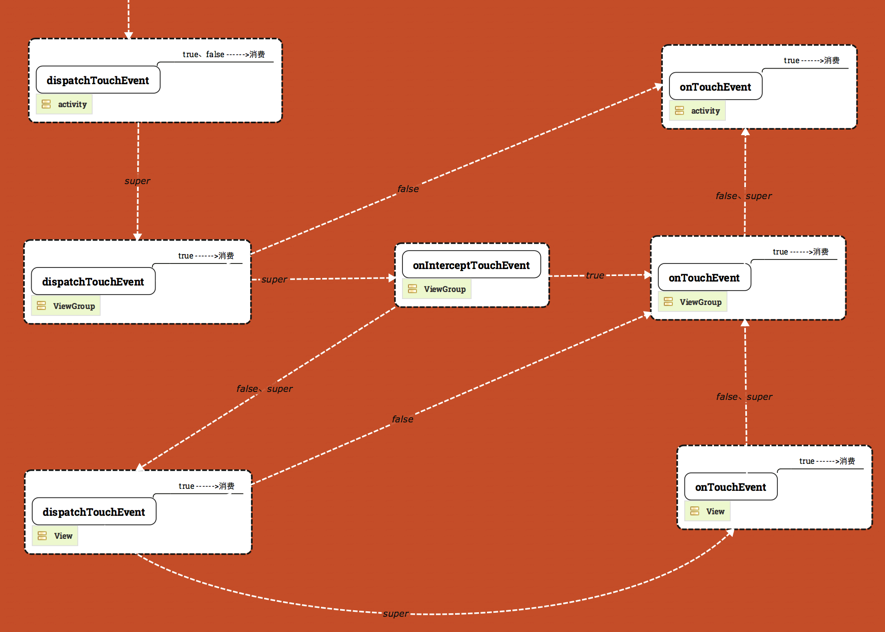

# Android 事件分发

> dispatchTouchEvent（）、 onInterceptTouchEvent() 、onTouchEvnt()
>
> 事件循序一个完成发下一个，InputDispatcher window DecorView Activity
>
> requestDisallowInterceptTouchEvent()
>
> 
>
> OntouchEventListener OnClickLisenter onTouchEvent
>
> 针对action_down，TouchTarget（派发目标-后续事件），多点触控拆分
>
> 1、三方法，三对象，事件传递
>
> 2、
>
> 3、
>
> 4、ViewGroup对事件的派发
>
> > 派发目标的确定：ACTION_DOWN，反向遍历子view（基于坐标确定子 view，dispatchTransformedTouchEvent派发事件给子 view），根据返回值与触控点绑定（dispatch 返回true，onTouch()true则确定为派发目标），保存到链表
>
> > 依照TouchTarget进行事件派发：遍历链表为派发目标派发事件dispatchTransformedTouchEvent，超出目标范围，依然传递
>
> > 移除派发目标：up、cancel把TouchTarget从链表中移除
>
> 5、dispatchTransformedTouchEvent派发事件给子view，拆分事件、坐标系转换

1、事件与事件流

> 事件：坐标、类型、触控点索引（可变）、触控点ID的int集合：（2的ID次幂，消费TouchTarget描述ID与派发目标的绑定）
>
> 消费：确定派发目标，触控点ID与view绑定，接受后续事件，dispatchTouchEvent返回ture ，默认返回onTouchEvent，
>
> 事件流(序列)：第一个down开始-----最后一个up结束，不消费down后续都接受不到

2、ViewGroup对事件的派发

> 确定TouchTarget派发目标：
>
> 依照TouchTarget派发事件：
>
> 移除TouchTarget：
>
> dispatchTrandformedTouchEvent:派发事件给目标，没有目标给自己。事件拆分、坐标系转换。

3、view事件的接收与处理

> 处理onTouch
>
> 处理onTouchEvent
>
> 返回true则消费事件

4、InputDispacher与window建立通道，ViewRoot具体处理，调用DecorView的dispacthTouchEvent，

派发目标传递性，view是，则父view是父父view目标

# 名称解释

事件流：ACTION_DOWN确定TouchTarget，绑定IDt-》ACRION_MOVE直接传递给目标控件-》ACTION_UP resetTouchState();清除派发目标

派发目标：

# MotionEvent

坐标：getX();getRawX()

>  一个int值，0～8类型 9～16索引
>
> 事件类型：ActionDown ActionUp ActionPointerDown
>
> 触控点索引：MotionEvent中内，数组<触控点信息>。 数组的索引号（手指抬起变更）

触控点ID：多点触控，区分触控点，用于追踪特定的触控点，一个int保存，对1左移若干位，2的ID次幂

# TouchTarget 绑定

## 1 事件传递

- 这里事件特指`MotionEvent.ACTION_DOWN`

- onTouch():是OnTouchListener接口的方法。onTouch优先级比onTouchEvent高

requestDisallowInterceptTouchEvent 新的down事件后失效 优先级高于onInterceptTouchEvent

activity：通过window调用decorVIew

## 2 OnTouchListener & OnClickListener

1. 设置OnTouchListener：onTouch方法返回false时，onTouch方法及View的onTouchEvent方法依次被调用；onTouch方法返回true时，只调用onTouch方法，onTouchEvent方法不再被调用
2. 设置OnTouchListener后：onTouch方法返回false，不影响OnClickListener及OnLongClickListener的触发；onTouch方法返回true时，OnClickListener及OnLongClickListener不再触发
3. OnClickListener的触发条件是手指从触屏抬起；OnLongClickListener的触发条件是按下触屏且停留一段事件
4. onLongClick方法返回false不影响OnClickListener的触发；onLongClick方法返回true，OnClickListener不再触发

## InputDispatcher

## 3滑动

#3.1 scrollTo/scrollBy