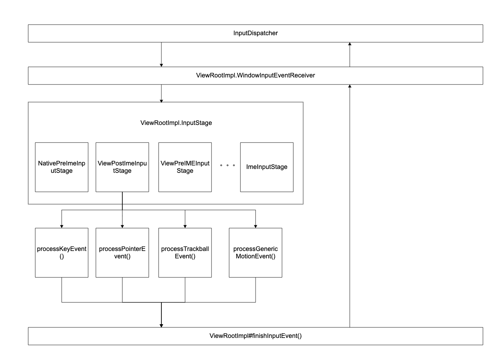
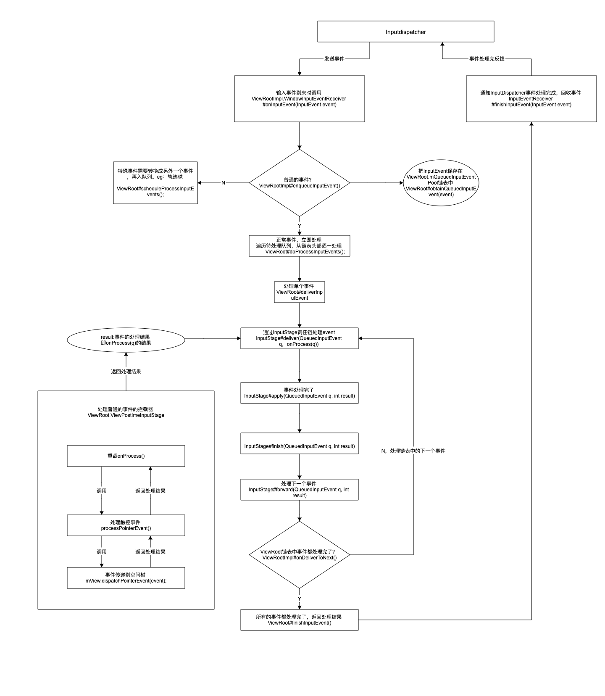
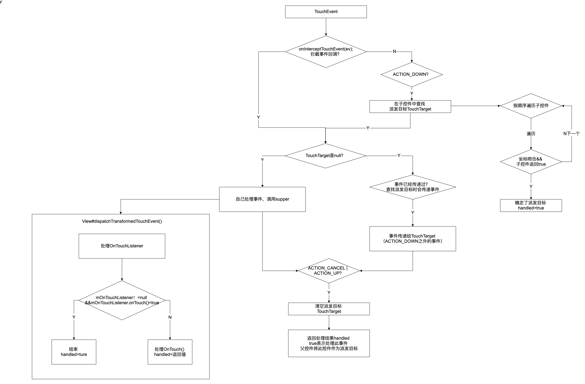

# Android 事件分发

- dispatchTouchEvent()

控件是以树形结构保存，根结点是DocorView。

事件传递:遍历控件树，执行dispatchTouchEvent()中。

1、action_down 根据触控点坐标和dispatch返回值，确定个派发目标，即谁消费这个事件

2、根结点到派发目标形成了双向链表，这时事件沿这个链进行传递啊

3、最后检查如果是action_up,就清除派发目标。也就是一个事件流结束

事件流，从第一个手指落下到最后一个手指抬起。action_down时不消费事件，事件流的后续事件都接收不到

- OnTouchEvent：寻找派发目标的时候，根据这个方法的返回值来确定派发目标。返回ture的表示消费。调用的顺序从控件树的叶子结点到根结点，所有的子控件都不消费，根节点会消费这个事件
- InterceptTouchEvent（）作用是拦截时间，传递事件时会执行这个方法，根据返回值决定是自己消费，还是向传递


## 总流程

**inputEventReceiver**:

- 输入系统的终点，控件系统的起点。设备驱动与窗口通讯的通道。
- 接受输入事件--->派发事件给控件处理--->反馈事件处理结果。
- 由ViewRoot创建并保存在其成员变量mInputEventReceiver中，参数为WMS分配的InputChanne以及主线程的looper。
- Input ANR：反馈事件的处理结果超时



**InputStage**将输入事件的处理分成若干个阶段（Stage）, 如果当前有输入法窗口，则事件处理从 NativePreIme 开始，否则从EarlyPostIme 开始，事件依次经过每个Stage，如果该事件没有被标识为 “Finished”， 该Stage就会处理它，然后返回处理结果Forward 或 Finish，Forward 运行下一个Stage继续处理，而Finished事件将会简单的Forward到下一级，直到最后一级 SyntheticInputStage。

| InputStage              | 说明                                                         |
| ----------------------- | ------------------------------------------------------------ |
| NativePreImeInputStage  | 分发早于IME的InputEvent到NativeActivity中去处理, NativeActivity和普通acitivty的功能一致,不过是在native层实现,这样执行效率会更高,同时NativeActivity在游戏开发中很实用（不支持触摸事件）。 |
| ViewPreIMEInputStage    | 分发早于IME的InputEvent到View框架处理，会调用view（输入焦点）的onkeyPreIme方法,同时会给View在输入法处理key事件之前先得到消息并优先处理，View系列控件可以直接复写onKeyPreIme（ 不支持触摸事件）。 |
| ImeInputStage           | 分发InputEvent到IME处理调用ImeInputStage的onProcess，InputMethodManager的dispatchInputEvent方法处理消息（不支持触摸事件）。 |
| EarlyPostImeInputStage  | 与touchmode相关，比如你的手机有方向键，按方向键会退出touchmode，这个事件被消费，有可能会有view的背景变化，但不确定（支持触摸事件）。 |
| NativePostImeInputStage | 分发InputEvent事件到NativeActivity,IME处理完消息后能先于普通Activity处理消息（此时支持触摸事件）。<br/>ViewPostImeInputStage	分发InputEvent事件到View框架，view的事件分发（支持触摸事件）。最终会调用到输入焦点的3个方法：使用setKeyListener注册的监听器的onKey，之后是onKeyDown和onKeyUp，或者调用activity的onKeyDown和onKeyUp方法，也就是兜底处理无人处理的key事件 |
| SyntheticInputStage     | 未处理 InputEvent最后处理。                                  |


### 总流程(详细)




## ViewRoot
### WindowInputEventReceiver

```java
// ViewRootImpl
// 连接InputDispatcher
final class WindowInputEventReceiver extends InputEventReceiver {
    public WindowInputEventReceiver(InputChannel inputChannel, Looper looper) {
        super(inputChannel, looper);
    }
		// 输入事件到来时调用
    @Override
    public void onInputEvent(InputEvent event) {
        Trace.traceBegin(Trace.TRACE_TAG_VIEW, "processInputEventForCompatibility");
        List<InputEvent> processedEvents;
        try {
          	// 检查特殊事件，eg：触控笔的按键。如是会将event加入processedEvents
            processedEvents =
                mInputCompatProcessor.processInputEventForCompatibility(event);
        } finally {
            Trace.traceEnd(Trace.TRACE_TAG_VIEW);
        }
        if (processedEvents != null) {
          	// 特殊事件的处理
            if (processedEvents.isEmpty()) {
                finishInputEvent(event, true);
            } else {
                for (int i = 0; i < processedEvents.size(); i++) {
                    enqueueInputEvent(
                            processedEvents.get(i), this,
                            QueuedInputEvent.FLAG_MODIFIED_FOR_COMPATIBILITY, true);
                }
            }
        } else {
          	// 处理普通输入事件的
            enqueueInputEvent(event, this, 0, true);
        }
    }

    /**
     * 通知InputDispatcher事件处理完成，回收事件
     * 此方法在InputEventReceiver中.
     */
    public final void finishInputEvent(InputEvent event, boolean handled) {
        if (event == null) {
            throw new IllegalArgumentException("event must not be null");
        }
        if (mReceiverPtr == 0) {
            Log.w(TAG, "Attempted to finish an input event but the input event "
                    + "receiver has already been disposed.");
        } else {
            int index = mSeqMap.indexOfKey(event.getSequenceNumber());
            if (index < 0) {
                Log.w(TAG, "Attempted to finish an input event that is not in progress.");
            } else {
                int seq = mSeqMap.valueAt(index);
                mSeqMap.removeAt(index);
              	// 通知InputDispatcher事件处理完成
                nativeFinishInputEvent(mReceiverPtr, seq, handled);
            }
        }
      	// 回收事件
        event.recycleIfNeededAfterDispatch();
    }
}
```

### enqueueInputEvent()

```java
// 待处理链表头部的event.
QueuedInputEvent mPendingInputEventHead;
// 待处理链表尾部的event.
QueuedInputEvent mPendingInputEventTail;
/** ViewRootImpl
	* @params event 接受到的新事件
	* @params receiver 处理事件的接收器，即WindowInputEventReceiver
	* @params processImmediately  正常事件一般true，当前线程、立即处理事件。
	*/
void enqueueInputEvent(InputEvent event,
        InputEventReceiver receiver, int flags, boolean processImmediately) {
 		// 把event加入mQueuedInputEventPool链表中保存
  	// QueuedInputEvent：由InputEvent封装而来，ViewRoot中事件的存在形式
    QueuedInputEvent q = obtainQueuedInputEvent(event, receiver, flags);

    // 待处理链表尾部的event.
    QueuedInputEvent last = mPendingInputEventTail;
    if (last == null) {
        mPendingInputEventHead = q;
        mPendingInputEventTail = q;
    } else {
        last.mNext = q;
        mPendingInputEventTail = q;
    }
    mPendingInputEventCount += 1;
    Trace.traceCounter(Trace.TRACE_TAG_INPUT, mPendingInputEventQueueLengthCounterName,
            mPendingInputEventCount);

    if (processImmediately) {
      	// 正常事件，立即处理
        doProcessInputEvents();
    } else {
      	// 特殊事件需要转换成另外一个事件，再入队列。eg：轨迹球
        scheduleProcessInputEvents();
    }
}
```

###  obtainQueuedInputEvent()

```java
// 把event加入mQueuedInputEventPool链表中保存，添加到链表尾部。
// @params receiver：ViewRoot的WindowInputEventReceiver，event处理完后需要使用 
private QueuedInputEvent obtainQueuedInputEvent(InputEvent event,
        InputEventReceiver receiver, int flags) {
  	// 链表，保存全部待处理事件event
    QueuedInputEvent q = mQueuedInputEventPool;
  	// 这个event加入链表
    if (q != null) {
        mQueuedInputEventPoolSize -= 1;
        mQueuedInputEventPool = q.mNext;
        q.mNext = null;
    } else {
        q = new QueuedInputEvent();
    }
    q.mEvent = event;
    q.mReceiver = receiver;//event处理完后需要使用
    q.mFlags = flags;
    return q;
}
```

### doProcessInputEvents()

```java
void doProcessInputEvents() {
    // 遍历待处理队列，从链表头部逐一处理
    while (mPendingInputEventHead != null) {
      	// mPendingInputEventHead：保存待处理event的链表，头部的事件
        QueuedInputEvent q = mPendingInputEventHead;
        mPendingInputEventHead = q.mNext;
        if (mPendingInputEventHead == null) {
            mPendingInputEventTail = null;
        }
        q.mNext = null;

        mPendingInputEventCount -= 1;
        Trace.traceCounter(Trace.TRACE_TAG_INPUT, mPendingInputEventQueueLengthCounterName,
                mPendingInputEventCount);

        long eventTime = q.mEvent.getEventTimeNano();
        long oldestEventTime = eventTime;
        if (q.mEvent instanceof MotionEvent) {
            MotionEvent me = (MotionEvent)q.mEvent;
            if (me.getHistorySize() > 0) {
                oldestEventTime = me.getHistoricalEventTimeNano(0);
            }
        }
        mChoreographer.mFrameInfo.updateInputEventTime(eventTime, oldestEventTime);
				// 处理事件
        deliverInputEvent(q);
    }

    // We are done processing all input events that we can process right now
    // so we can clear the pending flag immediately.
    if (mProcessInputEventsScheduled) {
        mProcessInputEventsScheduled = false;
        mHandler.removeMessages(MSG_PROCESS_INPUT_EVENTS);
    }
}
```

### deliverInputEvent()

```java
// 把事件传递给责任链
private void deliverInputEvent(QueuedInputEvent q) {
    Trace.asyncTraceBegin(Trace.TRACE_TAG_VIEW, "deliverInputEvent",
            q.mEvent.getSequenceNumber());
    if (mInputEventConsistencyVerifier != null) {
      	// tip事件不是在这里传递给根控件的
        mInputEventConsistencyVerifier.onInputEvent(q.mEvent, 0);
    }
    InputStage stage;
    if (q.shouldSendToSynthesizer()) {
        stage = mSyntheticInputStage;
    } else {
        stage = q.shouldSkipIme() ? mFirstPostImeInputStage : mFirstInputStage;
    }
    if (q.mEvent instanceof KeyEvent) {
        mUnhandledKeyManager.preDispatch((KeyEvent) q.mEvent);
    }
    if (stage != null) {
        handleWindowFocusChanged();
      	// 采用InputStage责任链传递事件，触控事件的拦截器是ViewPostImeInputStage
        stage.deliver(q);
    } else {
        finishInputEvent(q);
    }
}
```

### finishInputEvent()

```java
// 各类事件的终点，
// 通过InputEventReceiver，向InputDisptacher发送处理完毕事件
private void finishInputEvent(QueuedInputEvent q) {
    Trace.asyncTraceEnd(Trace.TRACE_TAG_VIEW, "deliverInputEvent",
            q.mEvent.getSequenceNumber());

    if (q.mReceiver != null) {
      	// 来自于InputDispatcher的事件，需要向InputDispatcher反馈，由其回收
        boolean handled = (q.mFlags & QueuedInputEvent.FLAG_FINISHED_HANDLED) != 0;
        boolean modified = (q.mFlags & QueuedInputEvent.FLAG_MODIFIED_FOR_COMPATIBILITY) != 0;
        if (modified) {
            Trace.traceBegin(Trace.TRACE_TAG_VIEW, "processInputEventBeforeFinish");
            InputEvent processedEvent;
            try {
                processedEvent =
                        mInputCompatProcessor.processInputEventBeforeFinish(q.mEvent);
            } finally {
                Trace.traceEnd(Trace.TRACE_TAG_VIEW);
            }
            if (processedEvent != null) {
              	// 通过InputEventReceiver反馈
                q.mReceiver.finishInputEvent(processedEvent, handled);
            }
        } else {
          	//// 通过InputEventReceiver反馈
            q.mReceiver.finishInputEvent(q.mEvent, handled);
        }
    } else {
      	// 此事件由ViewRoot自行创建，回收但不去要反馈
        q.mEvent.recycleIfNeededAfterDispatch();
    }

    recycleQueuedInputEvent(q);
}
```


### InputStage

```java
/**
 * Delivers an event to be processed.
 */
public final void deliver(QueuedInputEvent q) {
    if ((q.mFlags & QueuedInputEvent.FLAG_FINISHED) != 0) {
        forward(q);
    } else if (shouldDropInputEvent(q)) {
        finish(q, false);
    } else {
      	// onProcess()由拦截器重载，返回事件处理的结果
        apply(q, onProcess(q));
    }
}
```


```java
/**
 * Applies a result code from {@link #onProcess} to the specified event.
 */
protected void apply(QueuedInputEvent q, int result) {
    if (result == FORWARD) {
        forward(q);
    } else if (result == FINISH_HANDLED) {
        finish(q, true);
    } else if (result == FINISH_NOT_HANDLED) {
        finish(q, false);
    } else {
        throw new IllegalArgumentException("Invalid result: " + result);
    }
}
```


### PostImeInputStage

```java
@Override
protected int onProcess(QueuedInputEvent q) {
    if (q.mEvent instanceof KeyEvent) {
      	// 处理按键事件
        return processKeyEvent(q);
    } else {
        final int source = q.mEvent.getSource();
        if ((source & InputDevice.SOURCE_CLASS_POINTER) != 0) {
          	// 处理触控事件
            return processPointerEvent(q);
        } else if ((source & InputDevice.SOURCE_CLASS_TRACKBALL) != 0) {
          	// 处理滚动球事件
            return processTrackballEvent(q);
        } else {
          	// 处理其他事件。eg：悬浮（HOVER）、手柄等
            return processGenericMotionEvent(q);
        }
    }
}
```


```java
private int processPointerEvent(QueuedInputEvent q) {
    final MotionEvent event = (MotionEvent)q.mEvent;

    mAttachInfo.mUnbufferedDispatchRequested = false;
    mAttachInfo.mHandlingPointerEvent = true;
  	// 事件传递到了控件树
    boolean handled = mView.dispatchPointerEvent(event);
    maybeUpdatePointerIcon(event);
    maybeUpdateTooltip(event);
    mAttachInfo.mHandlingPointerEvent = false;
    if (mAttachInfo.mUnbufferedDispatchRequested && !mUnbufferedInputDispatch) {
        mUnbufferedInputDispatch = true;
        if (mConsumeBatchedInputScheduled) {
            scheduleConsumeBatchedInputImmediately();
        }
    }
    return handled ? FINISH_HANDLED : FORWARD;
}
```


## 控件树流程

- 这里事件特指`MotionEvent.ACTION_DOWN`

- onTouch():是OnTouchListener接口的方法。优先级OnTouchListener>onTouch>onTouchEvent高

- requestDisallowInterceptTouchEvent 新的down事件后失效 优先级高于onInterceptTouchEvent

- activity：decorVIew复写了dispatchTouchEvent(),


**ViewGroup对事件的派发**

- 1、派发目标的确定：ACTION_DOWN，反向遍历子view（基于坐标确定子 view，dispatchTransformedTouchEvent派发事件给子 view），根据返回值与触控点绑定（dispatch 返回true，onTouch()true则确定为派发目标），保存到链表

- 2、依照TouchTarget进行事件派发：遍历链表为派发目标派发事件dispatchTransformedTouchEvent()，

- 3、移除派发目标：up、cancel把TouchTarget从链表中移除



## ViewGroup
###dispatchTouchEvent()

```java
// 派发目标的集合（链表）。多点触控，所以可能有多个派发目标，用触控点ID区分。
// 第一根手指的触摸事件在链表头
private TouchTarget mFirstTouchTarget;

@Override
public boolean dispatchTouchEvent(MotionEvent ev) {
    if (mInputEventConsistencyVerifier != null) {
        mInputEventConsistencyVerifier.onTouchEvent(ev, 1);
    }

    if (ev.isTargetAccessibilityFocus() && isAccessibilityFocusedViewOrHost()) {
      	// 推测屏幕辅助相关。false清除标识，正常派发（）
        ev.setTargetAccessibilityFocus(false);
    }
		// 事件处理结果，最后的返回值
    boolean handled = false;
  	// 安全检查，对遮盖状态进行检查，详情卷3，P393
    if (onFilterTouchEventForSecurity(ev)) {
        final int action = ev.getAction();
      	// 事件类型。 ACTION_MASK：8个1
        final int actionMasked = action & MotionEvent.ACTION_MASK;

        // ACTION_DOWN事件处理钱准备.
        if (actionMasked == MotionEvent.ACTION_DOWN) {
            // 清除派发目标等.
            cancelAndClearTouchTargets(ev);
            resetTouchState();
        }

        // 检查拦截.
        final boolean intercepted;
        if (actionMasked == MotionEvent.ACTION_DOWN|| mFirstTouchTarget != null) {
            final boolean disallowIntercept = (mGroupFlags & FLAG_DISALLOW_INTERCEPT) != 0;
            if (!disallowIntercept) {
              	// 触发拦截回调
                intercepted = onInterceptTouchEvent(ev);
                ev.setAction(action); // restore action in case it was changed
            } else {
                intercepted = false;
            }
        } else {
            intercepted = true;
        }
      	// 拦截&非首次action_down.eg：第二根手指落下。
        if (intercepted || mFirstTouchTarget != null) {
          	// // 推测屏幕辅助相关。false清除标识，正常派发
            ev.setTargetAccessibilityFocus(false);
        }

        // 检查取消.
        final boolean canceled = resetCancelNextUpFlag(this)
                || actionMasked == MotionEvent.ACTION_CANCEL;

        // 多点触控可能需要拆分.
        final boolean split = (mGroupFlags & FLAG_SPLIT_MOTION_EVENTS) != 0;
        TouchTarget newTouchTarget = null;
      	// 确定派发目标时会传递一次事件，派发事件阶段就不需要再派发了，用这个做标识
        boolean alreadyDispatchedToNewTouchTarget = false;
      	// 不拦截&&不取消
        if (!canceled && !intercepted) {
            // 带焦点的子控件
            View childWithAccessibilityFocus = ev.isTargetAccessibilityFocus()
                    ? findChildWithAccessibilityFocus() : null;
          	// 1、确定派发目标。
            if (actionMasked == MotionEvent.ACTION_DOWN
                		// ACTION_DOWN意味着全新的事件序列开始，其他不是
                    || (split && actionMasked == MotionEvent.ACTION_POINTER_DOWN)
                    || actionMasked == MotionEvent.ACTION_HOVER_MOVE) { 
              	// 触控点ID：多点触控，区分触控点，用于追踪特定的触控点。
              	// 一个int保存，对1左移若干位，2的ID次幂
                final int actionIndex = ev.getActionIndex(); // 第几根手指
              	// 拆分事件？这个触控点的ID：-1
                final int idBitsToAssign = split ? 1 << ev.getPointerId(actionIndex)
                        : TouchTarget.ALL_POINTER_IDS;
                // 清除之前的派发目标.
                removePointersFromTouchTargets(idBitsToAssign);
								// 从子控件中选取派发目标
                final int childrenCount = mChildrenCount;
                if (newTouchTarget == null && childrenCount != 0) {
                  	// 没有子控件则不需要此此操作
                    final float x = ev.getX(actionIndex);// event的x轴坐标
                    final float y = ev.getY(actionIndex);// event的Y轴坐标
                    // 对子控件根据Z轴进行排序，确定派发顺序.
                    final ArrayList<View> preorderedList = buildTouchDispatchChildList();
                    final boolean customOrder = preorderedList == null
                            && isChildrenDrawingOrderEnabled();
                    final View[] children = mChildren;
                  	// tip：按照绘制顺序的逆序进行遍历
                    for (int i = childrenCount - 1; i >= 0; i--) {
                        final int childIndex = getAndVerifyPreorderedIndex(
                                childrenCount, i, customOrder);
                        final View child = getAndVerifyPreorderedView(
                                preorderedList, children, childIndex);
                        // 有焦点的控件优先接收事件.
                        if (childWithAccessibilityFocus != null) {
                            if (childWithAccessibilityFocus != child) {
                              	// 这view不是有焦点的view，跳过
                                continue;
                            }
                            childWithAccessibilityFocus = null;
                            i = childrenCount - 1;
                        }
												// 检查事件坐标是否落在控件之内。
                        if (!child.canReceivePointerEvents()
                                || !isTransformedTouchPointInView(x, y, child, null)) {
                            ev.setTargetAccessibilityFocus(false);
                          	// 不在，此子控件不是派发目标，继续查找下一个。
                            continue;
                        }
												// 这个child控件是派发目标
                      	// 检查这个控件在不在已有的派发目标中，
                        newTouchTarget = getTouchTarget(child);
                        if (newTouchTarget != null) {
                            // 这个控件已经是派发目标。eg：两个手指先后落在同一控件
                            newTouchTarget.pointerIdBits |= idBitsToAssign;
                            break;
                        }
												// 清除这个child控件的PFLAG_CANCEL_NEXT_UP_EVENT标识
                        resetCancelNextUpFlag(child);
                      	// 尝试把event派发给当前子控件，会执行child.dispatchTouchEvent()
                        // 返回ture表示子控件接受此事件，即为派发目标
                        if (dispatchTransformedTouchEvent(ev, false, child, idBitsToAssign)) {
                            // 这个子控件愿意处理此event.即onTouch()返回true
                            mLastTouchDownTime = ev.getDownTime();
                          	// 保存子控件的角标。
                            if (preorderedList != null) {
                                for (int j = 0; j < childrenCount; j++) {
                                    if (children[childIndex] == mChildren[j]) {
                                        mLastTouchDownIndex = j;
                                        break;
                                    }
                                }
                            } else {
                                mLastTouchDownIndex = childIndex;
                            }
                          	// 保存事件坐标
                            mLastTouchDownX = ev.getX();
                            mLastTouchDownY = ev.getY();
                          	// 保存派发目标
                            newTouchTarget = addTouchTarget(child, idBitsToAssign);
                          	// 记录已经派发过事件，派发事件阶段看见true，不会重复派发
                            alreadyDispatchedToNewTouchTarget = true;
                          	// 找到派发目标了跳出循环
                            break;
                        }

                        // 推测屏幕辅助相关.
                        ev.setTargetAccessibilityFocus(false);
                    }
                    if (preorderedList != null) preorderedList.clear();
                }
								// 子控件都不愿意处理此event.
                if (newTouchTarget == null && mFirstTouchTarget != null) {
                    // 这个事件交给第一个根手指的派发目标.
                    newTouchTarget = mFirstTouchTarget;
                    while (newTouchTarget.next != null) {
                        newTouchTarget = newTouchTarget.next;
                    }
                    newTouchTarget.pointerIdBits |= idBitsToAssign;
                }
            }
        }

        // 传递事件给派发目标.
        if (mFirstTouchTarget == null) {
          	// 没有派发目标.由本控件处理事件
            // 子控件传null，则会调用本控件的super.dispatchTouchEvent(event);
          	// 即本控件的父类View的dispatchTouchEvent()
            handled = dispatchTransformedTouchEvent(ev, canceled, null,
                    TouchTarget.ALL_POINTER_IDS);
        } else {
            // 子控件处理事件.
            TouchTarget predecessor = null;
            TouchTarget target = mFirstTouchTarget;
            while (target != null) {
                final TouchTarget next = target.next;
                if (alreadyDispatchedToNewTouchTarget && target == newTouchTarget) {
                  	// 确定派发目标时，已经传递过事件了
                    handled = true;
                } else {
                    final boolean cancelChild = resetCancelNextUpFlag(target.child)
                            || intercepted;
                  	// 把传递事件给派发目标
                    if (dispatchTransformedTouchEvent(ev, cancelChild,
                            target.child, target.pointerIdBits)) {
                        handled = true;
                    }
                    if (cancelChild) {
                        if (predecessor == null) {
                            mFirstTouchTarget = next;
                        } else {
                            predecessor.next = next;
                        }
                        target.recycle();
                        target = next;
                        continue;
                    }
                }
                predecessor = target;
                target = next;
            }
        }

        // 如果事件类型是cancel|action_up等，清空派发目标.
        if (canceled
                || actionMasked == MotionEvent.ACTION_UP
                || actionMasked == MotionEvent.ACTION_HOVER_MOVE) {
          	// 整个事件序列全部结束，删除所有的派发目标
            resetTouchState();
        } else if (split && actionMasked == MotionEvent.ACTION_POINTER_UP) {
          	// 第二个手指抬起，仅将对应的触控点ID从列表中移除
            final int actionIndex = ev.getActionIndex();
            final int idBitsToRemove = 1 << ev.getPointerId(actionIndex);
            removePointersFromTouchTargets(idBitsToRemove);
        }
    }

    if (!handled && mInputEventConsistencyVerifier != null) {
        mInputEventConsistencyVerifier.onUnhandledEvent(ev, 1);
    }
    return handled;
}
```


### dispatchTransformedTouchEvent()


```java
/**
	* 将触控事件转换为特定子视图的坐标空间，过滤掉无关的指针ID，并在必要时覆盖其动作。 
	* 如果child为null，则假定将MotionEvent发送到此ViewGroup。
	* @Params event 触控事件
	* @Params cancel 是否取消事件
	* @Params child 目标控件
	* @Params desiredPointerIdBits 事件当前的触控点ID
	*
	*/
private boolean dispatchTransformedTouchEvent(MotionEvent event, boolean cancel,
        View child, int desiredPointerIdBits) {
    final boolean handled;

   
    final int oldAction = event.getAction();
  	 // 1、需要终止子控件，处理事件序列的情况。
    if (cancel || oldAction == MotionEvent.ACTION_CANCEL) {
        event.setAction(MotionEvent.ACTION_CANCEL);// 修改action
        if (child == null) {
          	// 没有子控件则派发给ViewGroup自己
            handled = super.dispatchTouchEvent(event);
        } else {
            handled = child.dispatchTouchEvent(event);
        }
        event.setAction(oldAction);
        return handled;// 派发完毕直接返回
    }

  	// 下面这俩用于事件序列的拆分
  	// 表示原始事件中所有触控点列表，用1个int保存全部触控点ID
    final int oldPointerIdBits = event.getPointerIdBits();// 取出所有的触控点
  	// 派发目标期望接受的触控键，全部触控点ID&事件本次的触控点ID
    final int newPointerIdBits = oldPointerIdBits & desiredPointerIdBits;

    // 不正常情况.
    if (newPointerIdBits == 0) {
        return false;
    }

    // 新的MotionEvent，由原始MotionEvent而来.只包含目标感兴趣的触控点ID，传递给派发目标的不是原始MotionEvent，而是transformedEvent.
    final MotionEvent transformedEvent;
    if (newPointerIdBits == oldPointerIdBits) {
      	// 派发目标接受原始Event的全部触控点，不需要拆分事件
        if (child == null || child.hasIdentityMatrix()) {
          	// 派发目标不存在通过setScaleX()等方法进行的转换
          	// 为了效率单独处理，不考虑矩阵变换
            if (child == null) {
              	// 1、没有子控件，由本ViewGroup自己处理
                handled = super.dispatchTouchEvent(event);
            } else {
              	// 转换事件的坐标系
                final float offsetX = mScrollX - child.mLeft;
                final float offsetY = mScrollY - child.mTop;
                event.offsetLocation(offsetX, offsetY);
								// 2、事件传递给子控件
                handled = child.dispatchTouchEvent(event);
                event.offsetLocation(-offsetX, -offsetY);
            }
            return handled;
        }
      	// 复制原始事件
        transformedEvent = MotionEvent.obtain(event);
    } else {
      	// 派发目标接受原始Event的部分触控点，需要拆分
        transformedEvent = event.split(newPointerIdBits);
    }

    // 处理拆分的事件.
    if (child == null) {
      	// 自己处理
        handled = super.dispatchTouchEvent(transformedEvent);
    } else {
      	// 转换事件的坐标系
        final float offsetX = mScrollX - child.mLeft;
        final float offsetY = mScrollY - child.mTop;
        transformedEvent.offsetLocation(offsetX, offsetY);
        if (! child.hasIdentityMatrix()) {
          	// 需要处理矩阵转换，上面的转换不会处理这个
            transformedEvent.transform(child.getInverseMatrix());
        }
				// 子控件处理
        handled = child.dispatchTouchEvent(transformedEvent);
    }

    // Done.销毁新生成的事件
    transformedEvent.recycle();
    return handled;
}
```


## View
### dispatchTouchEvent()

```java
public boolean dispatchTouchEvent(MotionEvent event) {
    // 辅助功能相关.
    if (event.isTargetAccessibilityFocus()) {
        if (!isAccessibilityFocusedViewOrHost()) {
            return false;
        }
        event.setTargetAccessibilityFocus(false);
    }
    boolean result = false;
    if (mInputEventConsistencyVerifier != null) {
        mInputEventConsistencyVerifier.onTouchEvent(event, 0);
    }
    final int actionMasked = event.getActionMasked();
    if (actionMasked == MotionEvent.ACTION_DOWN) {
        // 停止滚动，防御性检查
        stopNestedScroll();
    }
		// 信息安全检查
    if (onFilterTouchEventForSecurity(event)) {
        if ((mViewFlags & ENABLED_MASK) == ENABLED && handleScrollBarDragging(event)) {
            result = true;
        }
        // 1、检查OnTouchListener，并处理回调
        ListenerInfo li = mListenerInfo;
        if (li != null && li.mOnTouchListener != null
                && (mViewFlags & ENABLED_MASK) == ENABLED
                && li.mOnTouchListener.onTouch(this, event)) {
            result = true;
        }
				// 2、调用onTouchEvent()，若OnTouchListener返回true，则不调用
        if (!result && onTouchEvent(event)) {
            result = true;
        }
    }

    if (!result && mInputEventConsistencyVerifier != null) {
        mInputEventConsistencyVerifier.onUnhandledEvent(event, 0);
    }

    // 如果是up事件（系列触摸动作的终点），或者是cancel事件，或者是DOWN事件并且没对它进行处理，就停止滚动状态.
    if (actionMasked == MotionEvent.ACTION_UP ||
            actionMasked == MotionEvent.ACTION_CANCEL ||
            (actionMasked == MotionEvent.ACTION_DOWN && !result)) {
        stopNestedScroll();
    }
    return result;
}
```


## 触控事件MotionEvent

坐标：getX()相对坐标系;getRawX()窗口坐标系

>  一个int值，0～8类型 9～16索引
>
> 事件类型：ActionDown ActionUp ActionPointerDown
>
> 触控点索引：MotionEvent中内，数组<触控点信息>。 数组的索引号（手指抬起变更）

触控点ID：多点触控，区分触控点，用于追踪特定的触控点，一个int保存，对1左移若干位，2的ID次幂

事件：坐标、类型、触控点索引（可变）、触控点ID的int集合：（2的ID次幂，消费TouchTarget描述ID与派发目标的绑定）

消费：确定派发目标，触控点ID与view绑定，接受后续事件，dispatchTouchEvent返回ture ，默认返回onTouchEvent()，

事件流(序列)：

> 第一个down开始-----最后一个up结束，不消费down后续都接受不到
>
> ACTION_DOWN确定TouchTarget，绑定IDt-》ACRION_MOVE直接传递给目标控件-》ACTION_UP resetTouchState();清除派发目标

##  OnTouchListener & OnClickListener

1. 设置OnTouchListener：onTouch方法返回false时，onTouch方法及View的onTouchEvent方法依次被调用；onTouch方法返回true时，只调用onTouch方法，onTouchEvent方法不再被调用
2. 设置OnTouchListener后：onTouch方法返回false，不影响OnClickListener及OnLongClickListener的触发；onTouch方法返回true时，OnClickListener及OnLongClickListener不再触发
3. OnClickListener的触发条件是手指从触屏抬起；OnLongClickListener的触发条件是按下触屏且停留一段事件
4. onLongClick方法返回false不影响OnClickListener的触发；onLongClick方法返回true，OnClickListener不再触发

