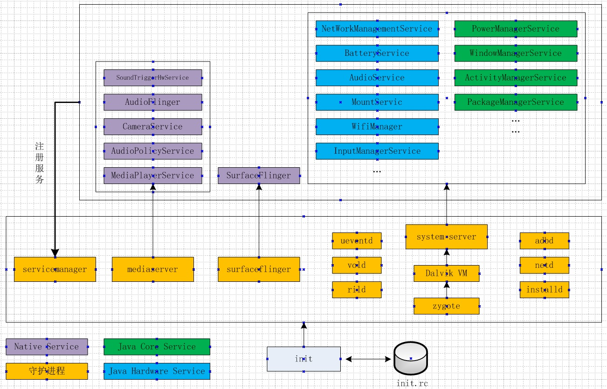
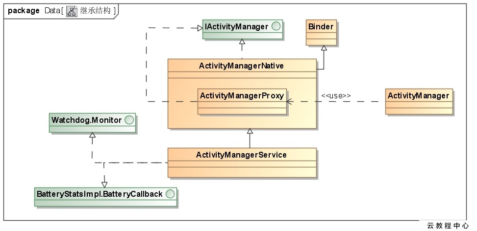
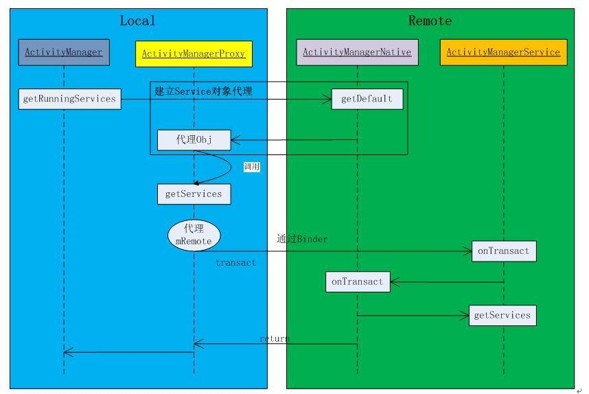
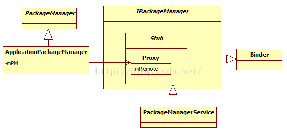
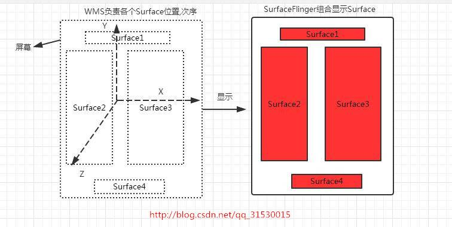
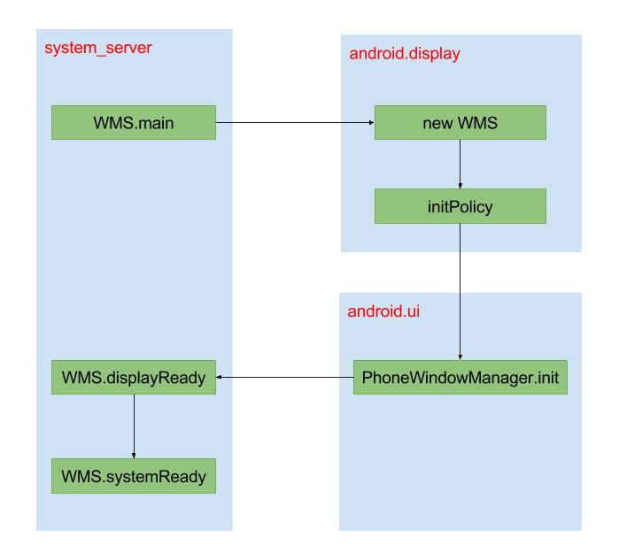

# Android 系统核心服务

## 1、 Java系统服务-综述

- 由Java语言编写，大部分运行在system_server进程中
- 每个系统服务都以线程的形态运行，等待应用程序发出的请求，然后对请求进程处理，再将结果返回给应用程序。
- 这部分系统服务又可以分为两种：Java核心系统服务和Java硬件系统服务。 
  	- Java核心系统服务是Android系统正常运转的基础，包括大家所熟知的AMS、WMS、PMS等。 
  	- Java硬件服务是为应用提供硬件控制服务，如电话服务、wifi服务、PowerManagerService等。

下面罗列了运行在system_server中的系统服务，按字母排序。

>  AccessibilityManagerService 截获用户输入，并根据输入给用户一些额外的反馈，起到辅助效果的服务 
> AccountManagerService 管理设备中所有账号的服务，包括账号、密码、授权管理功能 
> ActivityManagerService 管理所有组件的服务，安卓系统的核心服务 AlarmManagerService 管理闹钟的服务 
> AppWidgetService 管理APP widgets的工作，包括加载、删除、布局等 
> AssetAtlasService 将一些系统图片资源合并成一个纹理图传给GPU达到硬件加速的效果的服务 
> AudioService 管理音频的服务 
> BackupManagerService 管理备份和应用数据的服务 
> BatteryService 管理电池的服务 
> BluetoothManagerService 管理系统蓝牙的服务 
> CertBlacklister 更新系统SSL证书的公共秘钥和序列号黑名单的服务 
> ClipboardService 管理系统剪贴板的服务 
> CommonTimeManagementService 管理公共时间配置的服务 
> ConnectivityService 管理网络连接的服务 
> ContentService 管理系统数据更新通知的服务，和ContentProvider密切相关 
> CountryDetectorService 检测当前系统所属国家的服务 
> DevicePolicyManagerService 管理系统设备配置的服务 
> DeviceStorageMonitorService 管理系统存储空间的服务，当存储空间小于某个阈值时，会发出警告广播 
> DiskStateService 管理系统存储空间统计的服务 
> DisplayManagerService 管理显示设备的服务 
> DreamManagerService 管理屏幕保护的服务 
> DropBoxManagerService 生成和管理系统运行中日志文件的服务 
> EntropyMixer 加载和保存随机信息的服务 
> IdleMaintenanceService 管理系统在空闲时执行维护任务的服务 
> InputManagerService 管理触屏输入的服务 
> InputMethodManagerService 管理系统输入法的服务 
> LightsService 管理光传感器的服务 
> LocationManagerService 管理定位和位置的服务 
> LockSettingsService 管理系统锁屏设置的服务 
> MountService 管理系统存储设备挂载和卸载的服务 
> NetWorkManagementService 管理系统网络的服务 
> NetWorkPolicyManagerService 管理网络连接策略的服务 
> NetWorkStatsService 管理网络连接状态的服务 
> NetWorkTimeUpdateService 根据网络时间更新本地时间的服务 
> NotificationManagerService 管理系统通知的服务 
> PackageManagerService 管理应用包的服务 
> PowerManagerService 管理系统电源的服务 
> PrintManagerService 管理打印的服务 
> RecognitionManagerService 管理身份识别的服务 
> SamplingProfilerService 记录和分析系统启动性能的服务 
> SchedulingPolicyService 管理系统调度策略的服务 
> SearchManagerServcie 管理系统搜索功能的服务 
> SerialServie 管理系统串口设备的服务 
> StatusBarManagerService 管理系统状态栏的服务 
> TelephonyRegistry 监听和管理通话事件和状态的服务 
> TextServicesManagerService 文本拼写检查的服务 
> UiModeManagerService 设置和管理系统UI模式的服务 
> UsbService 管理USB连接的服务 
> UserManagerService 管理系统用户身份信息的服务 
> VibratorService 管理系统振动器的服务 
> ＷallpaperManagerService 管理系统桌面背景墙纸的服务 
> WifiP2pService 管理Wifi点对点连接的服务 
> WifiService 管理系统Wifi设备的服务 

## 2 ActivityManagerService

### 2.1、 概述

1. 主要负责系统中四大组件的启动、切换、调度及应用进程的管理和调度等工作
2. 由SystemServer的ServerThread线程创建,入口函数SystemServiceManager.startService(ActivityManagerService.Lifecycle.class) 
3. 采用C/S模型，Binder架构

###2.2 AMS类家族

- AM：ActivityManager客户端与AMS通讯，通过AMN的getDefault方法得到AMP，通过AMP就可以和AMN进行通信，也就是间接的与AMS进行通信。
- AMS：继承了AMN，并实现Watchdog.Monitor和BatteryStatsImpl.BatteryCallback接口。而AMN由Binder派生，实现了IActivityManager接口。
- AMN：AMS父类，继承了Binder
- AMP：ActvityManagerProxy是AMN内部类，binder代理类

相关源码位置：

> frameworks/base/services/java/com/android/server/SystemServer.java
>
> - SystemServer.java
>
> frameworks/base/services/java/com/android/server/am/ActivityManagerService.java
>
> - [ActivityManagerService.java](https://android.googlesource.com/platform/frameworks/base/+/4f868ed/services/core/java/com/android/server/am/ActivityManagerService.java)
>
> frameworks/base/core/java/android/app
>
> - ContextImpl.java
>
> - [ActivityManagerNative.java](https://android.googlesource.com/platform/frameworks/base/+/742a67127366c376fdf188ff99ba30b27d3bf90c/core/java/android/app/ActivityManagerNative.java)
>
> frameworks/base/core/java/android/app/ActivityThread.java
>
> - ActivityThread.java
>
> frameworks/base/services/java/com/android/server/am/ActivityStack.java
>
> - ActivityStack.java
>
> frameworks/base/cmds/am/src/com/android/commands/am/Am.java
>
> - Am.java
>
> frameworks/base/services/java/com/android/server/am/ProcessRecord.java
>
> - ProcessRecord.java
>
> frameworks/base/services/java/com/android/server/am/ProcessList.java
>
> - ProcessList.java
>
> frameworks/base/core/java/com/android/internal/os/RuntimeInit.java
>
> - RuntimeInit.java

###2.3 启动流程

1. 创建AMS实例对象，创建Andoid Runtime，ActivityThread和Context对象；
2. setSystemProcess：注册AMS、meminfo、cpuinfo等服务到ServiceManager；
3. installSystemProviderss，加载SettingsProvider；
4. 启动SystemUIService，再调用一系列服务的systemReady()方法；

### 2.4 app与AMS的通信实现

##3 PackageManagerServie

### 3.1 概述

由SystemServer创建，C/S模型，Binder架构

管理安装在设备上的应用程序，

- 应用程序的安装、卸载、信息查询
- 开机扫描安装的apk
- 默认赋予apk权限
- 解析应用的配置文件`manifest.xml`

### 3.2 PMS类家族

- IPackageManager：AIDL接口
- PackageManager：APP层可调用对象，Context.getPackageManager()获取，抽象类，实现类是APM
- ApplicationPackageManager：PM实现类，APP层隐藏不可见，持有PMS的Proxy引用
- PackageManagerService：继承自IPackageManager.Stub类

### 3.3 PMS相关源码

> frameworks/base/services/java/com/android/server/pm/
>
> - [PackageManagerService.java](https://android.googlesource.com/platform/frameworks/base/+/a029ea1/services/java/com/android/server/pm/PackageManagerService.java)
> - [Settings.java](https://android.googlesource.com/platform/frameworks/base/+/a029ea1/services/java/com/android/server/pm/Settings.java)
>
> frameworks/base/core/android/java/content/pm/
>
> - [IPackageManager.aidl](https://android.googlesource.com/platform/frameworks/base/+/483f3b06ea84440a082e21b68ec2c2e54046f5a6/core/java/android/content/pm/IPackageManager.aidl)
>
> frameworks/base/core/android/app
>
> - [ApplicationPackageManager.java](https://android.googlesource.com/platform/frameworks/base/+/483f3b06ea84440a082e21b68ec2c2e54046f5a6/core/java/android/app/ApplicationPackageManager.java)
>
> frameworks/base/services/java/com/android/server/
>
> - [SystemServer.java](https://android.googlesource.com/platform/frameworks/base/+/7d276c3/services/java/com/android/server/SystemServer.java)
>
> 
>
> 
>
> 
>
> 

- SystemUI的AndroidManifest.xml

frameworks/base/package/systemui/AndroidManifest.xml

- PackageParser.java

frameworks/base/core/java/android/content/pm/PackageParser.java

- commandline.c

system/core/adb/commandline.c

- installd.c

frameworks/base/cmds/installd/installd.c

- commands.c

frameworks/base/cmds/installd/commands.c

- pm脚本文件

frameworks/base/cmds/pm/pm

- Pm.java

frameworks/base/cmds/pm/src/com/android/commands/pm/Pm.java

- DefaultContainerService.java

frameworks/base/packages/defaultcontainerservice/src/com/android/defaultcontainerservice/DefaultContainerService.java

- UserManager.java

frameworks/base/services/java/com/android/server/pm/UserManager.java

- UserInfo.java

### 3.4 todo manifest解析    apk安装升级卸载。 activity 广播 intent——flite管理

https://www.jianshu.com/p/ef058fcfcd30

#4 WindowManagerService

### 4.1 概述

WMS主要的功能如下

1. 窗口的添加和删除

2. 窗口的显示和隐藏控制

3. Z-order顺序管理

4. 焦点窗口和焦点应用的管理

5. 输入法窗口管理和墙纸窗口管理

6. 窗口动画管理

7. 系统消息收集和分发

- window使用Surface记录view的绘制信息
- 一块屏幕有多个window，WMS记录所有window的Surface
- SurfaceFlinger将WMS维护的Surface按次序混合后，显示在屏幕

###4.2 WMS类家族

- WMS：继承于`IWindowManager.Stub`, 作为Binder服务端

  > - 成员变量mSessions：保存着所有的Session对象,Session继承于`IWindowSession.Stub`, 作为Binder服务端;
  > - 成员变量mPolicy：实例对象为PhoneWindowManager,用于实现各种窗口相关的策略
  > - 成员变量mChoreographer：用于控制窗口动画,屏幕旋转等操作;
  > - 成员变量mDisplayContents：记录一组DisplayContent对象,这个跟多屏输出相关;
  > - 成员变量mTokenMap：保存所有的WindowToken对象; 以IBinder为key,可以是IAppWindowToken或者其他Binder的Bp端;
  >   - 对应客户端为ActivityRecord.Token extends IApplicationToken.Stub
  > - 成员变量mWindowMap：保存所有的WindowState对象;以IBinder为key, 是IWindow的Bp端;
  >   - 另一端情况: ViewRootImpl.W extends IWindow.Stub

- WindowState：一般每个窗口都对应一个WindowState对象, 该对象的成员变量mClient用于跟应用端交互,成员变量mToken用于跟AMS交互.

### 4.3 wms启动流程

整个启动过程涉及3个线程: system_server主线程, “android.display”, “android.ui”, 整个过程是采用阻塞方式(利用Handler.runWithScissors)执行的. 其中WindowManagerService.mH的Looper运行在 “android.display”进程，也就意味着WMS.H.handleMessage()在该线程执行。 