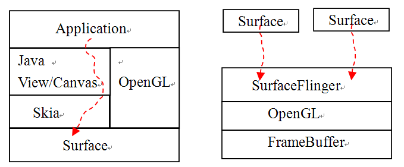
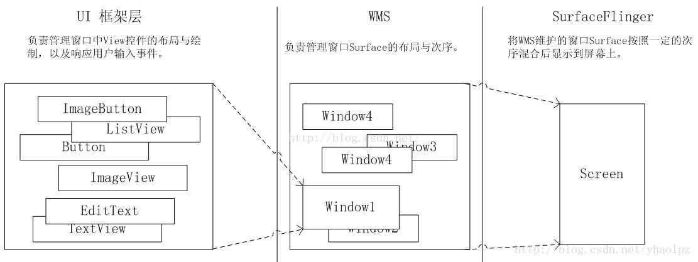
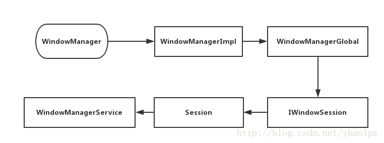
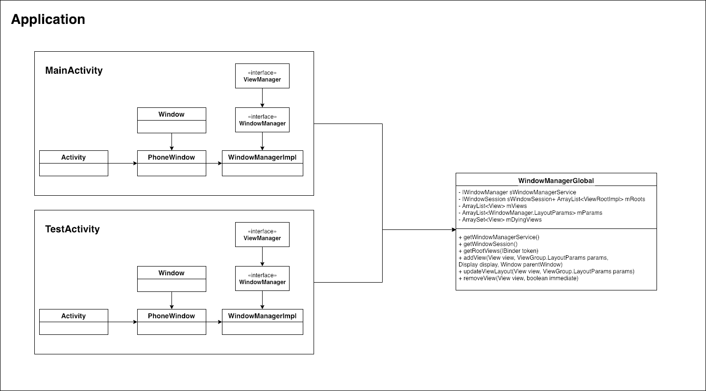
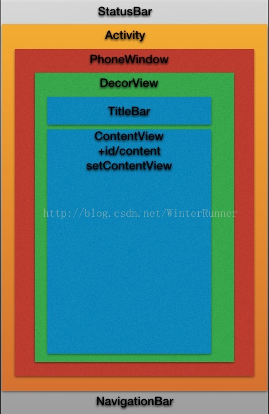
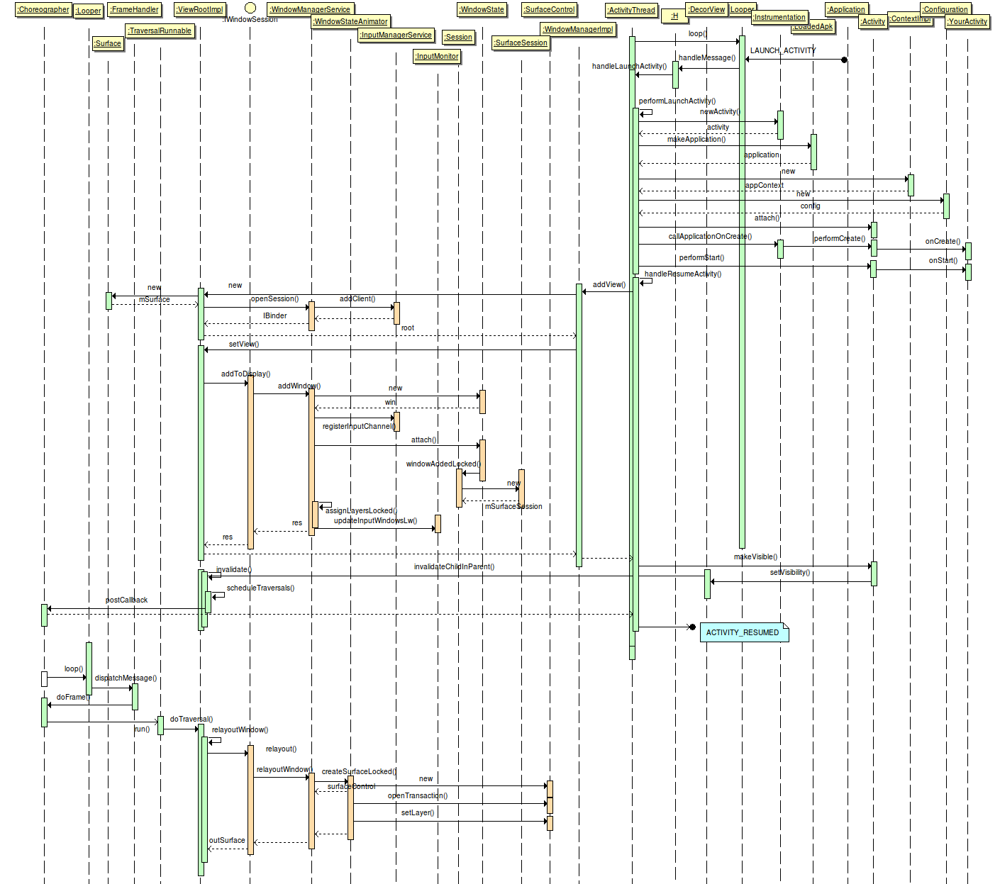

# Android 系统窗口管理机制

# 1、概述

- Surface是一块画布，应用可以随心所欲地通过Canvas或者OpenGL在其上作画。
- 然后通过SurfaceFlinger将多块Surface的内容按照特定的顺序（Z-order）进行混合并输出到FrameBuffer，从而将Android“漂亮的脸蛋”显示给用户。

###1.1、Android显示系统的三个层次

- 第一个层次是UI框架层，其工作为在Surface上绘制UI元素以及响应输入事件。
- 第二个层次为WMS，其主要工作在于管理Surface的分配、层级顺序等。
- 第三层为SurfaceFlinger，负责将多个Surface混合并输出。

### 1.2、涉及对象的简介

-  mContentParent：setContentView()由layout生成的view,根布局ID为content
-  DecorView： Activity 中的顶级 View，FrameLayout子类，子view为mContentParent，作为PhoneView的view容器
-  PhoneView：Window的具体实现类，即activity的window
-  window：屏幕上一块用于绘制各种UI元素并可以响应用户输入的一块矩形区域
-  WindowManager：应用层控制window中的view代理接口，三个接口方法 addView、updateViewLayout 以及 removeView 都是针对 View 的。view信息通往WMS的起点。
-  WindowManagerImpl：WindowManager实现代理类，内部持有WindowManagerGlobal，实际由其处理
-  WindowManagerGlobal：WindowManager实际执行者，进程单例，维护进程所有window中view信息
-  session
-  SWM：系统服务，管理所有window，即管理Surface的分配、层级顺序等；
- PhoneWindowManager：窗口管理策略类，帮WMS计算一个窗口的位置和大小的

## 2 window窗口

Android中的窗口概念：屏幕上一块用于绘制各种UI元素并可以响应用户输入的一块矩形区域。从原理上来看，窗口的概念是独自占有一个Surface实例的显示区域。如Dialog、Activity的界面、壁纸、状态栏以及Toast等都是窗口。

## 3、WindowManager

- 应用层控制window中的view代理接口，同步view信息到WMS
- 实现代理类WindowManagerImpl
- 实际执行者WindowManagerGlobal

**通过 ViewRootImpl 来更新界面并完成 Window 的添加过程**

### 3.1、WindowManagerGlobal

WindowManager实际执行者，进程单例，维护进程所有window中view信息

几个比较重要的集合：

`ArrayList<View> mViews`：存储所有 Window 所对应的 View

 `ArrayList<ViewRootImpl>`：存储所有 Window 所对应的 ViewRootImpl

 `ArrayList<WindowManager.LayoutParams>`：存储所有 Window 所对应的 WindowManager.LayoutParams

 `ArraySet<View>`：存储所有即将被移除的 View

 

### activity中的window和view

## 999 andorid窗口管理系统总架构图

