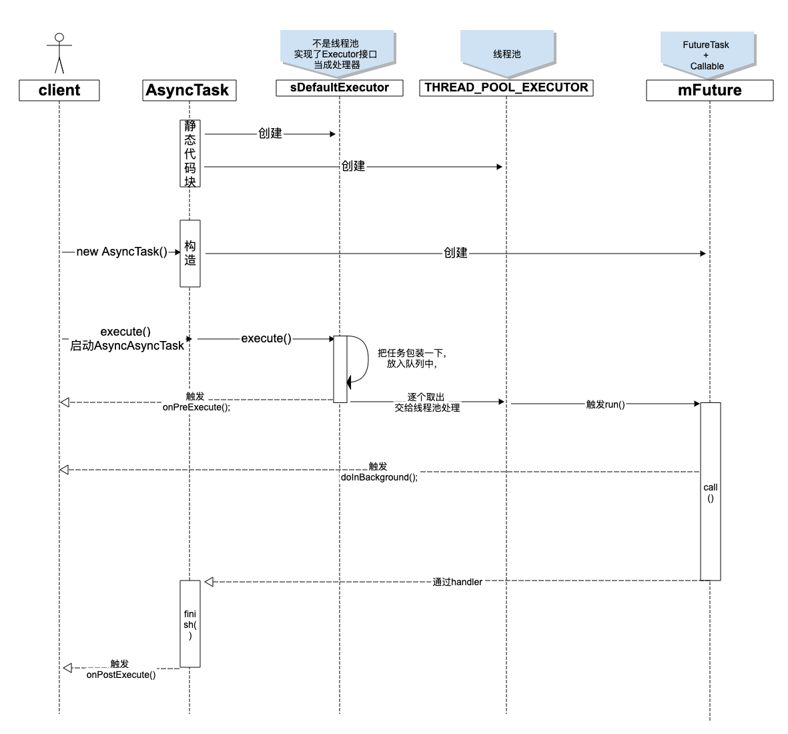

[TOC]

# 使用

1、定义个AsyncTask类，必须实现doInBackground()

```java
/**
 *  String 后台任务使用的参数类型，用于在doInBackground使用
 *  Integer 后台任务执行进度的单位
 *  Long 后台任务的返回结果类型，在doInBackground方法中返回，交给onPostExecute处理。
 */
public class CustomAsyncTask extends AsyncTask<String,Integer,Long>{

    /**
     * 执行后台任务,执行耗时操作，子线程执行
     * <P>
     *     抽象方法，必须实现，其他方法可选。
     * @param strings AsyncTask.execute("a","b")的参数
     * @return 后台任务的执行结果
     */
    @Override
    protected Long doInBackground(String... strings) {
        publishProgress(1);// 可子线程执行，通知任务进度的更新情况。
        return null;
    }
    /**
     * 先执行的方法，在这里一般可以做一些简单的UI初始化操作，如进度条的显示等。
     * <P>主线程执行
     */
    @Override
    protected void onPreExecute() {
        super.onPreExecute();
    }

    /** 更新进度，主线程 */
    @Override
    protected void onProgressUpdate(Integer... values) {
        super.onProgressUpdate(values);
    }

    /**
     * 任务执行完成触发
     * @param aLong doInBackground返回的结果
     */
    @Override
    protected void onPostExecute(Long aLong) {
        super.onPostExecute(aLong);
        // 更新UI的数据。
    }
   /**  调用cancel(boolean)&&doInBackground(Object[])完成时触发 */
    @Override
    protected void onCancelled() {
         super.onCancelled();
    }

    /**
    	* 调用cancel(boolean)&&doInBackground(Object[])完成时触发
      * @param aLong doInBackground(Object[])的返回值
      */
    @Override
    protected void onCancelled(Long aLong) {
         super.onCancelled(aLong);
    }
}
```

2、使用AsyncTask

```java
// 启动方式1，并发执行，指定线程池。返回值AsyncTask自身
new CustomAsyncTask().executeOnExecutor(AsyncTask.THREAD_POOL_EXECUTOR,"a","b");
// 启动方式1，串行执行，使用加入队列。返回值AsyncTask自身
new CustomAsyncTask().execute("a","b");
asyncTask.cancel(true);// 停止任务执行，参数true停止正在执行的任务
// 特例，使用线程池，子线程执行runnable
AsyncTask.execute(Runnable runnable)
Result get(long timeout, TimeUnit unit) && Result get()// 获取处理结果，或阻塞到处理完成  
```


# 读源码

```java
/**
 * tip：每个AsyncTask对象只能被execute一次，第二次被执行时会抛出异常。
 * @Param <Params> 后台任务使用的参数类型，用于在doInBackground使用
 * @Param <Progress> 后台任务执行进度的单位
 * @Param <Result> 后台任务的返回结果类型，在doInBackground方法中返回，交给onPostExecute处理。
 * 这些参数不需要时可以用Void代替。
 **/
public abstract class AsyncTask<Params, Progress, Result> {
    private static final String LOG_TAG = "AsyncTask";
    private static final int CORE_POOL_SIZE = 1; // 核心线程数量
    private static final int MAXIMUM_POOL_SIZE = 20;// 最大线程数量
    private static final int BACKUP_POOL_SIZE = 5;// 拒绝策略核心线程数
    private static final int KEEP_ALIVE_SECONDS = 3;// 空闲线超时时间
		// 线程创建工厂
    private static final ThreadFactory sThreadFactory = new ThreadFactory() {
        private final AtomicInteger mCount = new AtomicInteger(1);// 线程数量
				// 创建线程
        public Thread newThread(Runnable r) {
          	// 2线程名称，线程数量自增
            return new Thread(r, "AsyncTask #" + mCount.getAndIncrement());
        }
    };

    // 备用线程池，当主线程池满了时才会创建。使用这个线程池执行拒绝策略。
    private static ThreadPoolExecutor sBackupExecutor;
  	// 备用线程池的队列，无边界容量
    private static LinkedBlockingQueue<Runnable> sBackupExecutorQueue;
		// 线程池的拒绝策略
    private static final RejectedExecutionHandler sRunOnSerialPolicy =
            new RejectedExecutionHandler() {
      	// 线程池满了，执行拒绝策略时调用
        public void rejectedExecution(Runnable r, ThreadPoolExecutor e) {
            android.util.Log.w(LOG_TAG, "Exceeded ThreadPoolExecutor pool size");
          	// 单例懒加载
            synchronized (this) {
                if (sBackupExecutor == null) {
                    sBackupExecutorQueue = new LinkedBlockingQueue<Runnable>();
                  	// 核心5个，最大5，空闲时间3，单位秒，无边界队列，线程工厂与主线程池相同。
                    sBackupExecutor = new ThreadPoolExecutor(
                            BACKUP_POOL_SIZE, BACKUP_POOL_SIZE, KEEP_ALIVE_SECONDS,
                            TimeUnit.SECONDS, sBackupExecutorQueue, sThreadFactory);
                    sBackupExecutor.allowCoreThreadTimeOut(true);// 核心线程空闲超时会关闭
                }
            }
            sBackupExecutor.execute(r);// 执行任务
        }
    };

    // 执行任务的线程池
    public static final Executor THREAD_POOL_EXECUTOR;
		// 静态代码块，类加载初始化
    static {
      	// 核心1、最大20、超时3、时间单位秒、生产消费队列
        ThreadPoolExecutor threadPoolExecutor = new ThreadPoolExecutor(
                CORE_POOL_SIZE, MAXIMUM_POOL_SIZE, KEEP_ALIVE_SECONDS, TimeUnit.SECONDS,
                new SynchronousQueue<Runnable>(), sThreadFactory);
        threadPoolExecutor.setRejectedExecutionHandler(sRunOnSerialPolicy);// 设置拒绝策略
        THREAD_POOL_EXECUTOR = threadPoolExecutor;
    }

    /**
     * 不是线程池，负责执行任务。
     * 对APP开放， 静态所以进程单例
     */
    public static final Executor SERIAL_EXECUTOR = new SerialExecutor();

    private static final int MESSAGE_POST_RESULT = 0x1;
    private static final int MESSAGE_POST_PROGRESS = 0x2;

    //  不是线程池，负责执行任务。静态所以进程单例。私有		
    @UnsupportedAppUsage
    private static volatile Executor sDefaultExecutor = SERIAL_EXECUTOR;
    private static InternalHandler sHandler;// 主进程的handler
		// callable，call()中执行doInBackground()
    @UnsupportedAppUsage
    private final WorkerRunnable<Params, Result> mWorker;
  	// 使用WorkerRunnable创建，用于线程池执行和获取返回值
    @UnsupportedAppUsage
    private final FutureTask<Result> mFuture;
		// AsyncTask状态，默认pendding，其他会导致抛异常
    @UnsupportedAppUsage
    private volatile Status mStatus = Status.PENDING;
    /** AsyncTask被取消，不会再执行队列中的任务 */
    private final AtomicBoolean mCancelled = new AtomicBoolean();
    /**标记mWorker.call()被执行过 */
  	@UnsupportedAppUsage
    private final AtomicBoolean mTaskInvoked = new AtomicBoolean();
		// 一定是主进程的handler
    private final Handler mHandler;
		// 不是线程池，负责执行任务。
    private static class SerialExecutor implements Executor {
      	// 双端队列，任务列表
        final ArrayDeque<Runnable> mTasks = new ArrayDeque<Runnable>();
        Runnable mActive;// 当前任务
				// 1、来了一个新任务。
        public synchronized void execute(final Runnable r) {
          	// 2、把任务添加进队列
            mTasks.offer(new Runnable() {
              	// 6、scheduleNext()时执行这个run()
                public void run() {
                    try {
                        r.run();// 7、把（final Runnable r）执行了，r一定至队头的任务
                    } finally {
                        scheduleNext();//8、执行完毕，队列里取下一个任务执行
                    }
                }
            });
          	// 3、当前没有正在执行的任务
            if (mActive == null) {
                scheduleNext();// 4、从队列中拿任务来执行
            }// 若有mActive！=null不处理，执行完毕会从队列中取任务执行
        }
				// 使用线程池执行下一个，从mTask队列中取下一个任务，如果队列不为null
        protected synchronized void scheduleNext() {
            if ((mActive = mTasks.poll()) != null) {
                THREAD_POOL_EXECUTOR.execute(mActive);// 5、使用线程池执行任务，进入子线程
            }
        }
    }

    /**
     * 当前AsyncTask的状态
     * 每个AsyncTask对象只能被execute一次，第二次被执行时会抛出异常。
     */
    public enum Status {
        /** 没有被执行过. */
        PENDING,
        /** 正在执行. */
        RUNNING,
        /** 执行完毕. */
        FINISHED,
    }
		// 获取UI线程Handler
    private static Handler getMainHandler() {
        synchronized (AsyncTask.class) {
            if (sHandler == null) {
                sHandler = new InternalHandler(Looper.getMainLooper());
            }
            return sHandler;
        }
    }
		// 获取构造Handler，必然是主线程Handler
    private Handler getHandler() {
        return mHandler;
    }

    /** @hide 设置默认的任务处理器，对应用层隐藏了*/
    @UnsupportedAppUsage
    public static void setDefaultExecutor(Executor exec) {
        sDefaultExecutor = exec;
    }

    /** 构造必须，必须UI线程. */
    public AsyncTask() {
        this((Looper) null);
    }
    /** APP隐藏，构造必须，UI线程. */
    public AsyncTask(@Nullable Handler handler) {
        this(handler != null ? handler.getLooper() : null);
    }
    /** APP隐藏，核心构造，必须UI线程调用。 */
    public AsyncTask(@Nullable Looper callbackLooper) {
        mHandler = callbackLooper == null || callbackLooper == Looper.getMainLooper()
            ? getMainHandler()
            : new Handler(callbackLooper);// 因为对APP隐藏，所以必然UI想成Handler
				// callable
        mWorker = new WorkerRunnable<Params, Result>() {
            public Result call() throws Exception {
                mTaskInvoked.set(true);// 标记mWorker.call()被执行过
                Result result = null;
                try {
                  	// 设置当前线程优先级
                    Process.setThreadPriority(Process.THREAD_PRIORITY_BACKGROUND);
                    // 执行后台好事操作，并获取返回值。
                  	// mParams是WorkerRunnable成员变量，executeOnExecutor()时赋值
                    result = doInBackground(mParams);
                  	// 用户线程要进入阻塞之前跟内核线程发送消息，防止用户线程长时间的持有某个对象。
                    Binder.flushPendingCommands();
                } catch (Throwable tr) {
                    mCancelled.set(true);// 标识任务被取消
                    throw tr;
                } finally {
                    postResult(result);// 发送处理结果，触发onPostExecute()
                }
                return result;
            }
        };
				// 用mWorker创建FutureTask
        mFuture = new FutureTask<Result>(mWorker) {
          	// FutureTask状态转换成done时触发，默认无实现
            @Override
            protected void done() {
              //	如果任务没有被执行过，也发布下处理结果，应该是null吧
                try {
                    postResultIfNotInvoked(get());
                } catch (InterruptedException e) {
                    android.util.Log.w(LOG_TAG, e);
                } catch (ExecutionException e) {
                    throw new RuntimeException("An error occurred while executing doInBackground()",
                            e.getCause());
                } catch (CancellationException e) {
                    postResultIfNotInvoked(null);
                }
            }
        };
    }
		// 任务没有被执行过，也发布下处理结果，应该是null吧
    private void postResultIfNotInvoked(Result result) {
      	// false ： mWorker.call()没有被执行过
        final boolean wasTaskInvoked = mTaskInvoked.get();
        if (!wasTaskInvoked) {
            postResult(result);
        }
    }
		// result包装成AsyncTaskResult，放进message，发给构造handler处理
    private Result postResult(Result result) {
        @SuppressWarnings("unchecked")
        Message message = getHandler().obtainMessage(MESSAGE_POST_RESULT,
                new AsyncTaskResult<Result>(this, result));
        message.sendToTarget();
        return result;
    }

    /** 获取当前AsyncTask的状态，只有pendding时可执行，其他会抛异常 */
    public final Status getStatus() {
        return mStatus;
    }

    /**
     * 执行后台任务,执行耗时操作，子线程执行
     * <P>
     *  抽象方法，必须实现，其他方法可选。执行在mWorkingRunnable#call().
     * @param params  AsyncTask.execute("a","b")的参数
     * @return 后台任务的执行结果.
     */
    @WorkerThread
    protected abstract Result doInBackground(Params... params);

    /** 详见如何使用*/
    @MainThread
    protected void onPreExecute() {
    }

    /** 详见如何使用*/
    @SuppressWarnings({"UnusedDeclaration"})
    @MainThread
    protected void onPostExecute(Result result) {
    }

    /** 详见如何使用*/
    @SuppressWarnings({"UnusedDeclaration"})
    @MainThread
    protected void onProgressUpdate(Progress... values) {
    }

    /** 详见如何使用*/
    @SuppressWarnings({"UnusedParameters"})
    @MainThread
    protected void onCancelled(Result result) {
        onCancelled();
    }    
    
    /** 详见如何使用*/
    @MainThread
    protected void onCancelled() {
    }

    /** 执行过cancel(boolean)，ture。 */
    public final boolean isCancelled() {
        return mCancelled.get();
    }

    /**
     * 停止任务执行，参数true停止正在执行的任务
     * @param mayInterruptIfRunning true停止正在执行的任务; false 正在执行的任务执行完.
     * @return <tt>false</tt>没有任务被取消;
     *         <tt>true</tt> 有
     */
    public final boolean cancel(boolean mayInterruptIfRunning) {
        mCancelled.set(true);
        return mFuture.cancel(mayInterruptIfRunning);
    }

    /** 通过mFuture.get()获取结果，阻塞直至后台任务执行完成*/
    public final Result get() throws InterruptedException, ExecutionException {
        return mFuture.get();
    }

    /**
     * 通过mFuture.get()获取结果，阻塞直至后台任务执行完成
     * @param timeout 超时取消任务.阻塞时间超过设定的timeout时间，该方法将抛出异常.
     * @param unit 超时单位.
     * @return 任务处理结果.
     */
    public final Result get(long timeout, TimeUnit unit) throws InterruptedException,
            ExecutionException, TimeoutException {
        return mFuture.get(timeout, unit);
    }

    /**
     * 启动方式，串行执行.
     * <p>必须主线程调用.
     * @param params 后台执行的参数.
     * @return AsyncTask自身对象实例.
     * @throws IllegalStateException 只能执行一次，否则抛异常.
     */
    @MainThread
    public final AsyncTask<Params, Progress, Result> execute(Params... params) {
      	// sDefaultExecutor导致串行，这货不是线程池
        return executeOnExecutor(sDefaultExecutor, params);
    }

    /**
     * 启动方式，想并发执行时用这个方法.
     * @param exec 指定线程池.通常使用{@link #THREAD_POOL_EXECUTOR} 会并发处理.
     * @param params 任务后台执行的参数.
     * @return 当前AsyncTask对象实例.
		 */
    @MainThread
    public final AsyncTask<Params, Progress, Result> executeOnExecutor(Executor exec,
            Params... params) {
      	// 每个AsyncTask对象只能被execute一次，第二次被执行时会抛出异常。
        if (mStatus != Status.PENDING) {
            switch (mStatus) {
                case RUNNING:
                    throw new IllegalStateException("Cannot execute task:"
                            + " the task is already running.");
                case FINISHED:
                    throw new IllegalStateException("Cannot execute task:"
                            + " the task has already been executed "
                            + "(a task can be executed only once)");
            }
        }
				// 修改状态，再执行就抛异常
        mStatus = Status.RUNNING;
				// 触发执行前，准备的回调
        onPreExecute();
        mWorker.mParams = params;// 保存下参数
        exec.execute(mFuture);
        return this;
    }

    /** 使用线程池，子线程直接执行runnable。串行 */
    @MainThread
    public static void execute(Runnable runnable) {
        sDefaultExecutor.execute(runnable);// 使用执行器执行任务
    }

    /**
     * 可子线程执行，通知任务进度的更新情况。
     * <p>触发onProgressUpdate(Integer... values)
     * @param values 更新进度.
     */
    @WorkerThread
    protected final void publishProgress(Progress... values) {
        if (!isCancelled()) {
            getHandler().obtainMessage(MESSAGE_POST_PROGRESS,
                    new AsyncTaskResult<Progress>(this, values)).sendToTarget();
        }
    }
		// 任务处理完成
    private void finish(Result result) {
        if (isCancelled()) {
            onCancelled(result);// 任务被取消了，不会触发onPostExecute（）
        } else {
            onPostExecute(result);// 正常完成触发onPostExecute（）
        }
        mStatus = Status.FINISHED;
    }
		// 主进程的Handler
    private static class InternalHandler extends Handler {
        public InternalHandler(Looper looper) {
            super(looper);
        }

        @SuppressWarnings({"unchecked", "RawUseOfParameterizedType"})
        @Override
        public void handleMessage(Message msg) {
            AsyncTaskResult<?> result = (AsyncTaskResult<?>) msg.obj;
            switch (msg.what) {
                // mTask是AsyncTask对象实例
                case MESSAGE_POST_RESULT:
                    // 任务处理完成
                    result.mTask.finish(result.mData[0]);
                    break;
                case MESSAGE_POST_PROGRESS:
                		// 处理进度发生改变
                    result.mTask.onProgressUpdate(result.mData);
                    break;
            }
        }
    }

    private static abstract class WorkerRunnable<Params, Result> implements Callable<Result> {
        Params[] mParams;// 保存后台执行任务，使用的参数
    }
		// 用于包装处理结果
    @SuppressWarnings({"RawUseOfParameterizedType"})
    private static class AsyncTaskResult<Data> {
        final AsyncTask mTask;
        final Data[] mData;// 保存处理结果

        AsyncTaskResult(AsyncTask task, Data... data) {
            mTask = task;
            mData = data;
        }
    }
}
```


#  时序图




#  知识点

## Callable

Runnable#run()没有返回值，无法获取处理结果，Callable接口有返回值。

```java
public interface Callable<V> { 
      V call() throws Exception; 
}
```

实现ExcutorService接口，可使用Callable。java线程池基本都实现了，所以线程池可使用Callable。

**ExecutorService使用Callable的方法**：

```java
<T> Future<T> submit(Callable<T> task);
<T> Future<T> submit(Runnable task, T result);
Future<?> submit(Runnable task);
```


## Future<V>

Future<V>接口是用来获取异步计算结果的，说白了就是对具体的Runnable或者Callable对象任务执行的结果进行获取(get()),取消(cancel()),判断是否完成等操作。

Future接口的源码：

```java
public interface Future<V> {
    /**
     * 如果任务还没开始，执行cancel(...)方法将返回false；
     * 如果任务已经启动，执行cancel(true)方法将以中断执行此任务线程的方式来试图停止任务，如果停止成功，返回true；
     * 当任务已经启动，执行cancel(false)方法将不会对正在执行的任务线程产生影响(让线程正常执行到完成)，此时返回false；
     * 当任务已经完成，执行cancel(...)方法将返回false。mayInterruptRunning参数
     *
     * @param mayInterruptIfRunning 表示是否中断执行中的任务。
     */
    boolean cancel(boolean mayInterruptIfRunning);

    /** 如果任务完成前被取消，则返回true。 */
    boolean isCancelled();

    /** 任务执行是否结束，无论是正常结束或是中途取消还是发生异常，都返回true。 */
    boolean isDone();

    /** 获取异步执行的结果，如果没有结果可用，此方法会阻塞直到异步计算完成。 */
    V get() throws InterruptedException, ExecutionException;

    /**
     * 获取异步执行结果，如果没有结果可用，此方法会阻塞，但是会有时间限制，
     * 如果阻塞时间超过设定的timeout时间，该方法将抛出异常。
     */
    V get(long timeout, TimeUnit unit)
        throws InterruptedException, ExecutionException, TimeoutException;
}
```

Future提供了3种功能：（1）能够中断执行中的任务（2）判断任务是否执行完成（3）获取任务执行完成后额结果。

## FutureTask

FutureTask是**Future**和runnable的实现类。**Future**是接口，FutureTask是其实现类。

Runnbale没有返回值，无法获取后台的处理结果。

FutureTask可以使用get()获取返回值，此方法会阻塞直到异步计算完成。

FutureTask需要配合使用，构造如下

```java
public FutureTask(Callable<V> callable) {}
public FutureTask(Runnable runnable, V result) {}
```

FutureTask+Callable

```java
Callable<String> callable = new Callable<String>() {
    @Override
    public String call() throws Exception {
        return "返回值";
    }
};
FutureTask<String> futureTask = new FutureTask<>(callable);
ExecutorService executorService = Executors.newFixedThreadPool(3);
executorService.execute(futureTask);
String result = futureTask.get();//  返回值
```

FutureTask+Runnable

```java
Runnable runnable = new Runnable() {
    @Override
    public void run() {
        // ...
    }
};
FutureTask<String> futureTask = new FutureTask<>(runnable,"返回值");
ExecutorService executorService = Executors.newFixedThreadPool(3);
executorService.execute(futureTask);
String result = futureTask.get();//  返回值
```


## 线程池--拒绝策略

当线程池的任务缓存队列已满并且线程池中的线程数目达到maximumPoolSize，如果还有任务到来就会采取任务拒绝策略。

示例

```java
// 创建线程池。
ThreadPoolExecutor pool = new ThreadPoolExecutor(1, 1, 0, TimeUnit.SECONDS,
        new ArrayBlockingQueue<Runnable>(1));
// 设置线程池的拒绝策略为"抛出异常"
pool.setRejectedExecutionHandler(new ThreadPoolExecutor.AbortPolicy());
```

通常有以下四种策略：

```css
ThreadPoolExecutor.AbortPolicy:丢弃任务并抛出RejectedExecutionException异常。
ThreadPoolExecutor.DiscardPolicy：也是丢弃任务，但是不抛出异常。
ThreadPoolExecutor.DiscardOldestPolicy：丢弃队列最前面的任务，然后重新尝试执行任务（重复此过程）
ThreadPoolExecutor.CallerRunsPolicy：由调用线程处理该任务
```

自定义拒绝策略

1、实现RejectedExecutionHandler接口	

```java
class CustomRejectedExecutionHandler implements RejectedExecutionHandler {
    // 新任务将被拒绝时触发
    @Override
    public void rejectedExecution(Runnable r, ThreadPoolExecutor executor) {
        // 执行拒绝策略,eg用其他线程池去执行
        AsyncTask.execute(r);
    }
}
```

2、设置拒绝策略

```java
// 创建线程池。
ThreadPoolExecutor pool = new ThreadPoolExecutor(1, 1, 0, TimeUnit.SECONDS,
        new ArrayBlockingQueue<Runnable>(1));
// 设置线程池的拒绝策略为"自定义"
pool.setRejectedExecutionHandler(new CustomRejectedExecutionHandler());
```


##  核心线程空闲回收

示例

```java
// 创建线程池。
ThreadPoolExecutor pool = new ThreadPoolExecutor(1, 1, 0, TimeUnit.SECONDS,
        new ArrayBlockingQueue<Runnable>(1));
// 设置线程池核心线程空闲回收
pool.allowCoreThreadTimeOut(true);
```

线程池对象有个方法`allowCoreThreadTimeOut(boolean value)`, 当传入`true`的时候，表示核心线程池的线程在没有任务到达的时候，`keepAliveTime`时间后关闭。

`allowCoreThreadTimeOut`为`false`, 也就是说默认情况下，线程池的线程数最小是`corePoolSize`, 即使这些线程是空闲的，数量也会维持在`corePoolSize`。

## AsyncTask串行吗？

```java
// 启动方式1，并发执行，指定线程池。返回值AsyncTask自身
new CustomAsyncTask().executeOnExecutor(AsyncTask.THREAD_POOL_EXECUTOR,"a","b");
// 启动方式1，串行执行，使用加入队列。返回值AsyncTask自身
new CustomAsyncTask().execute("a","b");
// 特例，使用线程池，子线程执行runnable
AsyncTask.execute(Runnable runnable)
```

并行串行都可以。

**串行是怎么实现的**：搜索 【SerialExecutor implements Executor】看源码。

## TIP 
- 每个AsyncTask对象只能被execute一次，第二次被执行时会抛出异常。

- mHandler sHandler都是主线程的，可以更换mHandler的构造对APP隐藏，所以必须UI线程初始化
- 拒接策略，用sBackupExecutor线程池处理。该线程池单例懒加载，核心线程空闲回收


