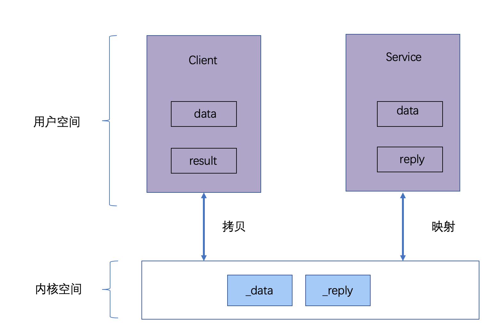

# Binder机制

## 1、概述

binder机制：Android系统提供的一种IPC机制

### 1.1 IPC内存关系


- 每个Android的进程，只能运行在自己进程所拥有的虚拟地址空间
- 虚拟地址空间分为：内核空间、用户空间
- 用户空间：不同进程之间彼此资源不能共享
- 内核空间：可以共享，普通程序无法直接访问
- IPC通常利用进程间可共享的内核内存空间来实现

### 1.2 Binder架构


- 四对象：Client、Server、ServiceManager以及binder驱动
- 基于C/S架构 ，运行在不同进程，彼此交互通过binder
- [iotcl](#2.1 ioctl函数用法详解)：系统标准接口，驱动不能直接操作，用户层iotcl()<----------->驱动层binder_iotcl()
- [Parcel](#2.3 Android Parcel对象)：共享内存读写，具体操作由Binder驱动控制

### 1.3 binder对象


### 1.4 数据流分析



- Client：data为参数，result为null
- 内核：Client通过Parcel开辟两块空间，data拷贝到_data
- Service:通过binder与内核形成映射关系，使用_data进行运算，结果写入reply，同时映射到_reply
- Client: 同步调用后，_reply已经有了返回值，通过Parcel将__reply拷贝到result，结束。

### 1.4 源码目录

1. **Java framework**
   [`/frameworks/base/core/java/android/os/`](http://androidxref.com/9.0.0_r3/xref/frameworks/base/core/java/android/os/)
       - IInterface.java
       - IBinder.java
       - Parcel.java
       - IServiceManager.java
       - ServiceManager.java
       - ServiceManagerNative.java
       - Binder.java  
   
   [`/frameworks/base/core/jni/`](http://androidxref.com/9.0.0_r3/xref/frameworks/base/core/jni/)    
       - android_os_Parcel.cpp
       - AndroidRuntime.cpp
       - android_util_Binder.cpp (核心类)


2. **Native framework**

   [`/frameworks/native/libs/binder`](http://androidxref.com/9.0.0_r3/xref/frameworks/native/libs/binder/)         
   
       - IServiceManager.cpp
       - BpBinder.cpp
       - Binder.cpp
       - IPCThreadState.cpp (核心类)
       - ProcessState.cpp  (核心类)
   
   [`/frameworks/native/include/binder/`](http://androidxref.com/9.0.0_r3/xref/frameworks/native/include/binder/)
   
       - IServiceManager.h
       - IInterface.h
       - Parcel.h
   
   [`/frameworks/native/cmds/servicemanager/`](http://androidxref.com/9.0.0_r3/xref/frameworks/native/cmds/servicemanager/)
   
       - service_manager.c
       - binder.c


3. **Kernel**

   `/kernel/drivers/staging/android/`
	
	- [binder.c](https://android.googlesource.com/kernel/common/+/refs/heads/android-4.14/drivers/android/binder.c)
    - [binder.h](https://android.googlesource.com/kernel/common/+/refs/heads/android-4.14/include/uapi/linux/android/binder.h)


## 2 前置知识点

### 2.1 ioctl函数用法详解

ioctl是设备驱动程序中对设备的I/O通道进行管理的函数。

注：系统提供的标准接口。普通应用无法操作binder驱动，操作内核空间、系统驱动需要使用系统提供的接口，即icotl。

``` c
#include <sys/ioctl.h>
/**
 * 操纵由参数指定的设备文件
 * @fd       用户程序打开设备时使用open函数返回的文件标示符
 * @cmd      用户程序对设备的控制命令
 * @...arg   补充参数
 * @return
 */
int ioctl(int fd, int cmd, ...arg);
```

### 2.2 RPC 远程过程调用协议
RPC 远程过程调用协议，**Remote Procedure Call**的简称,相对应本地过程调用。

张三—>通知李四—>李四干活

**RPC要解决的两个问题：**

1. **解决分布式系统中，服务之间的调用问题。**
2. **远程调用时，要能够像本地调用一样方便，让调用者感知不到远程调用的逻辑。**

https://zhuanlan.zhihu.com/p/36427583

### 2.3 Android Parcel对象

#### 2.3.1 简介


- Parcel提供了一套机制，可以将序列化之后的数据(writeXxx())写入一个**共享内存**中，其他进程通过Parcel可以从这块共享内存(readXxx())读出字节流，并反序列化成对象

- Parcel是一个存放读取数据的容器，系统中的**binder进程间通信(IPC)**就使用了Parcel类来进行客户端与服务端数据交互，而且**AIDL**的数据也是通过Parcel来交互的。在Java层和C++层都实现了Parcel，由于它在C/C++中，**直接使用了内存来读取数据**，因此，它更有效率。

- 其实Parcel是内存中的结构的是一块**连续的内存**，会自动根据需要**自动扩展**大小

- Parcel传递数据，可以分为3种，传递方式也不一样：

  > - 小型数据：从用户空间(源进程)copy到kernel空间(Binder驱动中)再写回用户空间(目标进程，binder驱动负责寻找目标进程)
  > - 大型数据：使用android 的匿名共享内存 (Ashmem)传递
  > - binder对象：Kernel binder驱动专门处理

#### 2.3.2 方法说明

``` java
obtain()：获取一个Parcel，可以理解new了一个对象，其实是有一个Parcel池
recyle()：清空，回收Parcel对象的内存

writeException()：在Parcel队头写入一个异常
readException()：在Parcel队头读取，若读取值为异常，则抛出该异常；否则程序正常运行
```


## 3. AIDL

### 3.1 原理分析


- 首先查找本地，没有则为进程间通讯，使用[RPC](#2.2 RPC 远程过程调用协议)

### 3.2 AIDL文件

包名目录下new aidl-file，自动创建目录及文件

采用AIDL技术，是原理还是利用framework binder的架构。AIDL会自动生成一个与之相对应的IAidlService.java文件，如下：

``` java
/*
 * This file is auto-generated.  DO NOT MODIFY.
 * Original file: /Users/v_maqinglong/Documents/AndroidProject/BinderGuide/aidl/src/main/aidl/com/norman/aidl/IAidlService.aidl
 */
package com.norman.aidl;

/**
 * 姓名：马庆龙 on 2019-06-25 15:05
 * 功能：系统生成的文件
 */
public interface IMyService extends android.os.IInterface {
    /**
     * binder实体
     */
    public static abstract class Stub extends android.os.Binder implements com.norman.aidl.IMyService {
        /**
         * 标示
         * 1、用于区分本地or跨进程
         * 2、跨进程中区分service
         */
        private static final java.lang.String DESCRIPTOR = "com.norman.aidl.IMyService";

        /**
         * 构造
         * 保存this和DESCRIPTOR为binder中成员变量
         */
        public Stub() {
            this.attachInterface(this, DESCRIPTOR);
        }

        /**
         * IBinder转IMyService
         * 本地返回实体
         * 跨进程返回代理，即proxy
         */
        public static com.norman.aidl.IMyService asInterface(android.os.IBinder obj) {
            if ((obj == null)) {
                return null;
            }
            //binderProxy返回null；Binder DESCRIPTOR相同则 返回mOwner
            android.os.IInterface iin = obj.queryLocalInterface(DESCRIPTOR);
            if (((iin != null) && (iin instanceof com.norman.aidl.IMyService))) {
                //本地通进程
                return ((com.norman.aidl.IMyService) iin);
            }
            //跨进程
            return new com.norman.aidl.IMyService.Stub.Proxy(obj);
        }

        @Override
        public android.os.IBinder asBinder() {
            return this;
        }


        /**
         * 接收client调用，与transact()对应
         * @param code
         * @param data 客户端传来的参数副本
         * @param reply 返回值，由客户端传入，由服务端复制
         * @param flags
         * @return
         * @throws android.os.RemoteException
         */
        @Override
        public boolean onTransact(int code, android.os.Parcel data, android.os.Parcel reply, int flags)
                throws android.os.RemoteException {
            java.lang.String descriptor = DESCRIPTOR;
            switch (code) {
                // TODO: 2019-06-25
                case INTERFACE_TRANSACTION: {
                    reply.writeString(descriptor);
                    return true;
                }
                case TRANSACTION_getData: {
                    //调用getData()
                    data.enforceInterface(descriptor);
                    //_arg0参数
                    com.norman.aidl.MyData _arg0;
                    if ((0 != data.readInt())) {
                        //从内核空间取数据，反序列化参数
                        _arg0 = com.norman.aidl.MyData.CREATOR.createFromParcel(data);
                    } else {
                        _arg0 = null;
                    }
                    //调用发生位置
                    com.norman.aidl.MyData _result = this.getData(_arg0);
                    //表示没有异常
                    reply.writeNoException();
                    if ((_result != null)) {
                        reply.writeInt(1);
                        //写入内核空间，PARCELABLE_WRITE_RETURN_VALUE表示此数据为方法的返回值
                        _result.writeToParcel(reply, android.os.Parcelable.PARCELABLE_WRITE_RETURN_VALUE);
                    } else {
                        reply.writeInt(0);
                    }
                    return true;
                }
                default: {
                    return super.onTransact(code, data, reply, flags);
                }
            }
        }

        /** binder 代理  与BinderProxy对应*/
        private static class Proxy implements com.norman.aidl.IMyService {
            /** BinderProxy对象 */
            private android.os.IBinder mRemote;

            Proxy(android.os.IBinder remote) {
                mRemote = remote;
            }

            @Override
            public android.os.IBinder asBinder() {
                return mRemote;
            }

            public java.lang.String getInterfaceDescriptor() {
                return DESCRIPTOR;
            }

            @Override
            public com.norman.aidl.MyData getData(com.norman.aidl.MyData data) throws android.os.RemoteException {
                //创建Parcel，用于向内核空间写入数据
                android.os.Parcel _data = android.os.Parcel.obtain();
                android.os.Parcel _reply = android.os.Parcel.obtain();
                //getData的返回值
                com.norman.aidl.MyData _result;
                try {
                    //给参数添加表示
                    _data.writeInterfaceToken(DESCRIPTOR);
                    if ((data != null)) {
                        _data.writeInt(1);
                        //参数写入内核空间，唯一拷贝发生位置
                        data.writeToParcel(_data, 0);
                    } else {
                        _data.writeInt(0);
                    }
                    //通过binder 调用service 调用结束前线程阻塞
                    mRemote.transact(Stub.TRANSACTION_getData, _data, _reply, 0);
                    //检查异常，service端异常也会抛到client中处理
                    _reply.readException();
                    if ((0 != _reply.readInt())) {
                        //从内核拷贝返回值到用户空间，返回值的唯一一次拷贝
                        _result = com.norman.aidl.MyData.CREATOR.createFromParcel(_reply);
                    } else {
                        _result = null;
                    }
                } finally {
                    //parcel使用后需要释放
                    _reply.recycle();
                    _data.recycle();
                }
                return _result;
            }
        }

        /** 标识，区分方法 */
        static final int TRANSACTION_getData = (android.os.IBinder.FIRST_CALL_TRANSACTION + 0);
    }

    /** 跨进程被调用的方法 */
    public com.norman.aidl.MyData getData(com.norman.aidl.MyData data) throws android.os.RemoteException;
}
```

### 3.3 AIDL自定义数据类型中的in、out、inout的作用

- in：表示数据只能由**客户端流向服务端**，服务端将会收到客户端对象的**完整数据**，但是客户端对象**不会因为服务端对传参的修改而发生变动**。
- out：表示数据只能由**服务端流向客户端**，服务端将会收到**客户端对象**，该**对象不为空**，但是它里面的**字段为空**，但是在服务端对该对象作任何修改之后客户端的传参对象都会**同步改动**。
- inout：表示数据可以在**服务端与客户端之间双向流通**，服务端将会接收到客户端传来**对象的完整信息**，并且客户端将会**同步服务端对该对象的任何变动**。


###


