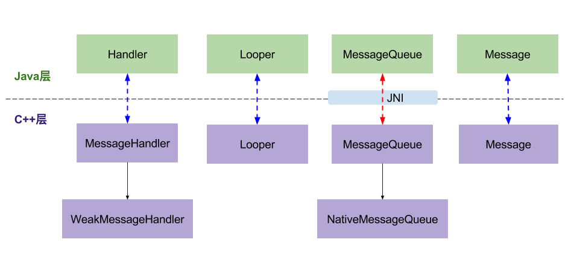

# Handler 机制

## 1、概述

- Handler通过sendMessage()发送Message到MessageQueue队列；
- Looper通过loop()，不断提取出达到触发条件的Message，并将Message交给target来处理；
- 经过dispatchMessage()后，交回给Handler的handleMessage()来进行相应地处理。
- 将Message加入MessageQueue时，处往管道写入字符，可以会唤醒loop线程；如果MessageQueue中没有Message，并处于Idle状态，则会执行IdelHandler接口中的方法，往往用于做一些清理性地工作。

###1.1、handler类图native层

### 1.2 java与native层关系

## 2、相关知识点

### 2.1、ThreadLocal

 线程本地存储区（Thread Local Storage，简称为TLS），每个线程都有自己的私有的本地存储区域，不同线程之间彼此不能访问对方的TLS区域。TLS常用的操作方法：

