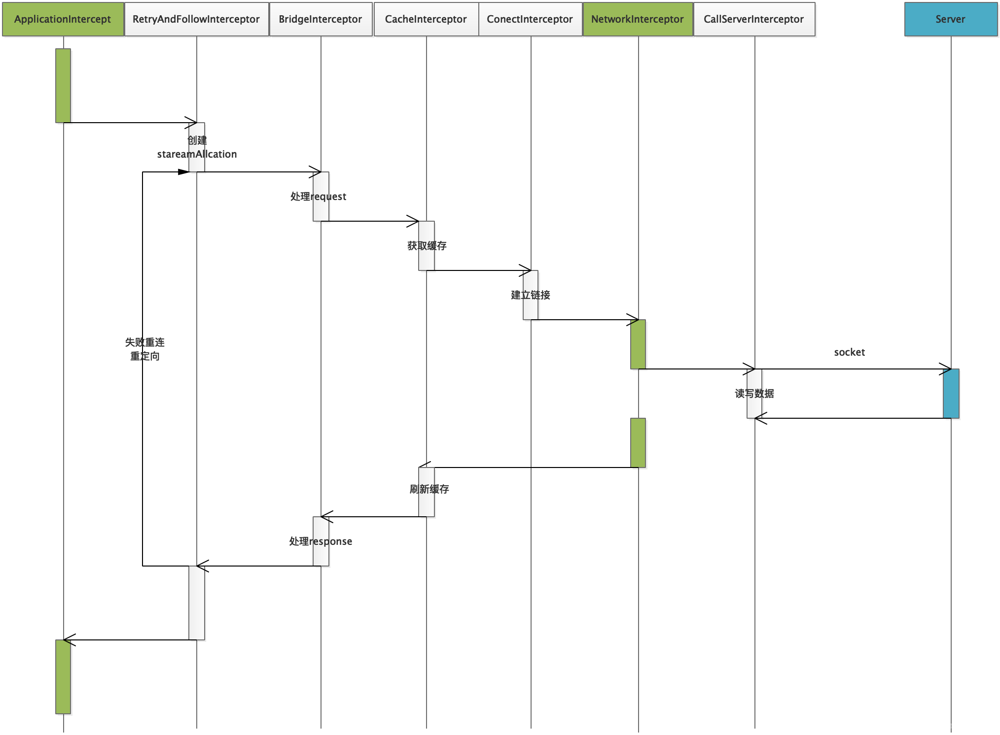

#网络请求相关
## 基础
UserAgent：用于识别用户的当前环境
```shell
User-Agent:Mozilla/5.0 (Macintosh; U; Intel Mac OS X 10_6_8; en-us) AppleWebKit/534.50 (KHTML, like Gecko) Version/5.1 Safari/534.50
```

## OkHttp原理（version3.8.1）
### 总流程时序图


> Application Interceptor

我们可以自定义设置 Okhttp 的拦截器之一。

从流程图中我们可以看到一次网络请求它只会执行一次拦截，而且它是第一个触发拦截的，这里拦截到的url请求的信息都是最原始的信息。所以我们可以在该拦截器中添加一些我们请求中需要的通用信息，打印一些我们需要的日志。

当然我们可以定义多个这样的拦截器，一个处理 header 信息，一个处理 接口请求的 加解密 。

> NetwrokInterceptor

NetwrokInterceptor 也是我们可以自定义的拦截器之一。

它位于倒数第二层，会经过 RetryAndFollowIntercptor 进行重定向并且也会通过 BridgeInterceptor 进行 request请求头和 响应 resposne 的处理，因此这里可以得到的是更多的信息。在打印结果可以看到它内部重定向操作和失败重试，这里会有比 Application Interceptor 更多的日志。

> RetryAndFollowInterceptor

RetryAndFollowUpInterceptor 的作用，看到该拦截器的名称就知道，它就是一个负责失败重连的拦截器。它是 Okhttp 内置的第一个拦截器，通过 while (true) 的死循环来进行对异常结果或者响应结果判断是否要进行重新请求。

> BridgeInterceptor

BridgeInterceptor 为用户构建的一个 Request 请求转化为能够进行网络访问的请求，同时将网络请求回来的响应 Response 转化为用户可用的 Response。比如，涉及的网络文件的类型和网页的编码，返回的数据的解压处理等等。

> CacheInterceptor

CacheInterceptor 根据 OkHttpClient 对象的配置以及缓存策略对请求值进行缓存。

> ConnectInterceptor

ConnectInterceptor 在 OKHTTP 底层是通过 SOCKET 的方式于服务端进行连接的，并且在连接建立之后会通过 OKIO 获取通向 server 端的输入流 Source 和输出流 Sink。

> CallServerInterceptor

CallServerInterceptor 在 ConnectInterceptor 拦截器的功能就是负责与服务器建立 Socket 连接，并且创建了一个 HttpStream 它包括通向服务器的输入流和输出流。而接下来的 CallServerInterceptor 拦截器的功能使用 HttpStream 与服务器进行数据的读写操作的。

### 责任链设计模式
 - 定义：避免请求发送者与接收者耦合在一起，让多个对象都有可能接收请求，将这些对象连接成一条链，并且沿着这条链传递请求，直到有对象处理它为止。职责链模式是一种对象行为型模式。
 - 角色
Handler（抽象处理者）：它定义了一个处理请求的接口，一般设计为抽象类，由于不同的具体处理者处理请求的方式不同，因此在其中定义了抽象请求处理方法。因为每一个处理者的下家还是一个处理者，因此在抽象处理者中定义了一个抽象处理者类型的对象，作为其对下家的引用。通过该引用，处理者可以连成一条链。
ConcreteHandler（具体处理者）：它是抽象处理者的子类，可以处理用户请求，在具体处理者类中实现了抽象处理者中定义的抽象请求处理方法，在处理请求之前需要进行判断，看是否有相应的处理权限，如果可以处理请求就处理它，否则将请求转发给后继者；在具体处理者中可以访问链中下一个对象，以便请求的转发。

### 抽象处理者(拦截器)
```Java
// 拦截器
public interface Interceptor {
   /**
    * 拦截器处理事件函数,直接调用&响应上个拦截器的proceed()
    * @param chain 指向下一个拦截器的链
    * @return 下一个拦截器处理后的response     
    */
    Response intercept(Chain chain) throws IOException;

    /** 责任链，获取下一个拦截器的引用 */
    interface Chain {
        // 获取当前请求的request
        Request request();
        // 调用链中下一个拦截器，其会执行intercept(),处理request，返回response
        Response proceed(Request request) throws IOException;

     /**
      * Returns the connection the request will be executed on. This is only available in the chains
      * of network interceptors; for application interceptors this is always null.
      */
      @Nullable Connection connection();
  }
}
```
### 具体抽象处理者(拦截器)
```Java
// 自定义个拦截器打印log
class LoggingInterceptor implements Interceptor {
    // 响应&处理事件
  @Override 
  public Response intercept(Interceptor.Chain chain) throws IOException {
    // 获取请求的request
    Request request = chain.request();
    // 。。。打印请求信息
    // 下一个拦截器处理，返回响应response
    Response response = chain.proceed(request);
    // 。。。打印响应信息
    return response;
  }
}
```
### chain,事件的传递
下一个拦截器的引用在哪？ chain是什么？
链chain的实现类 RealInterceptorChain

```Java
public final class RealInterceptorChain implements Interceptor.Chain {
    /** 拦截器的集合 */
    List<Interceptor> interceptors;
    @Override public Response proceed(Request request) throws IOException {
      // ...
      // 下一个拦截器的引用，根据index
      RealInterceptorChain next = new RealInterceptorChain(
          interceptors, streamAllocation, httpCodec, connection, index + 1, request);
      // 当前拦截器
      Interceptor interceptor = interceptors.get(index);
      // 当前拦截器处理事件，在intercept(next)中会执行Chain#proceed()
      Response response = interceptor.intercept(next);
      // ...
    }
    
     private final Request request;
     @Override public Request request() {
        return request;
      }
      
     private final RealConnection connection;
     @Override public Connection connection() {
         return connection;
       }   
}

```
### 分析一个 OkHttp的拦截器

> ConnectInterceptor：负责网络连接，其本质是复用连接池中socket连接。

```Java
public final class ConnectInterceptor implements Interceptor {
  @Override public Response intercept(Chain chain) throws IOException {
    // 需要使用实现类的proceed()方法
    RealInterceptorChain realChain = (RealInterceptorChain) chain;
    Request request = realChain.request();// 获取请求信息
    // 从拦截器链里得到StreamAllocation，由重定向拦截器创建，持有socket连接及其传输的数据流，成员变量：Address、ConnectionPool、HttpCodec、RealConnection、（RouteSelector线路选择器）
    StreamAllocation streamAllocation = realChain.streamAllocation();
    boolean doExtensiveHealthChecks = !request.method().equals("GET");
    // HttpCodec：http编解码
    HttpCodec httpCodec = streamAllocation.newStream(client, doExtensiveHealthChecks);
    // 管理Socket连接的
    RealConnection connection = streamAllocation.connection();
		// 连接已建立，调用下个拦截器传输数据去
    return realChain.proceed(request, streamAllocation, httpCodec, connection);
  }
}
```

### Socket实现Http请求

```Java
@SuppressWarnings("Duplicates")
public class SocketHttp {
    /** ip/域名 */
    private final String URL = "54.183.236.104";
    private final String CONTENT = "GET http://54.183.236.104/mini/queryVideo?videoNum=6  HTTP/1.1\r\nHost: 54.183.236.104\r\n\r\n";
    /** 服务器端口 */
    private final int PORT = 8088;

    /** get请求自己服务器 */
    public void getHTTP() {
        try {
            Socket socket = new Socket(URL, PORT); //建立TCP/IP链接
            OutputStream out = socket.getOutputStream();
            BufferedReader in = new BufferedReader(new InputStreamReader(socket.getInputStream(), "UTF-8"));
            out.write(CONTENT.getBytes());  //发送数据
            int d = -1;
            while ((d = in.read()) != -1) {       //接收
                System.out.print((char) d);  //输出到控制台
            }

        } catch (UnknownHostException e) {
            e.printStackTrace();
        } catch (IOException e) {
            e.printStackTrace();
        }
    }

    /** get请求淘宝 */
    public void getHTTPS() {
        try {
            //如果想建立一个sslSocket，用于https的通讯（例如：https://www.taobao.com）
            // 只需要通过sslSocketFactory进行创建sslSocket即可
            //443为https默认端口
            Socket socket = SSLSocketFactory.getDefault().createSocket("www.taobao.com", 443);
            OutputStream out = socket.getOutputStream();
            BufferedReader in = new BufferedReader(new InputStreamReader(socket.getInputStream(), "UTF-8"));
            String request = "GET https://www.taobao.com  HTTP/1.1\r\nHost: www.taobao.com\r\n\r\n";
            out.write(request.getBytes());  //发送数据
            int d = -1;
            while ((d = in.read()) != -1) {       //接收
                System.out.print((char) d);  //输出到控制台
            }

        } catch (UnknownHostException e) {
            e.printStackTrace();
        } catch (IOException e) {
            e.printStackTrace();
        }
    }

    /** post请求淘宝 */
    void postHttp() throws IOException {
        //http://54.183.236.104:8088/mini/queryVideo?videoNum=6
        Socket socket = new Socket();
        //用来描述IP地址和主机名称
        SocketAddress dest = new InetSocketAddress("54.183.236.104", 8088);
        socket.connect(dest);
        OutputStreamWriter streamWriter = new OutputStreamWriter(socket.getOutputStream(), "utf-8");
        BufferedWriter bufferedWriter = new BufferedWriter(streamWriter);
        //配置post参数
        String data = URLEncoder.encode("videoNum", "utf-8") + "=" + URLEncoder.encode("11", "utf-8")
                + "&" + URLEncoder.encode("age", "utf-8") + "=" + URLEncoder.encode("32", "utf-8");
        bufferedWriter.write("POST " + "/mini/queryVideo/" + " HTTP/1.1\r\n");
        bufferedWriter.write("Host: " + "54.183.236.104" + "\r\n");
        bufferedWriter.write("Content-Length: " + data.length() + "\r\n");
        bufferedWriter.write("Content-Type: application/x-www-form-urlencoded\r\n");
        bufferedWriter.write("\r\n");
        bufferedWriter.write(data);
        bufferedWriter.flush();
        bufferedWriter.write("\r\n");
        bufferedWriter.flush();

        BufferedInputStream streamReader = new BufferedInputStream(socket.getInputStream());
        BufferedReader bufferedReader = new BufferedReader(new InputStreamReader(streamReader, "utf-8"));
        String line = null;
        while ((line = bufferedReader.readLine()) != null) {
            System.out.println(line);
        }
        bufferedReader.close();
        bufferedWriter.close();
        socket.close();
    }
}
```


# 缓存

数据更新不频繁的查询操作，客户端缓存可以减少访问服务器次数，减少服务器压力，并且无网络状态也可以显示历史数据；服务器端缓存，响应快，方便管理。

一般的响应头：


```http
HTTP/1.1 200 OK
Server: openresty
Date: Mon, 24 Oct 2016 09:00:34 GMT
Content-Type: text/html; charset=utf-8
Transfer-Encoding: chunked
Connection: keep-alive
Keep-Alive: timeout=20
Vary: Accept-Encoding
Cache-Control: private
X-Powered-By: PHP 5.4.28
Content-Encoding: gzip
```

咱们只关心倒数第三条：Cache-Control: private

Cache-control是由服务器返回的Response中添加的头信息，它的目的是告诉客户端是要从本地读取缓存还是直接从服务器摘取消息。它有不同的值，每一个值有不同的作用。


```shell
max-age：这个参数告诉浏览器将页面缓存多长时间，超过这个时间后才再次向服务器发起请求检查页面是否有更新。对于静态的页面，比如图片、CSS、Javascript，一般都不大变更，因此通常我们将存储这些内容的时间设置为较长的时间，这样浏览器会不会向浏览器反复发起请求，也不会去检查是否更新了。
s-maxage：这个参数告诉缓存服务器(proxy，如Squid)的缓存页面的时间。如果不单独指定，缓存服务器将使用max-age。对于动态内容(比如文档的查看页面)，我们可告诉浏览器很快就过时了(max-age=0)，并告诉缓存服务器(Squid)保留内容一段时间(比如，s-maxage=7200)。一旦我们更新文档，我们将告诉Squid清除老的缓存版本。
must-revalidate：这告诉浏览器，一旦缓存的内容过期，一定要向服务器询问是否有新版本。
proxy-revalidate：proxy上的缓存一旦过期，一定要向服务器询问是否有新版本。
no-cache：不做缓存。
no-store：数据不在硬盘中临时保存，这对需要保密的内容比较重要。
public：告诉缓存服务器, 即便是对于不该缓存的内容也缓存起来，比如当用户已经认证的时候。所有的静态内容(图片、Javascript、CSS等)应该是public的。
private：告诉proxy不要缓存，但是浏览器可使用private cache进行缓存。一般登录后的个性化页面是private的。
no-transform: 告诉proxy不进行转换，比如告诉手机浏览器不要下载某些图片。
max-stale指示客户机可以接收超出超时期间的响应消息。如果指定max-stale消息的值，那么客户机可以接收超出超时期指定值之内的响应消息。
```


#### DiskLruCache

日志文件file


Entry

用于存储的缓存数据

一个url对应一个Entry对象，同时，每个Entry对应两个文件，key.1存储的是Response的headers，key.2文件存储的是Response的body

Snapshot 

Entry的快照。一个Entry对象，对应一个Snapshot对象

看下journal文件你就知道了

Editor

编辑entry类的

| 方法                        |                             意义                             |
| --------------------------- | :----------------------------------------------------------: |
| Source newSource(int index) |               返回指定index的cleanFile的读入流               |
| Sink newSink(int index)     |             向指定index的dirtyFiles文件写入数据              |
| commit()                    | 这里执行的工作是提交数据，并释放锁，最后通知DiskLruCache刷新相关数据 |
| abort()                     |                      终止编辑，并释放锁                      |
| abortUnlessCommitted()      |                    除非正在编辑，否则终止                    |

abort()和abortUnlessCommitted()最后都会执行completeEdit(Editor, boolean) 这个方法这里简单说下：
 success情况提交：dirty文件会被更名为clean文件，entry.lengths[i]值会被更新，DiskLruCache,size会更新（DiskLruCache,size代表的是所有整个缓存文件加起来的总大小），redundantOpCount++，在日志中写入一条Clean信息
 failed情况：dirty文件被删除，redundantOpCount++，日志中写入一条REMOVE信息

至此DiskLruCache的内部类就全部介绍结束了。现在咱们正式关注下DiskLruCache类


```objectivec
 1 *     libcore.io.DiskLruCache
 2 *     1
 3 *     100
 4 *     2
 5 *
 6 *     CLEAN 3400330d1dfc7f3f7f4b8d4d803dfcf6 832 21054
 7 *     DIRTY 335c4c6028171cfddfbaae1a9c313c52
 8 *     CLEAN 335c4c6028171cfddfbaae1a9c313c52 3934 2342
 9 *     REMOVE 335c4c6028171cfddfbaae1a9c313c52
10 *     DIRTY 1ab96a171faeeee38496d8b330771a7a
11 *     CLEAN 1ab96a171faeeee38496d8b330771a7a 1600 234
12 *     READ 335c4c6028171cfddfbaae1a9c313c52
13 *     READ 3400330d1dfc7f3f7f4b8d4d803dfcf6
```


# 关于Okio

在OkHttp底层网络连接是使用Socket，连接成功后则通过Okio库与远程socket建立了I/O连接，接着调用`createTunnel`创建代理隧道，在这里HttpStream与Okio建立了I/O连接。本篇文章就来看看Okio的使用

https://blog.csdn.net/IO_Field/article/details/51812054


Sink

可以简单的看做OutputStream（将流写入文件）

| 方法      | 说明 |
| --------- | ---- |
| write()   |      |
| flush()   |      |
| close()   |      |
| timeout() |      |


Source

可以简单的看做InputStream（从文件读取至流）

| 方法      | 说明 |
| --------- | ---- |
| read()    |      |
| close()   |      |
| timeout() |      |


BufferedSink


| 方法                                            | 说明                                          |
| ----------------------------------------------- | --------------------------------------------- |
| write(byte[] source)                            | 将字符数组source 写入                         |
| write(byte[] source, int offset, int byteCount) | 将字符数组的从offset开始的byteCount个字符写入 |
| write(ByteString byteString)                    | 将字符串写入                                  |
| write(Source source, long byteCount)            | 从Source写入byteCount个长度的                 |
| writeAll(Source source)                         | 将Source中的所有数据写入                      |
| writeByte(int b)                                | 写入一个byte整型                              |
| writeDecimalLong(long v)                        | 写入一个十进制的长整型                        |
| writeHexadecimalUnsignedLong(long v)            | 写入一个十六进制无符号的长整型                |
| writeInt(int i)                                 | 写入一个整型                                  |

| 方法                                                         | 说明                                                      |
| ------------------------------------------------------------ | --------------------------------------------------------- |
| writeLong(long v)                                            | 写入一个长整型                                            |
| writeShort(int s)                                            | 写入一个短整型                                            |
| writeString(String string, Charset charset)                  | 写入一个String，并以charset格式编码                       |
| writeString(String string, int beginIndex, int endIndex, Charset charset) | 将String中从beginIndex到endIndex写入，并以charset格式编码 |
| writeUtf8(String string)                                     | 将String 以Utf - 8编码形式写入                            |
| writeUtf8(String string, int beginIndex, int endIndex)       | 将String中从beginIndex到endIndex写入，并以Utf - 8格式编码 |
| writeUtf8CodePoint(int codePoint)                            | 以Utf - 8编码形式写入的节点长度                           |
|                                                              |                                                           |


BufferedSource

```java

int 		read(byte[] sink) 将缓冲区中读取字符数组sink 至sink
int 		read(byte[] sink, int offset, int byteCount)  将缓冲区中从offst开始读取byteCount个字符 至sink
long 		readAll(Sink sink) 读取所有的Sink
byte 		readByte()  从缓冲区中读取一个字符
byte[] 		readByteArray()  从缓冲区中读取一个字符数组
byte[] 		readByteArray(long byteCount) 从缓冲区中读取一个长度为byteCount的字符数组
ByteString 	readByteString() 将缓冲区全部读取为字符串
ByteString 	readByteString(long byteCount) 将缓冲区读取长度为byteCount的字符串
long 	        readDecimalLong()  读取十进制数长度
void 	        readFully(Buffer sink, long byteCount) 读取byteCount个字符至sink
void 	        readFully(byte[] sink)   读取所有字符至sink 
long 	        readHexadecimalUnsignedLong() 读取十六进制数长度
int 		readInt() 从缓冲区中读取一个整数
int 		readIntLe()  
long 	        readLong() 从缓冲区中读取Long 整数
long 		readLongLe() 
short 		readShort() 从缓冲区中读取一个短整形
short 		readShortLe()
String 		readString(Charset charset) 从缓冲区中读取一个String
String 		readString(long byteCount, Charset charset) 读取一个长度为byteCount的String，并以charset形式编码
String 		readUtf8() 读取编码格式为Utf-8的String
String 		readUtf8(long byteCount) 读取编码格式为Utf-8且长度为byteCount的String
int 		readUtf8CodePoint() 读取一个Utf-8编码节点，长度在1-4之间
String 		readUtf8Line() 读取一行Utf-8 编码的String，碰到换行时停止
String 		readUtf8LineStrict()
```


各自的实现类

 Sink和Source它门还各自有一个支持gzip压缩的实现类GzipSink和GzipSource；一个具有委托功能的抽象类ForwardingSink和ForwardingSource；还有一个实现类便是InflaterSource和DeflaterSink，这两个类主要用于压缩，为GzipSink和GzipSource服务


##Todo

有两类责任链

- 应用拦截器
addInterceptor()，重定向时执行一次
- 网络拦截器
addNetworkInterceptor()，重定向时执行两次


配置
代理
dns解析
CDN服务
连接池配置

责任链
- 异常捕获
- 日志打印
