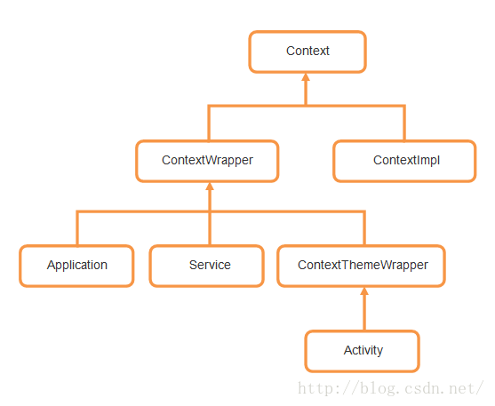

[TOC]
## Android的LaunchMode作用

standard：同栈创建一个新实例，生命周期正常走

singleTop：栈顶复用，调用onNewIntent()。不在栈顶同standard模式

singleTask：栈内复用，根据TaskAffinity查找目标栈，没有则创建新栈。栈内有实例则顶部弹栈，调用onNewIntent()

singleIntance:创建新栈，栈内只放该实例。启动其他实例，默认添加NEW_TASK的flag

## Activity Context ApplicationContext



- contextImpl存放了Apk路径，resource、theme等信息
- contextWrapper含属性ContextImpl mbase，装饰模式（给对象添加职责又不想增加子类）
- 都是继承关系，Aty、app本身就是context，包装了impl，提供信息的是mBase

## 多线程相关

Runnbale：接口，有个run()

Thread：线程类，实现了run()，创建方法1继承2参数runnbale

同步机制：

volatile：可见性，有序性，no原子性

sychronized：

lock

wiat notify notifyAll 

监视器：读写方法加synchronized 深拷贝


##handler

threadLock：线程封闭

# 内存

oom是什么: 

> Heap.cpp
>
> 分配内存？gc 〉增大内存》gc 带弱引用〉oom
>
> tig：手动调用System.gc() 没用！ 分配内存的时候自然会GC

gc：

>  引用计数法:加一减一tip：循环引用iOS
>
>  标记回收算法：标记GC Roots引用到的对象，其余回收，tip：内存碎片
>
>  复制算法：划分一块空内存块，发现存活直接拷贝进对象，清除原内存块，tip：快，空间换时间
>
>  标记-压缩算法：遍历标记，一起移动存活对象，清除其他：慢时间换空间
>
>  分代：青年代 老年代
>
>  并发GC：都会stop world，一次回收一部分，反复执行

内存泄露

> handle：内部类持有外部类引用，
>
> 静态 内部类 context thread
>
> 其他：webview dialog
>
> stream cursor 多媒体 传感器 系统服务 广播 contentObserver 集合
>
> 像素信息存放位置recycle()：2.3-》3.0>5.0>8.0
>
> 多activity

内存抖动：对象池（Message#obtain()，listview）

内存优化：少用+复用+释放+扩容

少用

>  编码（565 8888）、采样（inSampleSize）
>
>  Xml&代码&点9替换png
>
>  不可见回收：glide fragment
>
>  优化集合类：SparseArray ArrayMap 

复用

> inBitmap intentService 线程池   byte[]数组池 对象池
>
> 3级缓存：内存lru 弱引用 磁盘多尺寸
>
> LRUCache DiskLRUCache listView

释放：内存泄露

> Context:尽量使用ApplicationContext
>
> Handler：内部类&匿名内部类持有外部类引用，销毁时机，view.post(),thread
>
> 静态：单例，静态属性
>
> 资源释放：io 多媒体 系统服务 硬件传感器
>
> 反注册：观察者、广播、缓存
>
> 其他：WebView、dialog、recyclerView全局缓存池
>
> 

扩容：多进程、largeheap配置、匿名共享内存、兜底杀进程

# mvp

mvc衍生、架构模式。presenter： middle-man 处理表现层逻辑


View model层解藕，即vp相互依赖，通常

一个activity多个presenter

一个class定义view presenter两个接口

# AsyncTask

线程池+FutureTask + Callable:可以cancel（）基于interrupt()，可以get（）阻塞

串行SerialExecutor：Deque 保存task 执行完一个再取一个

# 启动优化

工具：ADT》traceview  AS〉profiler 耗电

activityThread#main() ->attachBaseContext()->ContentPrivude初始化-> onCreate->activity#create、start、resume-》viewRoot#performTraversal()

ContentProvide mulitDex TAG反射27ms 运行时注解、json（编译时注解）

加快布局渲染

> 优化布局include merge ViewStub 约束布局  

> 代码布局：Java替换xml  闪屏页 Java写view直接setContent(View view)

> theme优化：title background不要

1、异步2、线程池3、延时 dispatchDraw中view#post 或IdelHandle 或直接view#post

主线成挂起

> 跨进程调用 启动service

线程池优先队列 延时初始化

应用秒开

>  背景样式与启动页保持一致


# ANR

导出Trace文件  data/anr/traces_XXX.txt

分类：

带行号，其他线程，iowait？内存

InputDispatcher

> findFocusedWindowTargetsLocked:寻找聚焦窗口失败的情况：
>
> - 无窗口，无应用：Dropping event because there is no focused window or focused application.(这并不导致ANR的情况，因为没有机会调用handleTargetsNotReadyLocked)
>
> - 无窗口, 有应用：Waiting because no window has focus but there is a focused application that may eventually add a window when it finishes starting up.
>
> checkWindowReadyForMoreInputLocked
>
> ```c++
> // 非按键事件，事件等待队列不为空且头事件分发超时500ms
>         if (!connection->waitQueue.isEmpty()
>                 && currentTime >= connection->waitQueue.head->deliveryTime
>                         + STREAM_AHEAD_EVENT_TIMEOUT) {
>             return String8::format("Waiting to send non-key event because the %s window has not "
>                     "finished processing certain input events that were delivered to it over "
>                     "%0.1fms ago. Wait queue length: %d. Wait queue head age: %0.1fms.",
>                     targetType, STREAM_AHEAD_EVENT_TIMEOUT * 0.000001f,
>                     connection->waitQueue.count(),
>                     (currentTime - connection->waitQueue.head->deliveryTime) * 0.000001f);
>         }
> ```
>
> 

# 数据结构

hashmap 数据+链表/红黑树 扩容因子 复制

ArrayList:

实现：数组。增加：扩容1.5倍复制。 删除：后边向前复制。插入：不支持。

快：查找、修改。慢：删除、插入

LinkedList：双向链表，节点node，前置节点、前驱、后继

查找慢

HashMap

concurrentHashMap 分段锁

1、实现方式：数组、链表

2、线程安全

synchronousQueue

linkedBlockingQueue

arrayBlockingQueue

# handler


# view#post

 https://blog.csdn.net/scnuxisan225/article/details/49815269


    private void performTraversals() {
            // cache mView since it is used so much below...
            final View host = mView;
    // 这里面做了一些初始化的操作，第一次执行和后面执行的操作不一样，这里不关
    // 心过多的东西，主要关心attachInfo在此处被初始化完成
    
        // Execute enqueued actions on every traversal in case a detached view enqueued an action
        getRunQueue().executeActions(attachInfo.mHandler);
    
    ...
    performMeasure();
    ...
    performLayout();
    ...
    performDraw();
    }

getRunQueue().executeActions(attachInfo.mHandler);用handle发消息取执行

所以调用在三方法前，执行在三方法后


# 插件化

问题

> 默认的ClassLoader只加载应用安装目录的class文件，不能加载其他apk
>
> 清单文件没注册，PMS中没有组件信息
>
> 没有context，Resource 

应用加载流程：

>  开机PMS扫描应用目录拿appInfo（清单文件、apk安装路径、app存储路径、so路径、resource。。）
>
>  AMS通过PMS拿info，执行ActivityThread#main()，
>
>  创建ClassLoader Resource（通过PMS创建） +appInfo合成Context（解决id重名）

ClassLoader：

> 替换PathClassLoader：系统提供，篡改loadClass() 反射运行时属性
>
> AMS通过PMS拿appInfo（apk路径、app存储路径、so路径、resource。。）-》创建context-〉context包含ClassLoader

坑位：映射分配坑位-》启动坑位aty-〉hook ClassLoader-》加载目标aty

context: Aty#attachBaseContext()中替换 resource重名

menifest 资源id so

# 3体积优化

图片 so 一套资源

enum：一个增加1～1.5kb

# 加密

对称加密（DES、AES）

非对称加密：RSA

# http

状态码

Https:

1、获取公钥：从服务器获取证书（含公钥），使用发布机构证书校验真伪

2、获取密钥：生成随机密钥，用公钥加密密钥，发给服务器

3、加密传输：使用密钥对称加密，传输内容

证书：验证公钥

非对称加密：RSA，公钥加密、私钥解密。用于验证身份，加密密钥

对称加密：AES，DES，用密钥加密解密。用于加密数据


# 项目搭建

# 相机 

对焦

# 兼容问题

4.0-5.0


# 设计模式

*单例*：


*工厂*：创建型，用于具有继承关系的对象创建，隐藏产品创建逻辑，提供抽象接口

产品等级：对象的继承结构。丰田汽车、本田汽车----汽车

简单工厂：抽象产品、具体产品，工厂。静态方法，基于参数决定产品


产品族：由同一个工厂生产，隶属于不同产品等级的一组产品

抽象工厂：提供一个创建一系列相关或相互依赖对象的接口，而不指定具体的类

工厂方法：定义一个创建对象的接口，由接口的实现决定实例化哪个类，

抽象产品、具体产品，抽象工厂、具体工厂、（超级工厂用于创建工厂）。解决产品族


# launcher

它俗称“HomeScreen”也就是我们开机后看到的第一个App。launcher其实就是一个app，它的作用用来显示和管理手机上其他App。

```
<category android:name="android.intent.category.HOME"/>
<category android:name="android.intent.category.DEFAULT"/>
```

## react


## 小程序


# 列表相关

优化

ViewHolder：findViewById深度遍历view树，耗时。此操作放在静态ViewHolder中执行，直接从中获取view引用

createViewHolder();BindViewHolder();


# cpu优化

反射20+ms TAG

耗时操作子线程，线程池 ，优先队列，延时执行（onresume不行，view.post()或dispatchDraw（））

binder：启动service

# 耗电

满足业务之外的

动画、GIF、视频，不显示时未关闭

GPS各种传感器不使用时未关闭

Wakelock未释放
频繁唤醒：Push长连接心跳 后台定时任务、轮询

# retrofit

声明接口方法描述网络请求，jdk的api实现动态代理，adapter factory数据转换


# okhttp

使用socket建立tcp链接，根据http协议发送和解析字节流

socket连接池：底层使用socket建立流链接、长短链

责任链和拦截器：自定义Log拦截器，重定向、缓存

线程池和消息队列：SynchronousQueue

缓存：

# js交互

map《key,callback（）》

责任链 通过path获取拦截器

App://version/module/submodule/.../action?k1=v1&k2=v2&...

