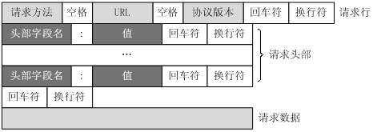

# Http

## 基础

### 1、什么是http

>  超文本传输协议(HyperText Transfer Protocol)
>
> Java中通过socket的API进行数据传输，传输的内容是一段字符串。这段字符串需要符合一定规则以便解析，Http协议便是这个规则

### 2、什么是Socket

> 使用http协议进行数据交互会用到httpClient、okhttp等框架
>
> 使用tcp协议进行数据交互，使用的就是socket，也就是一个工具类
>
> udp协议使用datagram

### 3、http请求的过程

> 客户端使用socketAPI、tcp传输层协议，把数据流（可理解为一段字符串）给服务器
>
> 服务器拿到数据流（即请求request），根据http协议的规则对数据流进行解析
>
> 服务器端使用socketAPI、tcp传输层协议，把数据流（即响应response）给客户段
>
> 服务器拿到数据流（即请求response），根据http协议的规则对数据流进行解析

### 4、http协议版本

> **0.9**：已过时，只接受 GET 一种请求。
> **1.0**：第一个在通讯中指定版本号的HTTP 协议版本，至今仍被广泛采用，特别是在代理服务器中。
> **1.1**：当前版本。持久连接被默认采用，并能很好地配合代理服务器工作。
>  		支持以管道方式同时发送多个请求，以便降低线路负载，提高传输速度。
>
> **https**：使用http1.1+SSL/TLS，通俗说使用SSL/TLS协议对数据流做了加密处理

## http报文


### 请求报文



- 请求行（request line）

  > GET http://54.183.236.104/mini/queryVideo?videoNum=6  HTTP/1.1\r\n

- 请求头部（header）

  > 请求头部由关键字/值对组成，每行一对，关键字和值用英文冒号“:”分隔。请求头部通知服务器有关于客户端请求的信息，典型的请求头有：
  >
  > User-Agent：产生请求的浏览器类型。
  >
  > Accept：客户端可识别的内容类型列表。
  >
  > Host：请求的主机名，允许多个域名同处一个IP地址，即虚拟主机。

- 空行 blank line

  > 最后一个请求头之后是一个空行，发送回车符和换行符，通知服务器以下不再有请求头。

- 请求数据 request-body

  > 请求数据不在GET方法中使用，而是在POST方法中使用。POST方法适用于需要客户填写表单的场合。与请求数据相关的最常使用的请求头是Content-Type和Content-Length。

###响应报文

- 状态行 status-line

  > 示例：HTTP/1.1 200 
  >
  > 结构：HTTP-Version Status-Code Reason-Phrase CRLF
  >
  > HTTP-Version表示服务器HTTP协议的版本；Status-Code表示服务器发回的响应状态代码；Reason-Phrase表示状态代码的文本描述。状态代码由三位数字组成，第一个数字定义了响应的类别，且有五种可能取值。
  >
  > - 1xx：指示信息--表示请求已接收，继续处理。
  >
  > - 2xx：成功--表示请求已被成功接收、理解、接受。
  >
  > - 3xx：重定向--要完成请求必须进行更进一步的操作。
  >
  > - 4xx：客户端错误--请求有语法错误或请求无法实现。
  >
  > - 5xx：服务器端错误--服务器未能实现合法的请求。
  >
  > 常见状态代码、状态描述的说明如下。
  >
  > - 200 OK：客户端请求成功。
  > - 400 Bad Request：客户端请求有语法错误，不能被服务器所理解。
  > - 401 Unauthorized：请求未经授权，这个状态代码必须和WWW-Authenticate报头域一起使用。
  > - 403 Forbidden：服务器收到请求，但是拒绝提供服务。
  > - 404 Not Found：请求资源不存在，举个例子：输入了错误的URL。
  > - 500 Internal Server Error：服务器发生不可预期的错误。
  > - 503 Server Unavailable：服务器当前不能处理客户端的请求，一段时间后可能恢复正常，举个例子：HTTP/1.1 200 OK（CRLF）。

- 消息报头 headers

  > ```html
  > Date: Sat, 31 Dec 2005 23:59:59 GMT
  > Content-Type: text/html;charset=ISO-8859-1
  > Content-Length: 122
  > ```
  > 常用响应头
  >
  > - Content-Type: 实体主体的类型, 例如 HTML 文档会被标记为 text/html; gif 格式的图片会被标记为 image/gif. 如果要传递的数据类型不止一种, 这种情况可能会出现在 form 表格中, 用户可能会一次上传文字和文件类型的数据, 那么此时的属性值会是 `Content-Type: multipart/form-data`. 用 multipart 来表示此时传递的数据是包含多个主体的.
  >
  > - Content-length: 实体主体的大小
  >
  > - Expires: 实体主体数据的过期时间
  >
  > - Content-Encoding: 实体的处理方式，例如压缩或者重新编码
  >
  >
  > 

- 空行 blank line

  > 最后一个响应头之后是一个空行，发送回车符和换行符，通知客户端器以下不再有响应头

- 响应正文 response-body

  > ```html
  > ＜html＞
  > ＜head＞
  > ＜title＞Wrox Homepage＜/title＞
  > ＜/head＞
  > ＜body＞
  > ＜!-- body goes here --＞
  > ＜/body＞
  > ＜/html＞
  > ```

