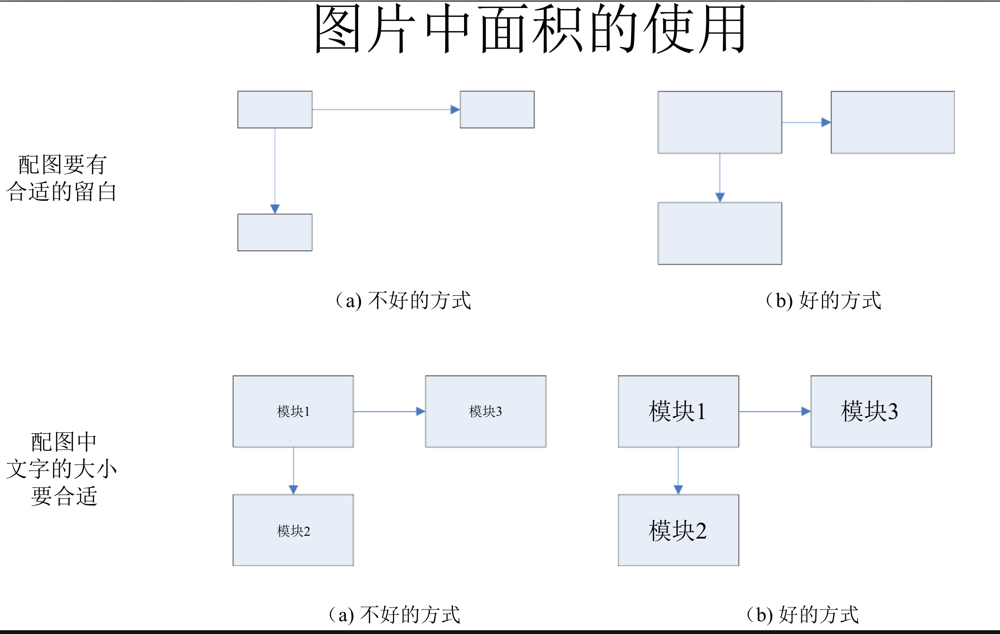
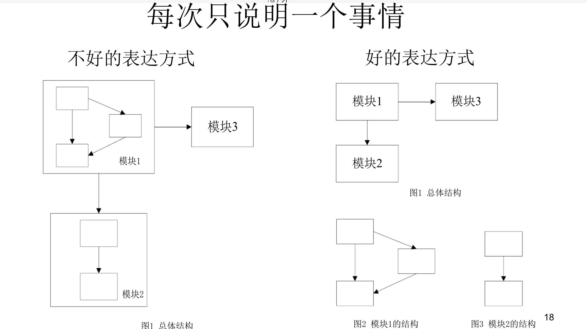

[TOC]

# 文档书写规范

- 封面

  -编号，项目，版本号

- 历史说明

  -修改人、修改日期、修改说明

- 字体

  -宋体、五号字、单倍行距

- 文档结构

  -分层次的标题，便于从全局把握

- 编写说明

  -最好有一个

- 上面自己定，同意就行

# 文档的格式

- 格式表现的是一种逻辑
  - 可能的逻辑关系：总-分，递进，并列，。。。
- 标题
  - 标题是否表达文档的内容
  - 标题是否和文档的内容相符合
  - 各层标题所构成的提纲，是否能清晰反映文档的内容
- 段落
  - 段首一定要有缩进
  - 段落不要太长
  - 注意每段的第一句话
  - 每段内的多句话应该有一定的逻辑

# 文档中问题的规划

- 选择合适的角度
  - 从不同的角度看到的东西是不一样的（类比：机械制图不同视角）
- 角度的说明
  - 说明划分问题的出发角度
- 注意联系
  - 子问题之间的**联系**
- 是否是一个**独立**的问题
  - 切分问题是否准确
- 是否是一个**重要**的问题
  - 决定写作的详略

# 选用合适的表述模式

- 不同种类的问题，有不同的模式
- 分析和解决一个问题：提出问题，分析问题，解决问题
- 提出一个实现的建议：出发点（目的），手段，工作量估计，收益的估计
- 系统的设计：模块，功能，过程
- 程序的设计：数据，函数，模块，调用过程，系统结构

# 文档的评价

- **文档是写给别人看的！**
- 能否让读者在5分钟内看懂
- 能否做到**问题清楚、重点突出、逻辑清楚？**
- 能否做到**言之有物：**不要死套格式
- 能否做到**言简意赅：**不要说废话
- 能否避免造成别人的**误解**
  - 不要说模棱两可的话
  - 要注意自己的表达是否通俗（有太多人说“自己才懂的方言”）

# 文档的书写方法

- 拉提纲，自顶向下
  - 大的标题下列出子问题，再对每个子问题逐步展开
- 反刍
  - 感觉（一句，一段，甚至整个文章的结构）不好之后要及时修改
  - 提高自己写文档的能力
- 让重要的内容醒目
  - 标题：段首第一句话
  - **加重**、有颜色、或者带下划线的文字

# 文档中配图的指南

- 要明确这个图片的目的
  - 只能展现**1--2个（最好是一个）**主要问题
  - 只能说明**一个层次**上的问题
- 要明确图片中传递信息的重点
- 要注意图片中面积的使用
  - 可能错误：太多空白的区域，说明的文字过小
- 图片最好能够独立的说明一个事情
  - 同时太多的关注点=>失焦
- 对于图中不能明确表达的地方，需要在图片周围的文字部分给出辅助的说明

