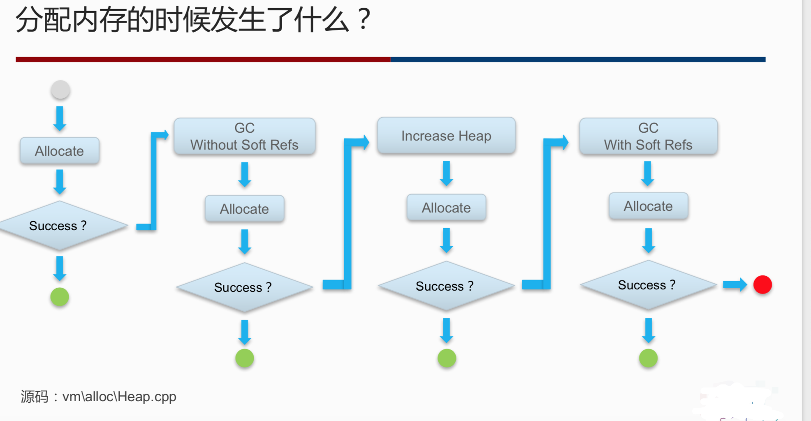

[TOC]

Activity 启动模式 生命周期

view动画、属性动画

buildToolsVersion：使用什么版本的API

TargetSDKVersion：兼容模式，运行时权限


diskLruCache如何设计一个缓存系统：建一个文件夹，将下载的数据存在文件夹下，使用LRU规则，当文件夹满时进行删除，使用文件本身的属性进行唯一标示


消息机制：知道messageQueue，looper，handler的关系，delayed的消息怎么实现的：线程中sleep进行等待

毛建国

ctivity相关问题，四种启动模式，生命周期

standard 标准启动模式（自己启动自己会按三次才能退出） singleTop 单一顶部模式

- 如果任务栈的栈顶存在这个要开启的activity，不会重新的创建activity，而是复用已经存在的activity。如果栈顶没有或者不在栈顶，会重新创建
- 会调用 onNewInstance()，复用已经存在的实例
- 应用场景：singleTop适合接收通知启动的内容显示页面。例如，某个新闻客户端的新闻内容页面，如果收到10个新闻推送，每次都打开一个新闻内容页面是很耗内存的。

singeTask 单一任务栈，在当前任务栈里面只能有一个实例存在

- 当开启activity的时候，就去检查在任务栈里面是否有实例已经存在，如果有实例存在就复用这个已经存在的activity，并且把这个activity上面的所有的别的activity都清空，复用这个已经存在的activity。保证整个任务栈里面只有一个实例存在
- 会调用 onNewInstance()，复用已经存在的实例
- 应用场景：

singleTask适合作为程序入口点，例如应用中的主页（Home页）。假设用户在主页跳转到其他页面，运行多次操作后想返回到主页，假设不使用SingleTask模式，在点击返回的过程中会多次看到主页，这明显就是设计不合理了。 singleInstance：activity会运行在自己的任务栈里面，并且这个任务栈里面只有一个实例存在

- 如果你要保证一个activity在整个手机操作系统里面只有一个实例存在，使用singleInstance
- 应用场景： 电话拨打界面

singleInstance适合需要与程序分离开的页面。例如我们有个需求，需要打开别的应用，这个时候如果不设置singleInstance的话，这个新打开的应用在我们程序的任务栈里，用户想要按任务键切换的话没法切换。


activity给fragment传递数据一般不通过fragment的构造方法来传递，会通过setArguments来传递，因为当横竖屏会调用fragment的空参构造函数，数据丢失。


view动画、属性动画


Gradle中buildToolsVersion和TargetSdkVersion的区别是什么

compileSdkVersion, minSdkVersion 和 targetSdkVersion 的作用：他们分别控制可以使用哪些 API ，要求的 API 级别是什么，以及应用的兼容模式。TargetSdkVersion 设为23那么是按6.0设置的（运行时权限），小于23是按6.0以前的方式（安装时默认获得权限，且用户无法在安装App之后取消权限）


service2种启动形式，有什么差别

1 通过startService

  Service会经历 onCreate 到onStartCommand，然后处于运行状态，stopService的时候调用onDestroy方法。

  如果是调用者自己直接退出而没有调用stopService的话，Service会一直在后台运行。

2 通过bindService  

  Service会运行onCreate，然后是调用onBind， 这个时候调用者和Service绑定在一起。调用者退出了，Srevice就会调用onUnbind->onDestroyed方法。所谓绑定在一起就共存亡了。调用者也可以通过调用unbindService方法来停止服务，这时候Srevice就会调用onUnbind->onDestroyed方法。

1.一旦在项目的任何位置调用了Context的startService()方法，相应的服务就会启动起来，并回调onStartCommand()方法。如果这个服务之前还没有创建过，onCreate()方法会先于onStartCommand()方法执行。

2.服务启动了之后会一直保持运行状态，直到 stopService()或stopSelf()方法被调用。注意虽然每调用一次startService()方法，onStartCommand()就会执行一次，但实际上每个服务都只会存在一个实例。所以不管调用了多少次startService()方法，只需调用一次stopService()或stopSelf()方法，服务就会停止下来了。

3.当调用了startService()方法后，又去调用 stopService()方法，这时服务中的 onDestroy()方法就会执行，表示服务已经销毁了。类似地，当调用了 bindService()方法后，又去调用unbindService()方法，onDestroy()方法也会执行，这两种情况都很好理解。但是需要注意，我们是完全有可能对一个服务既调用了startService()方法，又调用了bindService()方法的，这种情况下该如何才能让服务销毁掉呢？根据Android系统的机制，一个服务只要被启动或者被绑定了之后，就会一直处于运行状态，必须要让以上两种条件同时不满足，服务才能被销毁。所以，这种情况下要同时调用stopService()和unbindService()方法，onDestroy()方法才会执行这样就把服务的生命周期完整地走了一遍。

start –> bind -> unbind -> stop 经常使用服务长期后台运行，又可以调用服务中的方法

service如何杀不死？（思考）


显示系统三重缓存

https://www.jianshu.com/p/3e392fab43a2


surfaceview，surfacetexture，textureview，glsurfaceview


自定义View需要注意的问题

https://blog.csdn.net/u010452083/article/details/78742913


View的绘制流程:

流程一:mesarue()过程;

流程二:layout布局过程;

流程三:draw()绘图过程。

http://blog.csdn.net/qinjuning/article/details/7110211/


自定义View如何考虑机型适配:

http://blog.csdn.net/zhaokaiqiang1992/article/details/45419023


APP进程之间的通信，Binder机制及底层实现，AIDL，线程相关问题


Art和Dalvik对比:

Dalvik是Google公司自己设计用于Android平台的虚拟机。

ART即Android Runtime

Dalvik和ART的几点区别:

dalvik是执行的时候编译+运行,安装比较快,开启应用比较慢,应用占用空间小

ART是安装的时候就编译好了,执行的时候直接就可以运行的,安装慢,开启应用快,占用空间大

用个比喻来说就是,骑自行车

dalvik 是已经折叠起来的自行车,每次骑都要先组装自行车才能骑

ART 是已经组装好的自行车,每次骑直接上车就能走人

详情:http://www.jb51.net/article/88708.htm


view的滑动冲突解决


自定义View的事件分发机制:

对于 dispatchTouchEvent,onTouchEvent,return true是终结事件传递。return false 是回溯到父View的onTouchEvent方法。

ViewGroup 想把自己分发给自己的onTouchEvent,需要拦截器onInterceptTouchEvent方法return true 把事件拦截下来。

ViewGroup 的拦截器onInterceptTouchEvent 默认是不拦截的,所以return super.onInterceptTouchEvent()=return false;

View 没有拦截器,为了让View可以把事件分发给自己的onTouchEvent,View的dispatchTouchEvent默认实现(super)就是把事件分发给自己的onTouchEvent。

对于ACTION_MOVE、ACTION_UP总结:ACTION_DOWN事件在哪个控件消费了(return true), 那么ACTION_MOVE和ACTION_UP就会从上往下(通过dispatchTouchEvent)做事件分发往下传,就只会传到这个控件,不会继续往下传,如果ACTION_DOWN事件是在dispatchTouchEvent消费,那么事件到此为止停止传递,如果ACTION_DOWN事件是在onTouchEvent消费的,那么会把ACTION_MOVE或ACTION_UP事件传给该控件的onTouchEvent处理并结束传递。


###### Hander原理

Handler，loop轮询检测发送消息到MessagerQuery,MessageQuery对Message入列，Handler回调方法处理消息，重写handMessage方法刷新ui


###### Android性能优化

布局优化: 减少布局层级，使用ViewStub提高显示速度，布局服用，尽可能少使用warp_content，删除空间中无用的属性,避免过度绘制移除window默认背景，按需显示展位图，自定义View优化，使用canvas.clipRect()识别可见区域
启动速度:采用分布加载，异步加载，延期加载提高应用初始化速度，采用线程初始化数据等，合理的刷新机制
内存方面:防止内存泄露,使用一些第三方工具检测解决
代码优化:遵循Java生命周期
安装包优化:删除无用资源，优化图片，代码混淆，避免重复库存在，插件化


是否有遇到过ANR、crash问题，解决思路


开源框架使用及深入的程度（简历中获取）

二、

callback解决的问题，设计一个简单的callback

是否能从Android中举几个例子说说用到了什么设计模式（自己的项目）

如何理解生产者消费者模型

MVC，MVP，MVVM差别

实现单例模式（三种）？懒汉式中双层锁的目的是什么？两次判空的目的又是什么，怎么防止单例被反射攻击

单链表，将按照index重新排序，原；1->2->3>-4>5... 重排规则: 1->3->5...→2→4...  （鲁棒性）

合并两个有序单链表  （鲁棒性）

返回一个整数数组中最大子数组的和 ：https://www.cnblogs.com/allzy/p/5162815.html  （DP）

字符串中最长重复子串 （后缀树/DP）

整数数组中k个元素之和为m （背包问题，DP）

字符串分割：字符串s=“baidu”， 词典dic={“bai”，“du”}，判断字符串s是否可以分割为词典当中的单词 （DP，注意优化）

二叉搜索树中第K小的元素： 中序遍历该二叉搜索树，放到list，list里面是从小到大，索引从0开始，返回k-1上的数 （数据结构基础）

给定一个数组，其中的数据要么出现1次，要么出现2次，查找只出现一次的数据元素：异或的运用 （逻辑思维）

## Android 中多线程的常见实现方式

1、继承Thread，复写run()

2、实现Runnable/Callable接口，通过Thread、线程池执行 

3、HandlerThread、IntentService、AsyncTask、RxJava

## handler 内存泄漏原因

匿名内部类持有外部类引用，Handler生命周期可能比activity长

静态内部类+弱引用

##  OOM及内存引用类型

1、通过new创建对象，系统分配内存，内存不足，GC回收弱引用和虚引用

2、还不足，内存扩容。还不足，GC回收软引用

3、还是分配不了，强引用也不回收。抛OOM异常，也就是内存溢出a




| 引用类型 | 被垃圾回收时机        | 用途               | 英文             |
| -------- | --------------------- | ------------------ | ---------------- |
| 强引用   | GC Root到此对象不可达 | 对象的一般状态     | StrongReference  |
| 软引用   | 当内存不足时          | 对象缓存           | StrongReference  |
| 弱引用   | 正常垃圾回收时        | 对象缓存           | WeakReference    |
| 虚引用   | 正常垃圾回收时        | 跟踪对象的垃圾回收 | PhantomReference |


- 虚引用（PhantomReference）

主要用来跟踪对象被垃圾回收器回收的活动。

虚引用与软引用和弱引用的一个区别在于：虚引用必须和引用队列 （ReferenceQueue）联合使用。当垃圾回收器准备回收一个对象时，如果发现它还有虚引用，就会在回收对象的内存之前，把这个虚引用加入到与之 关联的引用队列中。
示例：

```java
ReferenceQueue<String[]> referenceQueue = new ReferenceQueue<String[]>();
PhantomReference<String[]> referent = new PhantomReference<String>(new String[]{"a", "b", "c"}, referenceQueue);
```


## 内存优化


## 包体积优化


## 类加载过程，什么是双亲委派模型？VerifyError 什么时候出现？ 基本了解

## Android 存储熟悉

## 进程间通信

binder

socket

信号量

。。。


## 动画实现
答的不错，贝塞尔曲线实现


## https原理 重定向 常见错误码

Cookie
比较浅
Session
比较浅


## list map set底层区别及 扩容原理

## RN 原理


## 常见设计模式

## 五层模型

## 接口和抽象类有什么区别

##  hashmap原理

##  线程安全  线程池 Thread

# 算法

给定一个整数数组 nums 和一个目标值 target，请你在该数组中找出和为目标值的 两个 整数。


```java
// 遍历法O(N2) 
public int[] twoSum(int[] nums,int target){
  for(int i = 0; i < nums.length; i++){
    for(int j = 1; j < nums.length; j++){
      if(nums[i] == target - nums[j]){
        return new int[]{nums[i],nums[j]};
      }
    }
  }
  return null;
}


// 一遍哈希表 空间换时间
public int[] twoSum(int[] nums,int target){
  Map<Integer,Integer> map = new HashMap<>();
  for(int i = 0;i < nums.length; i++){
    map.put(nums[i],i);
    int complement = target - nums[i];
    if(map.containKey(complement)){
      return new int[]{complement,nums[i]};
    }
  }
}
```

 快速排序算法， 写出来了，细节问题随时提，能优化。


开灯算法

字符串替换空格

10.排序算法；通过互换0与n的位置实现排序

二叉树的层序遍历